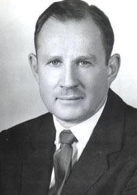

# Welcome!

---

{fig-alt="A wall with text Welcome, Everything is Fine, in green letters. A woman sits on a couch facing that wall."}

## Philosophy 101

This class is Philosophy 101 - Introduction to Philosophy.

I'm the lecturer, Brian Weatherson.

The GSIs for the course are Eduarda Fonseca da Nova Cruz, Subin Nam, and Ellie Riggsbee.

## Philosophy 101

There is a Canvas site for the course, at [https://canvas.umich.edu](canvas.umich.edu), and if you're enrolled in the course, you should be enrolled in that site.

If you're on the waitlist, let me or the GSI for the section you're on the waitlist for know, and we'll add you to the site as a participant.

The syllabus is there, and the readings and assignments will be posted there as well.

## Philosophy 101

::: {layout="[70, 30]"}

::: {}
{fig-alt="A QR code linking to the URL in the caption."}
:::

::: {}
There is also a GitHub site for the course, which is a little more flexible than Canvas.
:::

:::

## Readings, etc

All the readings for the course are on those sites. (I.e., they each have links to all of them.)

Most are completely free. A handful require you to log in from a campus computer or using a UM account. None require payment.

. . .

You will need an [iClicker](https://www.iclicker.com/students/apps-and-remotes/apps) for this course. A dedicated iClicker remote costs some money, but if you have an iPhone or Android phone, you can use the free iClicker app. We will start using this in week 3.

## Syllabus

The full syllabus for the course is also on both sites.

We will go over the details of it more with the GSIs in the first discussion section.

# Why Are We Here?

## What Are We Doing Here?

In many subjects, the natural thing to do here would be to define the subject matter. What we do in courses like this is [fill in the blank here].

. . .

Unfortunately, philosophers like to argue. That might be our defining characteristic.

. . .

And one of the things they like to argue about philosophy is what philosophy is. Any answer would be really contentious.

. . .

The best answers are more like aphorisms than definitions.

## Sellars

::: {layout="[40, 60]"}

::: {}
{fig-alt="A portrait of Wilfrid Sellars."}
:::

::: {}
Let's start in Ann Arbor, with Wilfrid Sellars.

He went to _high school_ here at UM, back when the education program ran a high school.

And he became one of the greatest American philosophers of the twentieth century.
:::

:::

## Sellars

::: {layout="[40, 60]"}

::: {}
{fig-alt="A portrait of Wilfrid Sellars."}
:::

::: {}
:::: {.callout-note title="Sellars"}
The aim of philosophy, abstractly formulated, is to understand how things in the broadest possible sense of the term hang together in the broadest possible sense of the term.
::::
:::

:::

## Hills

::: {layout="[40, 60]"}

::: {}
{fig-alt="A portrait of David Hills."}
:::

::: {}
:::: {.callout-note title="Hills"}
Philosophy: the ungainly attempt to tackle questions that come naturally to children, using methods that come naturally to lawyers.
::::
:::

:::

## Midgley

::: {layout="[40, 60]"}

::: {}
{fig-alt="A portrait of Mary Midgley."}
:::

::: {}
:::: {.callout-note title="Midgley"}
Plumbing and philosophy are both activities that arise because elaborate cultures like ours have, beneath their surface, a fairly complex system which is usually unnoticed, but which sometimes goes wrong. In both cases, this can have serious consequences. Each system supplies vital needs for those who live above it. Each is hard to repair when it does go wrong, because neither of them was ever consciously planned as a whole.
::::
:::

:::

## Foundations

When philosophers are feeling particularly grandiose, they will describe their work as _foundational_.

There's something right about that.

. . .

The foundations are a part of the building that most people would rather not hang out in. They are dark, and dirty, and smelly, and there are lots of pipes.

Usually part of the plumbing is there.

. . .

Usually the outbound part.

## Foundations

But when they go wrong, it's very important to fix them.

Sometimes, you only understand something by seeing what it's built on.

So you have to look underneath what you're used to looking at, burrow down into less familiar places, to see what is holding everything up, and if necessary fix it.

## Really?

This all sounds a bit grandiose. If this work is so important, shouldn't it be something everyone across the university is doing?

. . .

Answer: Yes, of course it is.

. . .

Philosophy, done well, requires engaging with a wide variety of other disciplines, not least because the alternative is stumbling over things that other people have figured out.

## Joint Appointments

Among my colleagues in the philosophy department here at UM, there are people with joint appointments in the following programs:

. . .

::: {layout="[50, 50]"}

::: {}
- Statistics
- Classics
- Women and Gender Studies
- Psychiatry
- Ross (i.e., business)
:::

::: {}
- African American Studies
- Law
- Classics
- Asian Languages and Culture
- Political Science
:::

:::

. . .

That's not meant to be exhaustive, it's just a sample of the kind of things we engage with.

## What is Philosophy

At this point you might be really doubtful there is any _subject matter_ that these fields could all have in common. And that's basically right.

. . .

What is in common to the work these folks do is a disposition to take fewer things for granted, and to muck about in the plumbing if things don't seem to be going right.

## Majors

Somewhat relatedly, philosophy has one of the lowest ratio of majors to students of any department in the university.

That's in part because there are lots of courses that are useful to other majors.

But it's mostly because the main way people at UM take multiple philosophy courses is if they are in one of the two interdisciplinary majors that we are part of:

- Cognitive Science
- Philosophy, Politics and Economics (PPE)

. . .

While I'll be _thrilled_ if many of you become philosophy majors, the course isn't built on the assumption that you will. It's going to be just as much targetted at majors in those two programs, and at people who might never take another philosophy course.

# Course Overview

## Our Plan

That was all a bit metaphorical; let's get more down to earth.

We're going to be broadly concerned with three kinds of questions.

1. How do we learn about the world?
2. What kinds of things are minds?
3. What do we owe each other?

## AI

This isn't a course in philosophy and AI; though there are (as of this year) a few such courses offered in our department.

. . .

But it isn't entirely unrelated.

When I was choosing the topics, I steered towards things that are especially relevant to a world where ChatGPT, Claude, etc exist.

I'm mostly _not_ going to belabor the connections between the topics and AI in lecture, but they will often be there, and maybe we'll make them explicit from time to time.

---

::: {layout="[40, 60]"}

::: {}
{fig-alt="The cover of Fleetwood Mac's album _Rumours_."}
:::

::: {}
- But there's another way in which AI impacts this course, and in fact all courses in the university.
- There's a rumor that some students are using AI to do their assignments for them.
- Without judging how true that is, there are some steps we're taking this seriously.
:::

:::

## Assignments

- For one thing, there will be more assignments done in section than historically was the case.
- This might not be a particularly dramatic change for people who are just starting at UM, but it is a shift for those who have been here for a bit.
- For another, we're going to be more strictly enforcing rules that were always there.

## Three Rules

1. **Document everything**. Any tech usage in preparing work, even brainstorming, should be recorded. Don't use anyone else's account.
2. **Acknowledge everything**. Any help you get, from friends, family, books, or machines, should be acknowledged. There's nothing wrong with getting help; anything hard enough to be worth doing is going to be hard without a little help from your friends. But acknowledge help as precisely as possible.
3. **Submit your own work**.

## Submit Your Own Work

By this, I mean you can answer the following two questions about anything you write.

1. What does this part mean?
2. Why did you write this?

. . .

- If we have any suspicions that you aren't submitting your own work, we'll ask you, in person, these two questions about the work.
- Indeed, we'll sometimes ask that even if we _don't_ have any suspicions. This is basically an audit, and like other audit systems, we're going to use a system of random checks plus extra checks when something looks off.

## Rules

We'll go over all this again when written assessments are distributed. It's annoying for you, it's annoying for us, but it's the world we're in.

One of the annoyances is that the norms around this are very unsettled. Do **NOT** assume that what I say is what your other professors will expect, or vice versa. We're all figuring this out.

For what it's worth, what I've said on the previous slides is based on the assumption that actually AI isn't _that_ different to previous methods of taking shortcuts: copying from books, repeating essays from previous years, paying someone else to write it, etc. I do not think that view is shared across the university, and you shouldn't assume that it is.

## For Next Time

We'll start thinking about learning, by talking about logic.

And we'll start with some logic games.