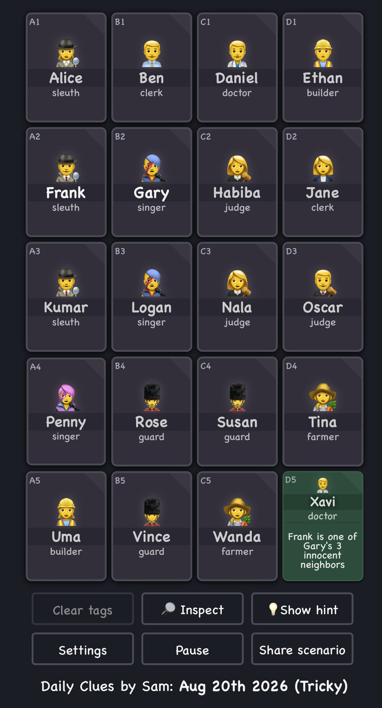

# Logic Games

## Clues by Sam

::: {layout="[40,60]"}

::: {}
{fig-alt="Screenshot of a Clues by Sam game"}
:::

::: {}
Over the summer, I spent more time than I'd like to admit solving the puzzles at

> [cluesbysam.com](https://cluesbysam.com). 

The trick is to use clues to figure out which of the 20 people (or occasionally animals) shown on a grid like this are criminals, and which are innocent.
:::

:::

## The promise on the box

The site makes a promise about the game.

> You never need to guess.

. . .

That's what makes this a *logic* game; from what's revealed to you, you can always figure out *something*. You are never stuck, and can always work out someone's status as criminal/innocent.

## What the promise means

Actually there are three promises here:

1. Everything you are told is true.
2. At every stage in the game, you can make another move, where that means saying (with certainty) the status of another person.
3. If you keep making these moves, you'll eventually fill in the board.

. . .

So for each person there is a chain of reasoning from the clues to the answer. Your job is to find it.

. . .

What do we mean by 'chain' here? That's what I'll try to make a bit clearer today.

# Arguments

## Two kinds of arguments

Sometimes an argument is two people disagreeing loudly. E.g., "We all left because Ted and Bill were having a loud argument about Odysseus."

. . .

Sometimes it is one person giving reasons for a view. E.g., "Chris argued that Odysseus was the kind of figure who was responsible for the Bronze Age Collapse."

. . .

We mean the second; whenever we mean an argument, we mean someone putting something forward with reasons.

## The parts of an argument

An argument is a set of claims offered in support of another claim.

- The claims doing the supporting are the **premises**.
- The claim they support is the **conclusion**.

## From many, one

An argument can have one premise, or two, or twenty.

It has exactly one conclusion.^[Two caveats that you might want to discuss more. Sometimes an argument will have _intermediate_ conclusions, things which follow from earlier premises, and get used for later reasoning. And sometimes the speaker will draw two conclusions from the same premises. We'll treat each of these as multiple arguments, and keep the 'single conclusion' constraint in place.] 

&nbsp;

&nbsp;

&nbsp;

## Arguments in natural language

There are good but not perfect guides to which parts of speech relate to which parts of an argument.

- Premises often follow *because*, *since*, *for*, *after all*.
- Conclusions often follow *so*, *therefore*, *thus*, *hence*, *consequently*.

. . .

The conclusion can come first, last, or in the middle. Word order is not a good guide. In fact, a really common thing in speech is to announce your 'conclusion' first, and then tell people why you think it. These connective words are not perfect, but they are a better guide than word order.

# Assessing Arguments

## Two ways to fail

Somebody offering an argument is doing two things at once: putting up premises, and claiming those premises support the conclusion.

So there are two ways to fail. The premises can be false. 

Or they can be true and still not support the conclusion.

. . .

For today, we're not going to care much about false premises; we'll just talk about support.

## No support at all

1. Today is Thursday.
2. Ann Arbor is in Michigan.
3. So this course has twenty-eight lectures.

. . .

The premises are true and the conclusion is true, and the premises give you **no reason whatsoever** to believe it.

## Some support

1. Most philosophy classes at UM have fewer than one hundred students.
2. This is a philosophy class at UM.
3. So this class has fewer than one hundred students.

. . .

Now the premises do bear on the conclusion. If they were true, _and they are_, they give you some reason to believe the conclusion.

. . .

But you are living in the exception. The premises can be true and the conclusion false, and in this case they are.

## Guaranteed support

1. Every philosophy class at UM has fewer than five hundred students.
2. This is a philosophy class at UM.
3. So this class has fewer than five hundred students.

. . .

There is now **no way** for the premises to be true and the conclusion false. The premises **guarantee** the conclusion.

That's not to say the conclusion couldn't be false; those premises could fail. Maybe this course will be so popular that next year I'll have more students than Intro Psych. But the premises have to fail for the conclusion to fail.

## Validity

An argument is **valid** when the truth of the premises guarantees the truth of the conclusion.

Equivalently, and often easier to use: it is impossible for all the premises to be true and the conclusion false.

. . .

Validity says nothing about whether the premises are true. "All cats are verbs; President Grasso is a cat; so President Grasso is a verb." is valid.

## Soundness

A valid argument with true premises is **sound**.

An argument that is invalid, or that has a false premise, is unsound.

. . .

Note that these definitions for 'valid' and 'sound' are _stipulative_. I'm not claiming to tell you how the words work in ordinary English. Rather, I'm telling you how _we_ are going to use them.

# Logic Games Revisited

## The rule of the game

You may mark somebody only when the clues **guarantee** you are right.

. . .

Thgat is, you may write down a verdict only when there is a valid argument from the clues to that verdict.

## Your Turn

## Our Clues Game

::: {layout="[40,60]"}

::: {}
{fig-alt="QR code linking to the address in the caption" width=50%}
:::

::: {}
Open the warm-up puzzle at this link.

The clues are all true, and the answer is always reachable. If you find yourself guessing, you have not found the argument yet.

Work with the person beside you. Saying the reasoning out loud is the fastest way to learn whether it holds. We'll allow ten minutes for this. See if you can do the "Warm Up" and, if you have time, the "Challenge"
:::

:::

# Two important moves

## Spelling out the reasoning

Most of what you did was counting. A clue says exactly three of these five, you know two of them are innocent, and the rest follows.

But two other moves were in there, and they turn up everywhere in philosophy. 

Let's introduce them more carefully, with some fancy names.

## Move one: reductio

Make a supposition. See what follows from it. If you derive something inconsistent with what you already know, or two things inconsisten with each other, conclude that the supposition was false.

. . .

- Suppose *P*.
- Derive a contradiction.
- Conclude *not-P*.

. . .

Its full name is *reductio ad absurdum*, reduction to absurdity.

## Reductio in practice

From the warm-up. Two of its clues:

> At most 1 of Bea's neighbours (including diagonals) is guilty.
> Exactly 3 of Dana, Evan, Fay, Gil, and Ira are criminals.

. . .

Bea's neighbours are Amir, Cory, Dana, Evan and Fay.

. . .

Suppose Amir is guilty. He is one of Bea's neighbours, so by the first clue none of the others is guilty, i.e., Dana, Evan and Fay are all innocent. But then the second clue needs three guilty people out of Gil and Ira alone.

That cannot happen. So Amir is innocent.

## Move two: argument by cases

Sometimes you cannot settle a question, and it turns out not to matter. You can see that something else would follow no matter what it was.

. . .

- Suppose *P*. Derive *Q*.
- Suppose *not-P*. Derive *Q*.
- Since *P* is either true or false, conclude *Q*.

. . .

You reach *Q* without ever finding out about *P*.

# Play again

## Challenge II

Open Challenge II. It is larger and it does not fall to counting alone.

When you get stuck, look for using one or other of these rules. 

# Going forward

## Next time

Every argument today was valid. But sometimes good arguments are not valid, and next Tuesday we'll start talking about why that is.
