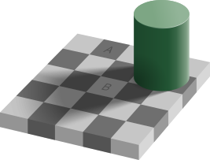

# A picture of a learning system

## Two parts

Here a really simple picture of a learning system, including potentially human learners.

- The system has two parts: a **perceptual** part and a **processing** part.
- **Perception** takes things in from the world.
- **Processing** does something with what came in.

. . .

Information enters at one end, gets worked on, and beliefs come out the other.

## The division of labor

On the strongest version of this model, the two parts are completely isolated.

- Perception does not reason; it is a passive absorption of information.
- Processing does not detect the world; it waits for information then acts on it.

. . .

It's hopefully clear that we need both these parts. What's less clear is whether

- They exhaust what we need, or
- They can't be analysed further, or
- They need to be isolated.

## Why start here

Still, it's a really attractive, simple picture of how learning systems (again, including us) work.

Even for systems that don't meet this picture, we'll often understand them by contrast with this picture.

So it is worth having it in view.

# Uses of this picture

## Bayesian machinery

I'm not going to go into the details of what this means, some of you will already know and if you don't the details don't matter, but broadly Bayesian pictures of the mind basically fit this model.

The system is adjusted by the exogenous input of *evidence*, and there is a preferred rule for how to deal with evidence.

These systems are _very_ popular in contemporary academic work, both as models for how to build artificial learning systems, and as models for how natural learning systems (like us) work.

## Machine learning, with hedges

Even machine learning systems that aren't Bayesian still often follow more or less this approach.

There is a part of the system that receives information from the external world, and a part that does something with that information.

. . .

In order to make the view less cartoon-ish, let's note one qualification on it. Sometimes the processing part can determine what the perceiving part looks at. You *think* about where to turn your eyes. But then your eyes just see things.

# Holmes

## The master detective

I assigned this as the first reading because it's a really vivid depiction of a system that has these two parts.

Holmes first gathers evidence, then he concludes.

## Gathering

> Sherlock Holmes was transformed when he was hot upon such a scent as this. Men who had only known the quiet thinker and logician of Baker Street would have failed to recognise him.

He crawls over the ground with a lens. He is fast, silent, and not talking to anybody.

. . .

Notice what Doyle does there. He's hitting you over the head with the thought that the two parts are not just doing different work; they *look* different from outside.

. . .

> his nostrils seemed to dilate with a purely animal lust for the chase

## Concluding

Back at the carriage the animal is gone and the expositor is back:

> Is a tall man, left-handed, limps with the right leg, wears thick-soled shooting-boots and a grey cloak, smokes Indian cigars, uses a cigar-holder, and carries a blunt pen-knife in his pocket.

Holmes doesn't collect any new evidence here; he just processes what he has.

## Holmes's own description

Earlier in the story, he describes his method as:

> I only quote this as a trivial example of observation and inference. Therein lies my métier.

For "Observation" and "inference", we could just say "perception" and "processing".

. . .

Historically, this picture doesn't get cleanly stated in the philosophy/psychology/cognitive science literature until some decades after this, but it's clearly here in popular culture.

# Illusions

## Why believe the split

I've said that this model of learning is simple, and that a famous writer of detective stories used it over a century ago.

These aren't the most conclusive reasons. Can we do better?

. . .

Here's one reason to think something like it is right - it explains the possibility of optical illusions.

## The checkershadow (by Edward H. Adelson, 1995)

{fig-alt="What looks like a chessboard with a cylinder casting a shadow."}

## Adelson's checkershadow deconstructed

{fig-alt="A gif constructing the previous slide."}

## Perception and reason

In an illusion, your lying eyes keep telling you things you know aren't true.

If you had a unified perception-processing system, that would be a strange outcome.

But if your perceptual system runs on its own logic, independent of what you know, it makes sense that this would sometimes happen.

# Doubting the Simple Model

## Where might it go wrong

We'll go over three reasons that you might not like the model.

- Something might be neither perception nor processing.
- Processing might not be one thing.
- The line between the two might not be sharp.

## Neither

Suppose you are born knowing some things about the world. These are called **innate ideas**, and whether humans are born with knowledge is a running debate for thousands of years.

- Plato argues (in *Meno*) that reflections on how geometric proof show we have innate knowledge of geometry.
- Descartes picks up on this and argues that we can't avoid scepticism with some innate knowledge.
- Noam Chomsky argues that we have innate knowledge of basic principles of language.
- Modern experimentalists argue that newborns have innate knowledge of how human faces look.

## Mathematical versions

Modern machine learning systems don't start with _nothing_.

Whether what they start with can be called innate knowledge is tricky. We'll come back to this on Thursday.

## Splitting up processing

There are some natural subdivisions within 'processing'.

- **Deduction**, where the conclusion is already settled by what you have.
- **Induction**, where you reach past what you have to something new.

. . .

Last Thursday we focussed on deduction. The clues **forced** the verdicts. That's not what detective work is normally like.

## Two properties of deduction

1. Deductive arguments **chain**. In a deductive argument, if the premises are true, the conclusions have to be true. That stays true even if you do billions of steps. That matters because these days, we have machines that do perform billions of steps.
2. The validity of a deductive argument can be checked by looking at its **form**. You can know that the argument "All blickets are cromulent, this is a blicket, so this is cromulent" is valid without knowing what a blicket is, or what it means to be cromulent.

. . .

The second is also relevant to machine learning. It means that things can use deduction without having understanding. And in fact we built machines that could do deductions decades before we built machines that came close to understanding things.

## Induction

Holmes talks about *deducing* who the killer is, but he's using the term somewhat differently to how we use it, and arguably incorrecting.

Holmes tends to use one of the following two kinds of arguments.

## Inference to the best explanation

1. Here are the facts.
2. The only sensible explanation of the facts is that $P$ is true.
3. So, $P$ is true.

## Enumerative induction

1. Here are the facts.
2. I've seen this pattern a lot, and in every case I've seen, $P$ is true.
3. So, $P$ is true.

## Two Features

- These are good rules, but they are **fallible**. If you use them a billion times, you're bound to fail.
- These are very hard to *automate*. Getting a machine to tell which explanation is *sensible* is really hard; even getting to judge patterns is tricky, though in the last few years we've gotten much better at that.

## Further cuts

Deduction and induction is a first cut, not the last one.

Is memory a third thing, or storage attached to the other two? Is taking somebody's word for it a way of processing, or a second way of taking things in, or something that should be a separate category?

. . .

We're going to briefly touch on memory, and we're going to talk about testimony a lot.

# Crossing the categories

## Cognitive penetration

The picture assumes perception hands over its results without caring what you already think.

As noted above, the existence of illusions is *some* evidence for this.

. . .

But it isn't universally accepted. In both philosophy and psychology, there is important research arguing against the 'clean division' model.

The claim is that what you believe, expect or want can shape what you actually **see**, not merely what you conclude from it.

## Why it matters

Here's one kind of evidence that has influenced the debate, and is obviously of considerable practical importance.

Create (ideally in Photoshop so you can control the specifics) a picture of an adult man holding something black and slightly larger than his hand.

Show it to an (American) experimental subject, briefly, and ask them to say whether the thing is a gun.

. . .

At least across subjects, if you show a bunch of people a bunch of these pictures, with some of the pictures being duplicates except for the skin color of the man, you get a correlation between skin color and whether the person judges that it is a gun.

## Analysis

The canonical study on this is "The police officer's dilemma: Using ethnicity to disambiguate potentially threatening individuals." by Joshua Correll, Bernadette Park, Charles M. Judd, and Bernd Wittenbrink from 2002, and there are lots of versions of it you can find now if you look around.

The hard question, one you can find philosophers, psychologists, and cognitive scientists on both sides of, is whether results like this are best explained by either:

1. Saying that beliefs about who is likely to be carrying a gun influence how the scene **looks**; or
2. Saying that how the commonly perceived scene is **processed** is influenced by these background beliefs.

. . .

This isn't something we're going to cover in 101, but if you're interested in research on topics like this, there are going to be many chances to learn about it across multiple departments at UM.

# Going Forward

## What we have

We started with a simple, but not completely implausible, picture about how minds, or learning systems generally, work.

1. They take in things from the world.
2. They process the things they take in.

. . .

We noted that there are useful reasons to split the 'processing' side into safe and risky processing.

## Thursday

We look at a really simple version of the 'risky' side, one that at first doesn't seem *that* risky.

You have seen a thousand ravens and every one was black. What exactly entitles you to anything about the next one?

. . .

The answer is more complicated than it looks.
