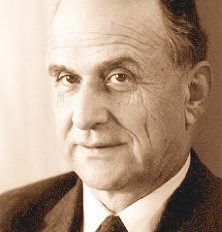

# Where we are

## Recap

Start with a toy model of a system that learns about the world. It has two parts:

1. A part that **perceives**.
2. A part that **processes** the information that perception delivers.

. . .

We noted that there are reasons to think that really good learning systems, like us, might either (a) have other features, or (b) have a not-so-sharp boundary between the two parts. Set those thoughts aside for now.

. . .

We also noted that it makes sense to split the processing part in turn in two, into **safe** and **risky** processing.

## Safe and Risky

There are terms that we use for each of these.

Deductive reasoning
:    Safe reasoning, where the truth of the inputs, the **premises**, guarantees the truth of the conclusion. The arguments that have this struture are called **valid**.

Inductive reasoning
:    Risky reasoning, where the truth of the inputs makes it **reasonable** to believe the conclusion, but does not quite guarantee it.

## Forms of risky processing

We also mentioned two kinds of risky processing, though note that this is **not** meant to be exhaustive.

Explanationist
:    We know some things, possibly by perception. There is only one sensible explanation of these things, so we infer that's true.

Enumerative induction
:    There is a pattern we've seen recur again and again. The evidence is that the first part of the pattern, so we expect the second part of the pattern to follow.

. . .

'Follow' here can be temporally follow, as when we infer from the rain that the streets will be wet. But it need not be, as when we infer from the rain that there are clouds in the sky.

## Subject and predicate

To make this talk more precise, it helps to have a little bit more terminology.

Simple sentences in English, and I think basically every other language, can be divided into a _subject_, who or what the sentence is about, and a _predicate_, which says something about the subject.

We're going to focus on simple subject-predicate sentences where the subject is a _name_, like 'Brian', or perhaps a demonstrative like 'That'.

In English, and again many other natural languages, names are capitalized, and predicates are not. And subjects typically come first.

## Subject and predicate

The most common kind of formal language used in philosophy (and many other fields), reverses all of this.

- Names are written in lower case. When there aren't many names, we just use single letters for them, like 'a'.
- Predicates are written as capital letters, again often single letters like 'F'.
- And predicates come first, so a simple sentence might be 'Fa'.
- If 'a' is a name for Alfred, and 'F' means 'is a frog', then 'Fa' means 'Alfred is a frog'.

## Enumerative Induction

The main reason I'm introducing all this is to make it easier to talk about a formal model for inductive learning.

1. I've seen lots of things that are _F_, in lots of places, and they've all been _G_.
2. _Fa_
3. Therefore, _Ga_.

## Two benefits of safe inference

When I did the safe/risky distinction last time, I mentioned two benefits of the safe inferences.

1. Because they are safe, they can be chained. Enumerative induction does sometimes go wrong, and if you chain enough of them, you're sure to run into the bad case.
2. We have ways of teaching computers to make the safe inferences. It's harder to teach them to make the risky ones.

. . .

Now point 2 might be intuitive when it comes to explanations; how do you train a computer to tell what explanation is sensible? (Perhaps, it turns out, you build an LLM.)

But doesn't enumerative induction look pretty _formal_? Computers can tell when you're using the same predicate over and over again.

# Grue

## Nelson Goodman

::: {layout="[40,60]"}

::: {}
{fig-alt="Photo of Nelson Goodman"}
:::

::: {}
Nelson Goodman, who spent most of his career at Harvard, showed that there was a puzzle about induction which turns out to complicate many theories about it.

I'm going to focus on the challenge it raises for how to automate inductive reasoning, but it raises many related problems.
:::

:::

## A new word

He starts by defining a new term: **grue**. 

Slightly updating Goodman's definition, say something is **grue** when it is examined before 10 December 2026 and is green, or is not examined before then and is blue.

That's a bit weird, but it makes sense I think.

## Every emerald you have ever heard of

Every emerald anyone has examined has been **green**. That looks like pretty good evidence that the next emerald that's examined will also be green.

. . .

Notice that every one of those emeralds is also **grue**. They were examined before 10 December 2026, and they were green, which is exactly what being grue requires of them.

The evidence for "the first emerald examined on 10 December 2026 will be green" and the evidence for "the first emerald examined on 10 December 2026 will be grue" is the same evidence. 

## Two hypotheses, one body of evidence

So take an emerald still in the ground, to be dug up next year. Call it Emmie.

Enumerative induction on 'green' suggests we have a compelling reason to believe Emmie is green, because all emeralds we've seen are green.

Enumerative induction on 'grue' suggests we have a compelling reason to believe Emmie is grue, and hence blue, because all emeralds we've seen are grue.

. . .

Your evidence supports both hypotheses equally well, and they disagree about what you will find.

## The riddle, stated

Our evidence isn't contradictory, so it can't support both _Emmie is green_ and _Emmie is blue_.

So which one does it support?

. . .

And why?

## Back to the argument

It's like the argument was really 

1. I've seen lots of things that are _F_, in lots of places, and they've all been _G_.
2. _Fa_
3. _F_ is one of the good predicates, like 'green', not one of the bad ones, like 'grue'.
4. Therefore, _Ga_.

. . .

But how do we know 3? How do we teach it to machines? And what does it even _mean_?

# Some ways

## "Grue is about time, and green isn't"

The natural complaint is that grue smuggles a date into its definition, and respectable predicates do not do that.

Goodman's reply is to define one more word. Something is **bleen** when it is examined before December and is blue, or is not examined before then and is green.

. . .

Now describe green using only grue and bleen. Something is green when it is examined before December and grue, or is not examined before then and bleen.

From inside the grue vocabulary, it is green that carries the date.

## "Grue is about time, and green isn't"

Also, if you put in rules against using time-sensitive predicates in induction, you're going to have a hard time learning when it is and isn't awful to find a parking spot around campus.

All the predicates you want to use there are about time.

## "Something more fundamental explains why it is green"

This is probably true.

. . .

But there are two problems.

1. Ancient people, who didn't know that colors aren't fundamental, still need a response to the argument.
2. Once you've seen the recipe for creating 'grue'-some predicates, you can run it for 'schmavity' (rather than 'gravity') or whatever is fundamental.

## "We think about green, grue is a philosopher's invention"

This has two complications.

1. It is surprising if our practices make induction rational, rather than the rationality of induction validating our practices.
2. Do we in fact think about green. As Ludwig Wittgenstein pointed out around the same time (in slightly different words), saying just how our word "green" means green rather than grue recreates the same problem.

## "Nobody actually talks that way"

That's true, but does it solve the problem?

Do conventions about language really settle what it is rational to believe? Maybe, but that would be really surprising? Are different conclusions justified for people speaking different languages?

. . .

This is close to Goodman's own answer. 'Green' is embedded in our practices, including our linguistic practices. People with different practices should do different things.

# The machine version

## Building better bots

A system that learns from examples faces this exactly. Show it a million green/grue emeralds and it still has to decide whether to expect green or grue emeralds going forward.

Nothing in the data picks one out. The choice comes from how the system was built. This is a processing choice which can't be made on the basis of data.

. . .

This is sometimes called inductive bias. Crucially it's a design decision. Goodman's puzzle shows why it has to be a design decision. You have to pick a language, either one with green or one with grue, before you start processing evidence.

## Building better bots

This is the other half of why building machines that do inductive learning is so much harder than building machines that do deductive reasoning.

Deductive arguments are language-neutral; if some reasons guarantee a conclusion, the translations of the reasons guarantee the translation of the conclusion.

Inductive arguments don't *look* like that. We have to pick a language for our machines. For better or worse, we seem to have picked _English_. That's a choice, and one that the grue puzzle shows may have consequences.

## Next week

We move from how to reason to when a belief is rational, starting with the case that looks easiest. You look out, and you simply see that something's true, and that's what you start with.

Whether that is as solid as it sounds is Tuesday's question.
