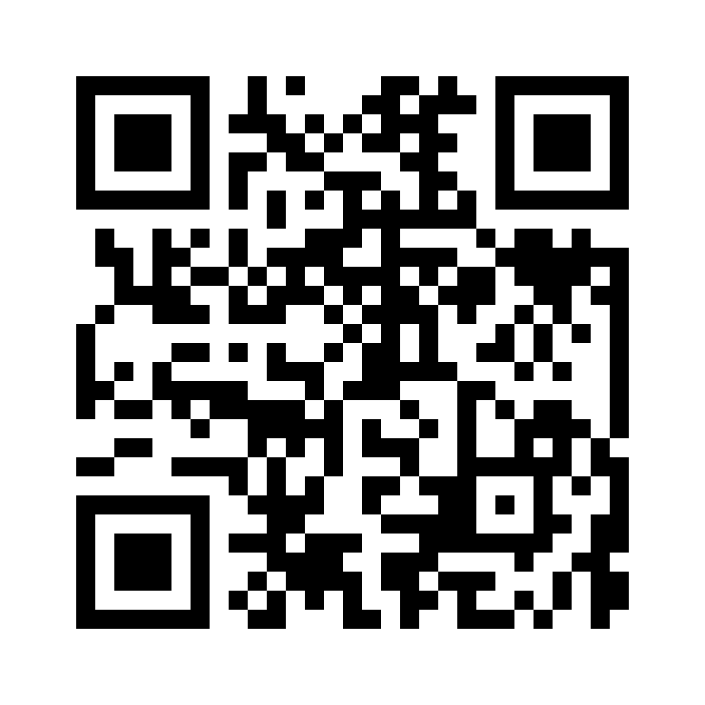

# Where we are

## Recap

We've been working through a list of candidate sources of knowledge.

- Perception looks like an obvious candidate, though it raises challenges about how you handle visual illusions.
- Memory raises two big questions: is it dependent on prior knowledge, and can we gain justification by forgetting the details?
- The next thing we'll consider is testimony, i.e., believing something because somebody told you.

## Still not on iClicker?

::: {layout="[40,60]"}

::: {}
{fig-alt="QR code linking to https://join.iclicker.com/XYGS, which adds Phil 101 to your iClicker account."}
:::

::: {}
Scan that, or go to [join.iclicker.com/XYGS](https://join.iclicker.com/XYGS).

Sign in with your umich.edu address, or your answers won't match the roster.

If it still won't work, see me or a GSI after class rather than hoping.
:::

:::

## POLL: Where did you learn it?

The Earth goes around the Sun. How do you know?

A.  I worked it out
B.  I observed it myself
C.  Somebody told me, either in person or in a book
D.  I have no idea how I know

. . .

We'll come back to the answers.

## Why that matters

I'm very sceptical of anyone who answered B!

. . .

For most facts in history, geography, science, etc, the main way you learn them is that somebody told you. (I'm using 'told' here to cover speaking and writing.)

. . .

Why is that a good way to get knowledge

# Reductionism

## Reductionism

Here's the view Datta is arguing against, and he says it's the one "with which everybody is familiar".

Testimony isn't a source of knowledge in its own right, rather it **reduces** to other familiar sources. What happens is:

1. You **perceive** some words.
2. You **infer** that they're true, because speakers of that kind, in situations of that kind, are usually right.

. . .

So testimony is perception plus inference.

## Advantages

- It's simple; we don't have to posit anything new.
- It avoids **gullibility**. The second step is doing some work at filtering out people we should not believe.

# Datta's first objection

## Observation

Datta's opening move is not about what we *should* do, but what we *actually* do.

. . .

:::: {.callout-note title="Datta, p. 354"}
Belief in one's statement does not wait to be established by inference. On the contrary we believe implicitly in the truth of what we hear, unless we have positive grounds for doubt or disbelief.
::::

## Montague agrees

Datta quotes a writer on the other side of the debate making the same observation.

:::: {.callout-note title="Montague, quoted by Datta"}
Man is a suggestible animal and tends to believe what is said to him unless he has some positive reason for doubting the honesty or competence of his informant.
::::

## Recent empirical evidence

If you present people with a bunch of statements while putting them under extra cognitive load, e.g., making them read some text while solving simple math problems, they believe much more of it.

This is true even if you do over the top things like having the text come on the screen in red, and saying at the start of the experiment **Everything in red is false**.

The conclusion some psychologists have drawn is that we accept what we're told *by default*, and have to do some work to not accept it.

## The reductionist retreats

This objection can be absorbed, and Datta says so himself. The reductionist can change the claim from a psychological one to a normative one.

. . .

Fine, people are suggestible and lazy, and believe without checking. But this is *bad*, it makes them *gullible*, so they **should not**.

We're not in a psych lab here; we're trying to give people good advice. And *believe everything you're told* is awful advice.

## Where that leaves us

Here's a better statement of what the reductionist can endorse:

> A belief from testimony only counts as knowledge once its truth has been ascertained some other way.

. . .

That sounds nice and not very gullible. 

. . .

Datta's reply is that it's *too* strict, and that it takes perception down with it.

## The diagnosis

Datta thinks the whole dispute rests on running together two different questions.

## Two questions

:::: {.callout-note title="Datta, p. 355"}
(1) How the content of a knowledge is obtained.

(2) How that content is ascertained to be true.
::::

. . .

The first is about **getting** a belief, the second about **checking** it; it's possible at least these are separate questions

## Examples of the difference

A stranger says the 5:15 bus is cancelled. 

You have the content instantly, and no idea whether to believe it.

. . .

Alternatively, imagine someone you trust hands you a sealed envelope and tells you *everything in here is true*.

The prior trust plus their assurance in effect does the checking before you even have the content.

## The glad friend

Datta uses this example. 

A friend tells you he's glad. You might work out, by inference, that since he's honest his statement is true.

. . .

But that inference doesn't tell you he's glad. It tells you his statement is reliable. Where the actual information came from is him.

. . .

So even when an inference does the checking, testimony did the **telling**.

## Datta's summary

:::: {.callout-note title="Datta, p. 355"}
It is clear then that the attempt to reduce testimony to inference is based on a confusion between the source of a knowledge and the source of the knowledge of the validity of that knowledge.
::::

# Perception and testimony

## Equal standards argument

Datta's best argument against the reductionist, I think, is that the reductionist doesn't consistently apply their own standards.

They hold testimony to a higher standard than they hold perception to.

Take this example: You see something in the distance and take it to be a man. You might doubt it. How would you check?

. . .

You could walk closer and look again. Or you could ask somebody who has been closer. In general, there is always the chance for a *checking* stage

## Is perception a source?

:::: {.callout-note title="Datta, p. 355"}
And if testimony ceases to be a source of knowledge because the truth of it has to be ascertained through inference, why should not even perception cease to be a source of knowledge?
::::

. . .

The rule proves too much. Apply it evenly and there are no sources left at all.

## Method

The structure of the argument is as useful to focus on here as the argument itself. Here's what he is saying.

1. The reductionist says that there is a reason to say that testimony is really something else, e.g., perception plus inference. The reason is that we check it.
2. We sometimes check perception too. So if that's a reason to say testimony is something else, it's just as good a reason to say perception is really something else.
3. But that's absurd! Perception is agreed on all sides to be a basic way of learning about the world.
4. So the reductionist's alleged reason must be no reason at all.

. . .

This is similar to the *reductio* reasoning we discussed in logic games; reject something because assuming it creates a crisis elsewhere.

# Is testimony independent?

## The second line of attack

Here's a second reason to think testimony is not an independent source, one that resembles our earlier discussion of memory.

1. When you tell me that *p*, I only gain knowledge if you already knew that *p*.
2. So, testimony cannot generate knowledge, it can only transfer it.
3. So, testimony shouldn't count as a basic source of knowledge.

## Datta's First Response

This is the wrong level of detail. 

The question isn't how some abstract thing *knowledge* can be generated, it's how *I* can gain knowledge.

So the step from line 2 to line 3 is bad; what matters is whether testimony can generate knowledge *for a particular person*, and that's possible even on the transfer model.

## Datta's Second Response

Outside of really toy cases, like looking straight at a cat and coming to believe there is a cat, all learning requires background.

:::: {.callout-note title="Datta, p. 357"}
What ordinarily appears to us to be a single piece of knowledge is not really a simple thing: it is a complex process, the different elements of which may be derived from different sources.
::::

## Datta's Second Response

In normal cases, we say that the source of the knowledge is the last step.

When you see a table, memory supplies the concept *table*. Perception supplies *this one, here*. We call the whole thing a perception, because the new bit came in through the eyes.

Even if cases of testimony require lots of background, it's fair to describe testimony as the source if it makes the last step.

## A Modern Response

Jennifer Lackey, a philosopher at Northwestern, has a famous case designed to question the basic premise of this transfer argument.

A high school teacher believes that creationism is true, but is committed to teaching the material that the students have to learn to pass their tests.

So she tells her students "Humans descended from other primates", and other more detailed claims about evolution.

## Lackey's Argument

1. The students can learn that humans descended from other primates in class.
2. If the students learn this, they learned it by testimony from their teacher.
3. But the teacher does not know this, she doesn't even believe it.
4. So, it's possible to come to know something on the basis of testimony from someone who doesn't know it.

# Easy checking

## Back to Datta's first argument

Datta started with a point about whether do in fact check.

He didn't lean too much on this, because he was worried, reasonably, that it was a purely descriptive claim, not a claim about what we *ought* to do.

But modern anti-reductionists, people who like Datta think that testimony is a basic source, have sometimes wanted to lean more on it.

## Ought implies can

Here's one way to put the argument:

1. Whatever we ought to do, we can do.
2. It's not just that we don't check everything we're told, we *could not* do this.
3. So it can't be a rational requirement to check everything we're told.

## Vigilance

There's a very interesting response to this out of some philosophers and psychologists based in Paris. The key figures here are Dan Sperber and Hugo Mercier.

They say, partially on the basis of armchair reasoning and partially on the basis of lab testing, that we can check everything as long as the checks are *really simple*.

## Vigilance

For lots of things, the optimal way to avoid disaster is a two step process.

1. Every time something comes in, you decide *Do I need to worry about this?*. This process should be really cheap, and you live with lots of false positives as long as you avoid false negatives.
2. If the answer ot the first question is yes, you spend resources checking it more thoroughly.

. . .

Their thought is that humans (and groups of humans) use this two-part method all the time in lots of settings, and it's a really good method to use.

. . .

If we check incoming testimony this way, perhaps that's checking enough to avoid the anti-reductionist argument.

# Going forward

## Thursday

In practice, the reductionist and the anti-reductionist often don't disagree.

- The reductionist says everyone gets very quickly checked, and then we worry about people who are a bit suspect.
- The anti-reductionist says that we believe people by default, but this can be overturned if we get reasons to doubt them.

. . .

Great - who is *a bit suspect* or who do we have *reasons to doubt*?

. . .

In particular, when someone purports to be **an expert** how do we run those checks? That's the question for Thursday.
