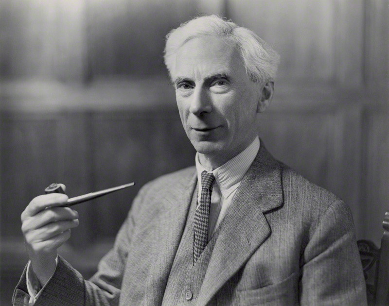
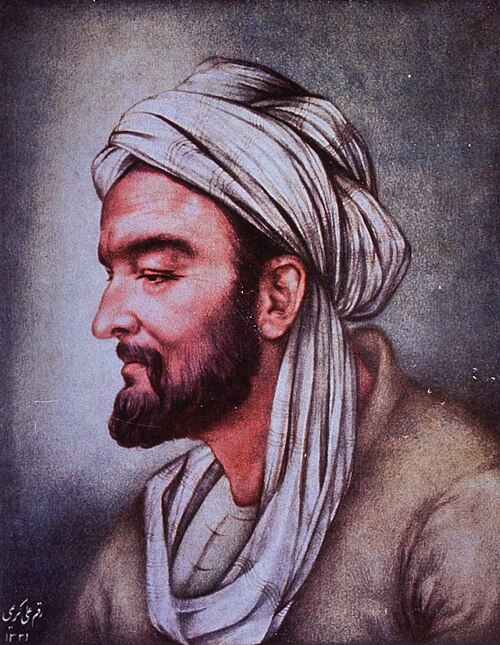

# Where we are

## Back to Perception

When I first discussed perception, I noted that it had a problem with illusions, like the checkershadow. And I flagged that one possible move was this:

> What's basic isn't *square A is darker than square B*, but rather *square A looks darker to me*.

. . .

And I noted the downside of that move was that it meant your starting points were inside your head, and you'd need to find a way out.

Today we return to that problem.

## Russell

::: {layout="[40, 60]"}

::: {}
{fig-alt="A portrait of Bertrand Russell."}
:::

::: {}
We're mostly going to be talking about Bertrand Russell, arguably the most important English language philosopher of the last 150 years, maybe more.

Officially Lord Russell, due to a title he inherited from his grandfather, who was Prime Minister in the 1830s.

Won the Nobel Prize for Literature in 1950.

Imprisoned for protesting WWI in 1916, and after that bounced between various academic and non-academic positions, including being hired at CUNY and then having the appointment terminated by courts.
:::

:::

## Russell

::: {layout="[40, 60]"}

::: {}
{fig-alt="A portrait of Ibn Sīnā."}
:::

::: {}
But we're going to start with a thought experiment from one of the most prominent figures in the golden age of Islamic philosophy, around the 10th and 11th centuries: Ibn Sīnā.

He was based in modern day Iran, and was primarily famous for his medical works, but he was also a massively important philosopher, and an essential part in the chain of influences between ancient Greek sources and medieval Europe.
:::

:::

## The flying man

Imagine a man created all at once, fully formed. His eyes are covered. He's suspended in the air, with nothing touching him, and his limbs are held apart so they don't even touch each other.

He perceives nothing at all.

**Would he know he exists?**

## The Flying Man

Ibn Sīnā says that he would. He'd affirm his own existence without affirming that he has a body, or any part of one.

. . .

The suggestion is that self-knowledge is in some ways prior to knowledge of the external world.

. . .

We'll come back to Ibn Sīnā when we look at what conclusions you can draw from this about what kind of thing the self might be, but for now I just want to introduce the idea that maybe knowledge does start with self-knowledge.

## Is anything certain?

:::: {.callout-note title="Russell, *The Problems of Philosophy*, ch. 1"}
Is there any knowledge in the world which is so certain that no reasonable man could doubt it?
::::

. . .

Russell's first candidate is the table he's sitting at. It looks oblong, brown and shiny. It feels smooth and cool and hard. Surely he knows that much.

## Color

Walk around the table and the color changes. The parts that reflect the light look much brighter than the rest. In the dark there's no color at all.

:::: {.callout-note title="Russell"}
But the other colours which appear under other conditions have just as good a right to be considered real; and therefore, to avoid favouritism, we are compelled to deny that, in itself, the table has any one particular colour.
::::

## Shape

We say the table is rectangular. But from almost anywhere you stand, it looks as if it has two acute angles and two obtuse ones.

:::: {.callout-note title="Russell"}
The 'real' shape is not what we see; it is something inferred from what we see.
::::

. . .

And texture goes the same way. The table looks smooth. Under a microscope it's all hills and valleys, and there's no obvious reason to prefer the initial impression to the microscope.

## Russell's vocabulary

:::: {.callout-note title="Russell"}
Let us give the name of 'sense-data' to the things that are immediately known in sensation: such things as colours, sounds, smells, hardnesses, roughnesses, and so on.
::::

Sensation
:    The experience of being immediately aware of something.

Sense-data
:    What you're immediately aware of: the colors, shapes and textures.

Physical object
:    The table, if there is one.

## The two questions

Once the table and what you see have come apart, Russell says two questions arise.

:::: {.callout-note title="Russell"}
(1) Is there a real table at all? 

(2) If so, what sort of object can it be?
::::

. . .

We'll come back to illusion in a second, but note that Russell here is really not stressing **illusion**. No one is tricked by the apparent angles of the table. He's stressing **apparent variation**.

# The argument from illusion

## Once more

::: {layout="[40,60]"}

::: {}
{fig-alt="A checkerboard with a cylinder casting a shadow, with squares A and B marked."}
:::

::: {}
On Day 3 this was evidence that perception and processing are separate systems. On Day 5 it was a problem for foundationalism.

Today it asks something new.

A and B are the same shade. A looks darker.
:::

:::

## A quick question (POLL)

A and B are the same shade. A looks darker.

**Is there anything here that is darker?**

A.  Yes, square A is darker
B.  Yes, something in my experience is darker, though neither square is
C.  No, nothing is darker. A merely looks darker.

. . .

Hold on to your answer. You have just voted on a premise.

## The first half

Russell's reasoning has been tidied up into what's called the **argument from illusion**. Here's the first half.

1. In an illusion, it seems to you that something is darker, although square A isn't darker than B.
2. Whenever it seems to you that something is darker, there really is something darker that you're directly aware of.
3. So in an illusion, what you're directly aware of isn't the square.

. . .

Premise 2 has a name, the **Phenomenal Principle**. Remember it; everything turns on it.

## The spreading step

That only covers illusions. The second half spreads the conclusion.

4. Illusions and ordinary perceptions can be exactly alike from the inside, so the same account should cover both.
5. So even when things go right, what you're directly aware of isn't the square.

. . .

Conclusion: you are never directly aware of ordinary objects. Only of sense-data.

# What it costs

## The veil

If all you're ever directly aware of is sense-data, then the world sits behind them, like a scene behind a curtain you can never lift.

. . .

Everything you believe about tables, people and planets becomes an inference from patches of color to their causes.

That's Day 5's cost in full. And, as we said then, the attempts to make that inference respectable have not been spectacular successes.

## Private objects

Your sense-data are yours. Nobody else can be aware of them.

. . .

So when the class and I look at the same table, we aren't sharing evidence. Each of us has our own private patches, and all we can compare is our reports about them.

That quietly turns *all* shared evidence into testimony about private objects, which is a strange place to have ended up after three weeks defending testimony.

## Strange objects

And what are these things?

The darker patch isn't on the board, where the two squares are the same shade. Is it in your head? Nothing in your head is that shade of grey either.

. . .

The sense-data theorist has answers. But it's fair to say the view buys certainty about what you're aware of by making what you're aware of very odd.

# Two ways out

## Reject premise 2

The argument's weak point is the Phenomenal Principle: the claim that if something *seems* darker, there must *be* something darker.

Two big rivals to the sense-data theory both deny it.

## Representation

On the first view, experience works like a description. Your experience **represents** square A as darker.

. . .

A false sentence saying A is darker doesn't need a darker thing to exist. It's just false.

Likewise an illusion doesn't need a darker object. It's an experience that gets things wrong. You're still aware of the square, misrepresented.

## Naive realism

On the second view, you're simply aware of the square itself, and **looking darker** is something the square does in that light, to a viewer like you.

. . .

Here's the neat part. Russell has already said it. The color, he wrote, is "something depending upon the table and the spectator and the way the light falls on the table."

A naive realist agrees, and concludes that looks are relations between the thing, the light and you. Which is exactly what the checkershadow is about: a cylinder, a shadow, and a square that looks how a square in shadow looks. Nothing there requires a private object.

## What you voted on

**B** is the Phenomenal Principle, premise 2. If something seems darker, then something darker is there.

Take B, and the argument runs, and you get sense-data.

. . .

**C** denies it, and that's where both of the rivals live. What they disagree with each other about is something else.

. . .

**A** is worth a moment too. The squares are the same shade, so A is false. That it still gets votes is the illusion working on this room in real time.

. . .

There's a fourth view we didn't put to a vote, on which there's no object of awareness at all, just a way of experiencing. It exists, and we're leaving it alone.

# Going forward

## Short Answer 2

Today is one of the three topics for Short Answer 2, which goes out a week from today.

The five moves it asks for line up with today almost exactly: state the view, give its best argument, give the most serious objection, give the reply, and say where you land.

## This week

- Module Quiz 1, on Lectures 1 to 9, is due on Sunday.
- Short Answer 1 is written in section next week.

## Tuesday

Today asked what experience is *of*.

. . .

Tuesday asks what it's *like*, starting with a bat.
