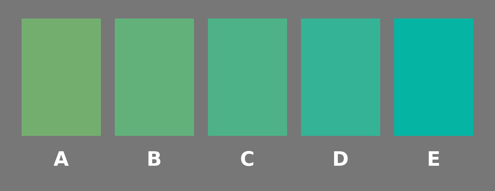

# Where we are

## Recap

Thursday we asked what experience is *of*.

- Russell's answer was **sense-data**: private objects you're immediately aware of.
- The obvious alternative is **worldly objects**: when you look at a cat, you're immediately aware of the cat.
- And there are other alternatives which say this is a false dichotomy, but let's stick with these two,

## A different question

Today look not at what your experience is *of*, but at what it is *like*.

. . .

And in the background, eventually the foreground, will be a question about how we know what the experience of other people, or other things, is like.

## Which one is pure green? (iClicker Poll)

{.nostretch fig-alt="Five green swatches, labelled A to E, running from a yellowish green to a blue-green, on a neutral grey background."}

By **pure green** I mean the one that is neither a bit yellowish nor a bit bluish, but just green.

**A, B, C, D, or E?**

. . .

Don't confer. This is a poll, and we might differ.

Also, if these all look the same color to you, pick one at random. In a group this size, it would be surprising if 100% of people can distinguish these.

## Phenomenal Variation

We could do more of these. How many of you find that coriander tastes like soap, or know someone for who this is true?

. . .

And this is just variation among members of a single species, in pretty similar environments. Across species, things are weirder.

. . .

"What Is It Like to Be a Bat?" is by Thoma Nagel, and American philosopher who has primarily worked at NYU. It came out in 1974 and is one of the most cited papers in modern philosophy. 

## The thing that makes consciousness hard

Nagel's complaint is that people writing on the mind-body problem keep making it look tractable, and that they manage this by leaving out the part that isn't.

:::: {.callout-note title="Nagel"}
Consciousness is what makes the mind-body problem really intractable.
::::

. . .

Remember, he's writing in 1974. Computers are becoming well established in military and industrial uses; they were central to the Apollo program. The idea that the mind might be some kind of computer is catching on, and making minds look intelligible.

## What Nagel means by consciousness

Crucially, by consciousness Nagel does not mean:

- Self-awareness, at least in the sense of having representations of oneself, like a car with a fuel gauge;
- The ability to make self-reports; or
- Intelligence, at least in a minimal sense.

:::: {.callout-note title="Nagel"}
[F]undamentally an organism has conscious mental states if and only if there is something that it is like to be that organism---something it is like *for* the organism.
::::

. . .

That last clause does all the work; from the inside, there is something it is like to be that thing.

## A trap in the English

"What is it like to be a bat?" sounds like a request for a comparison. *Oh, it's a bit like being a small dog with bad eyesight.*

. . .

That's not the question, and the grammar misleads here. The "like" isn't comparative.

The question is whether there is any way things seem from in there. In the evocative phrase that's become standard, it's about whether "the lights are on", and "somebody's home".

## Why bats

:::: {.callout-note title="Nagel"}
I have chosen bats instead of wasps or flounders because if one travels too far down the phylogenetic tree, people gradually shed their faith that there is experience there at all.
::::

. . .

Bats are mammals. It would be weird if they didn't have an inner life. And it would be weird if their inner life, like ours, was not tied up with their perceptual system. But their perceptual system is really really different to ours.

## Sonar

:::: {.callout-note title="Nagel"}
[B]at sonar, though clearly a form of perception, is not similar in its operation to any sense that we possess, and there is no reason to suppose that it is subjectively like anything we can experience or imagine.
::::

## iClicker QUIZ

Nagel says he picked bats rather than wasps or flounders. Why?

A.  Bats are mammals, so we're more confident there's experience there at all
B.  Bat sonar has been studied more carefully than insect senses
C.  Bats are more intelligent than wasps or flounders
D.  Bats are nocturnal, so their experience is more unlike ours

# Imagination

## Try it

Imagine you have webbing on your arms. Imagine you primarily eat by catching insects in your mouth. (Maybe less of a stretch for some of us.) Imagine you spend your day hanging upside down in an attic, and your night flying around in the dark.

. . .

:::: {.callout-note title="Nagel"}
In so far as I can imagine this (which is not very far), it tells me only what it would be like for *me* to behave as a bat behaves. But that is not the question. I want to know what it is like for a *bat* to be a bat.
::::

## Why the test fails

:::: {.callout-note title="Nagel"}
Our own experience provides the basic material for our imagination, whose range is therefore limited.
::::

. . .

Imagination tends to involve mixing and matching from perception. We have perceived horses, and perceived things with horns, so we can imagine horses with horns.

What's harder to do with imagination is start with different building blocks to perception, rather than just rearrange the blocks in a different way.

## It isn't really about bats

The bat is vivid, but the point is general, and it runs much closer to home.

The same problem arises between people. It's really dramatic for people with different sensory capacities, but it arises even in the statistically common parts of the population.

## Back to the swatches

You didn't agree. (I'm gambling here; as I note on the next couple of slides, this is based on some real studies.)

. . .

Why? Three natural options.

1. The angles of the room and the lighting mean you saw different thing, like Russell walking around the table.
2. You mean slightly different things by "yellowish" or "blueish".
3. Your experiences of the same swatch differ.

. . .

The first one a lab can control for, and when it does, the disagreement stays.

## How big the disagreement is

Pool the published studies and settings for pure green vary across people with ordinary colour vision by about **55 nm** of wavelength, which is a really large.^[If you want more details, see, "The distribution of unique green wavelengths", *Journal of Vision* (2013).]

To put that in context, for any one person, the gap between what they call pure green and what they call pure blue is not much more than 55nm.

. . .

It does seem this is a bigger range for green than other colors; if there's a good reason for that, I don't know it.

But it is a pretty resilient finding that there is a lot of variation in what we call pure green.

## Why?

We can do this under very controlled conditions, not a lecture theatre, and remove the problem of different shading, and the result remains.

Is this because:

1. People mean different things by their words; or
2. People have different experiences?

. . .

How could we possibly know? What would it even mean? This is a human level version of Nagel's problem.

# Objectivity

## Point of view

:::: {.callout-note title="Nagel"}
[E]very subjective phenomenon is essentially connected with a single point of view, and it seems inevitable that an objective, physical theory will abandon that point of view.
::::

This seems like a not bad statement of (a) what we mean by calling something subjective, and (b) the hope that the subjective views will get subsumed in a grander objective view. 

## The reversal

Normally, getting more objective gets you *closer* to how things really are. 

. . .

:::: {.callout-note title="Nagel"}
If the subjective character of experience is fully comprehensible only from one point of view, then any shift to greater objectivity---that is, less attachment to a specific viewpoint---does not take us nearer to the real nature of the phenomenon: it takes us farther away from it.
::::

## What physics does

Physics works by subtracting the point of view.

- We replace talk of seen color with wavelengths.
- We replace talk of felt warmth with mean kinetic energy.

. . .

These are good steps, we learn a lot by these replacements.

. . .

The trouble is that the thing we're trying to explain when we study consciousness is exactly the bit that keeps getting dropped.

## A quick question (POLL)

Suppose bat neuroscience is finished. Every neuron mapped, every process understood, nothing left over.

**Would we then know what it is like to be a bat?**

A.  Yes. There'd be nothing left to know.
B.  No, and that shows the physical story leaves something out.
C.  No, but only because we couldn't *imagine* it. Nothing is left out of the story.
D.  The question has no answer.

. . .

We'll come back to this on Thursday.

## What Nagel is not saying

:::: {.callout-note title="Nagel"}
It would be a mistake to conclude that physicalism must be false.
::::

By physicalism, he means the doctrine that the whole world is made up of physical things instantiating physical properties. (This used to be called **materialism** until physics told us that matter wasn't particularly fundamental.) 

Many philosophers have used arguments like Nagel's against physicalism.

. . .

Nagel's actual claim is weaker, and stranger. It's that we don't properly understand what physicalism is asserting, because *we do not at present have any conception of how it might be true*.

## Objective phenomenology

Nagel sketches a rather ambitious, optimistic, way forward; he envisages a way of describing experience that doesn't depend on being able to have it.

:::: {.callout-note title="Nagel"}
[A] phenomenology that is in this sense objective may permit questions about the physical basis of experience to assume a more intelligible form.
::::

. . .

He does not say how to build one. I'm not sure anyone else has done better.

## Thought and feeling

Nothing in the bat argument said bats are clever. 

Nothing said they reason, or plan, or have concepts. 

The argument works whether or not any of that is true.

. . .

All it needed was that there's something it is like to be one.

## Two different things

Thinking
:    Whatever it is we do with our observations of the world, and with combinations of them, e.g., reasoning, planning, inferring. Humans think; thermostats don't.

Consciousness
:    There being something it is like, for the thing itself. There is something it is like to be human; nothing it is like to be a thermostat.

## Thinking and Feeling

Ordinary speech runs those two notions together, and so does a lot of the current argument about machines. 

*Does it really think?* and *is there anything it's like to be it?* get asked as though they were the same question.

. . .

They're really not. Maybe it will turn out as a matter of fact that there is something it is like to be something if and only if that thing thinks. But that's a bold claim that needs argument. We'll come back to it.

# Going forward

## This week

- Short Answer 1 is written in section this week.
- Short Answer 2 goes out on Friday, on Lectures 10 to 12.

## Thursday

Nagel says we can't see how a physical story could capture what experience is like.

. . .

Thursday we look at an argument that tries to turn that into a proof: not just that we can't see how physicalism could be true, but that it isn't.

The case is a scientist who knows everything there is to know about colour vision, and has never seen a colour.
