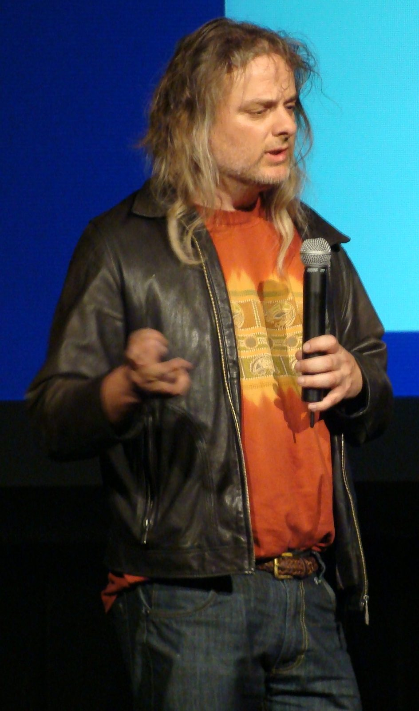
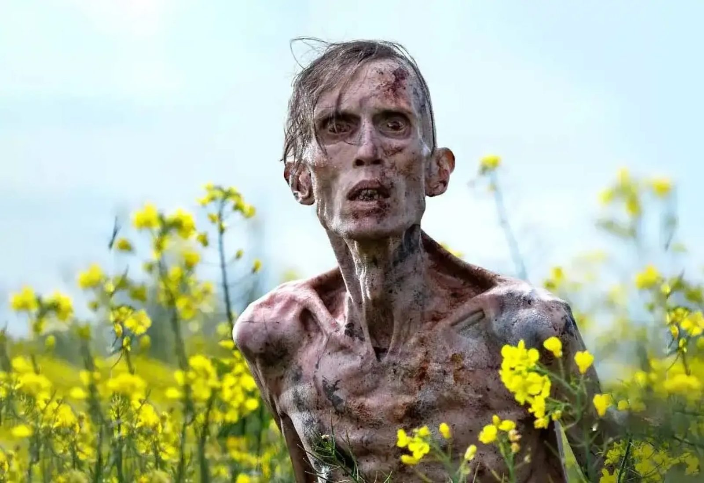
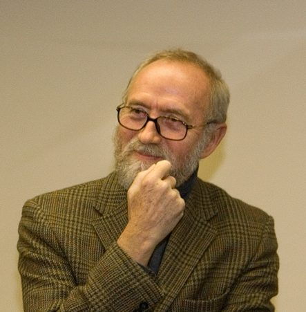

# Where we are

## Recap

On Tuesday we tried to imagine being bats.

- There's something it is like to be a bat, there is something there to imagine.
- But we can't imagine it.
- The usual scientific trick, _be objective_, seems to make things worse.

. . .

Nagel himself concluded not that physicalism is false, but that we can't see how it *could* be true.

## Today

We'll look at two Australian philosophers who have tried to turn that puzzle into an argument that physicalism is true.

We'll do things out of order, starting with the younger of the two philosophers, and we'll primarily look a distinction he draws between two problems about the mind.

Then we'll look at a slightly older philosopher, who presented, almost in passing, a thought experiment that turned Nagel's worry into a full-blown argument against physicalism.

# The hard problem

## David Chalmers

::: {layout="[50, 50]"}

::: {}
{fig-alt="A portrait of David Chalmers."}

. . .
:::

::: {}
{fig-alt="A movie zombie."}
:::

:::

## Easy and Hard Problems

David Chalmers, in the mid-1990s, came up with a useful label for the problem Nagel was getting at.

In philosophy of mind, the **easy problems** are the ones about what the brain *does*. These problems include:

- How it tells stimuli apart, 
- How it integrates information, 
- How it reports on its own states, 
- How it focuses attention, 
- How it controls behavior.

. . .

"Easy" is relative. These are massive, massive problems, and especially for the last two, we're a *long* way from getting the answer. But it feels like going objective is the right way to go, and we're making progress.

## The hard problem

The **hard problem** is why any of that should be accompanied by experience at all.

. . .

Cameras and microphones and LIDARs take in information without having any experience. (I'm extremely confident of that, but remember knowledge here is hard.)

. . .

Some cars, most successfully I guess those that Waymo builds, integrate that information and use it to control behavior. But they're still not conscious. (I'm also confident of that, though I'm not sure what I'd say to someone who wasn't.)

. . .

We can imagine, says Chalmers, a **zombie** version of one of us that is exactly alike us on the outside *and the inside*, but which has no conscious experience.

. . .

Why aren't we zombies?

## Why these labels

They give you a clue to when someone is switching problems.

If somebody explains how the brain distinguishes red light from green light and offers that as an explanation of colour experience, they have solved an easy problem and reported it as the hard one.

# Physicalism

## The thesis

:::: {.callout-note title="Kıymaz"}
[P]hysicalism is the view that mental states, like beliefs, feelings and desires, are nothing over and above the physical states of the brain: we don't have souls or any non-physical features, and so all facts about our minds are, at bottom, physical facts.
::::

This is false if there are any facts that are not physical facts.

## Frank Jackson

::: {layout="[50, 50]"}

::: {}
{fig-alt="A portrait of Frank Jackson."}

. . .
:::

::: {}
Frank Jackson has made contributions to just about every field of philosophy you will come across.

But his most famous contribution, I believe the most cited paper written by an Australian academic, concerned an argument against physicalism and for dualism.
:::

:::

# Mary

## The room

:::: {.callout-note title="Jackson"}
Mary is confined to a black-and-white room, is educated through black-and-white books and through lectures relayed on black-and-white television.
::::

In there she becomes the world's leading expert on the physics and neuroscience of colour vision. 

She learns about wavelengths, cone cells, opponent processing, everything you might care about. (If you don't know what the terms in that sentence mean, they are worth looking up, because color vision is really fascinating, but I'm not the best person to explain them.)

. . .

She knows every physical fact there is about what happens when somebody looks at a ripe tomato.

## The release

Then somebody opens the door.

. . .

She sees a tomato.

. . .

**Does she learn anything?**

## A question (POLL)

When Mary comes out and sees red for the first time, she

A.  learns a new fact she didn't know before
B.  learns no new fact, but gains a new ability
C.  learns no new fact, but comes to know an old fact in a new way
D.  learns nothing at all

. . .

Those four answers are the four positions in the literature, and we're going to take them in that order. 

## The argument

Jackson's own statement of it, from the 1986 paper:

:::: {.callout-note title="Jackson"}
(1) Mary (before her release) knows everything physical there is to know about other people.

(2) Mary (before her release) does not know everything there is to know about other people (because she learns something about them on her release).

Therefore,

(3) There are truths about other people (and herself) which escape the physicalist story.
::::

## iClicker QUIZ

In that argument, which line is true simply because of the way the case was described?

A.  Line (1)
B.  Line (2)
C.  Line (3)
D.  Neither premise; both need defending

## Testing the Argument

OK, that looks valid. If she knew every physical fact, and not all the facts, some fact is non-physical.

The first premise is true by stipulation.

. . .

So everything rests on the second premise. 

And the second premise has exactly one thing holding it up: the sense that of course she learns something.

# Four Responses

## A. She learns a new fact

Take the argument at face value and physicalism is false. 

There are truths about experience that no amount of physics can teach you, only experience.

This was Jackson's own position in 1982 and 1986.

:::: {.callout-note title="Jackson"}
My claim is that the knowledge argument is a valid argument from highly plausible, though admittedly not demonstrable, premises to the conclusion that physicalism is false.
::::

## B. The ability hypothesis

:::: {.callout-note title="Kıymaz"}
Mary does learn something when she sees red, however, what she learns is not a new *fact*, but it is *know-how*; she just acquires new cognitive abilities.
::::

What Mary picks up is the ability to recognise, imagine and remember the experience. She can now imagine what other people are experiencing when they see a red thing.

## Why that would help

Knowing how to ride a bicycle isn't just a set of facts about bicycles. 

You can do really well on physics exams about balance, and still fall off.

. . .

If what Mary gains is know-how, like knowing how to balance, especially if that's tied closely to the ability to balance, premise (2) is false. 

She knew all the facts. She just lacked an ability.

## Jackson's reply

He says this misdescribes what Mary is doing when she comes out.

:::: {.callout-note title="Jackson"}
What is immediately to the point is not the kind, manner, or type of knowledge Mary has, but what she knows.
::::

. . .

His test case: Mary comes out, and wonders whether other people's experience of red is like hers. 

That's a question about how things are with other people. It isn't a question about what she can now do.

## C. Phenomenal concepts

:::: {.callout-note title="Kıymaz"}
[W]hat Mary learns upon seeing red is not a new truth, but a new way of apprehending a physical truth that she already knew.
::::

. . .

This is tricky. The idea is that sometimes we can learn old facts under new descriptions. Like could someone know 1, but not recognise that 2 is a presentation of the same fact?

1. John is an unmarried man.
2. John is a bachelor

. . .

Maybe what Mary learns is like the person who 'learns' John is a bachelor.

## The cost of phenomenal concepts

This is the most popular physicalist response, but it has some downsides.

What exactly is the equivalent of 'bachelor' in this little analogy? (Assuming that new presentation not new fact is the right way to handle the bachelor csae.)

. . .

Kıymaz flags this as the open problem for the view, and it's fair to say it's still open.

## D. She learns nothing at all

The remaining option is to reject the intuition outright.

The argument here is to stress how little we know about what it would like to be Mary. Who knows what it is like to know **all** these facts.

## Where the poll landed

**A** is Jackson's own view in 1986. 

**B** says what she gains isn't knowledge of a fact at all. 

**C** says she gains a new grip on a fact she already knew. 

**D** says the case was never coherent enough to have an answer.

. . .

All of these are widely held positions, and many of them have sub-divisions.

## The twist

Jackson changed his mind, and decided the argument didn't really prove physicalism.

. . .

I've never felt like I completely understood the reasons for his change of heart, but probably part of it was the fact that on his earlier view, experiences are these really important things that are central to our lived reality ... and they are causally inert. That's weird, maybe too weird.

# Zombies

## Back to Chalmers

A **philosophical zombie** is a thing physically identical to you, atom for atom, in a world with the same physical laws, which has no experience at all. Nothing going on inside.

. . .

It still says "oh, that looks beautiful", because saying that is a physical event with physical causes, and every physical cause is present. But it doesn't experience beauty in any sense.

## What the case is for

Nobody thinks zombies exist. 

The claim is only that they might. And if they might exist, then the physical facts don't settle all the facts, because they physical facts could have been exactly the same, while some of us were zombies.

## Connecting back

Remember Tuesday's distinction between thinking and there being something it is like.

A zombie very plausibly thinks, but doesn't feel; there is nothing it is like to be a zombie.

. . .

On Tuesday, we'll look more generally at arguments that use this kind of reasoning to argue that minds are not actually physical.

# Going forward

## Short Answer 2

Out after class today, due Friday 23 October.

## Tuesday

We now have two arguments that something is missing from the physical story.

. . .

Tuesday we ask what the missing thing might be, and take seriously the view that it feels like some of these arguments are pushing towards: minds simply aren't physical.

We'll go back to Ibn Sīnā's flying man, and then on to Descartes.
