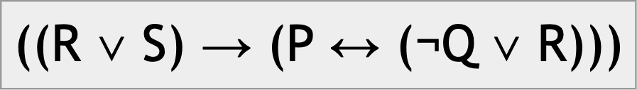
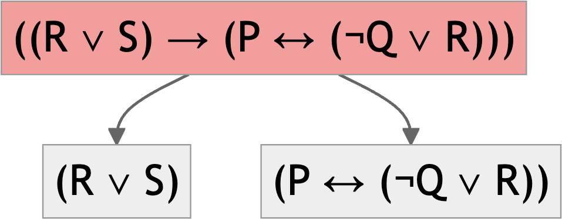
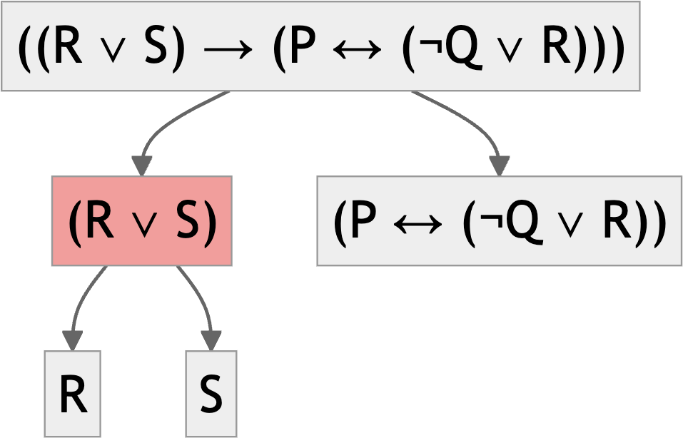
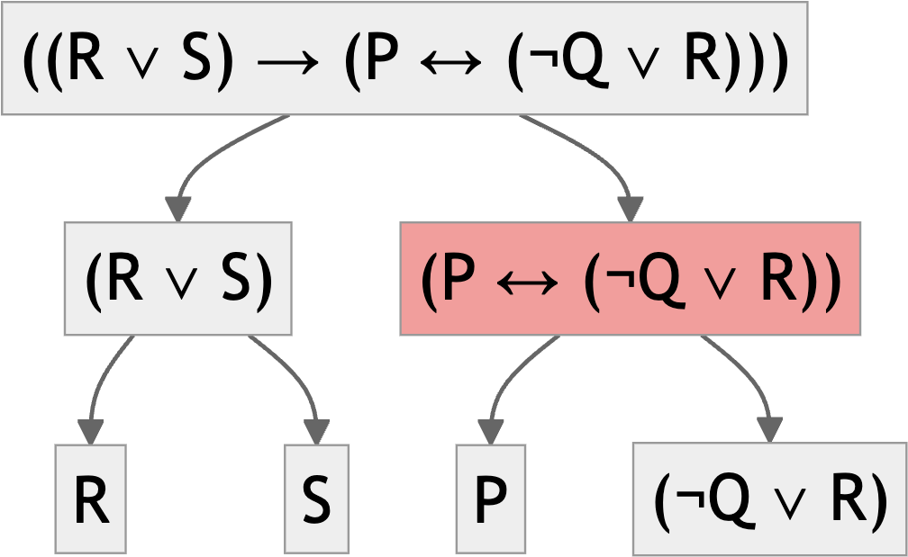
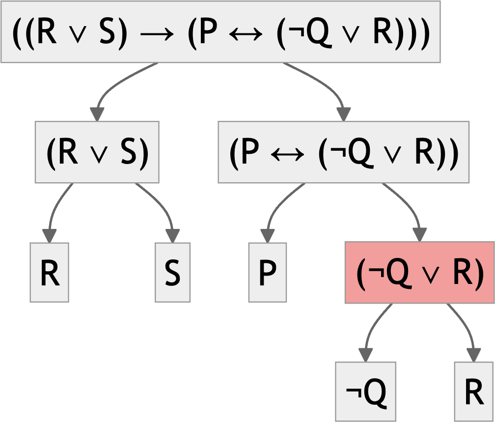
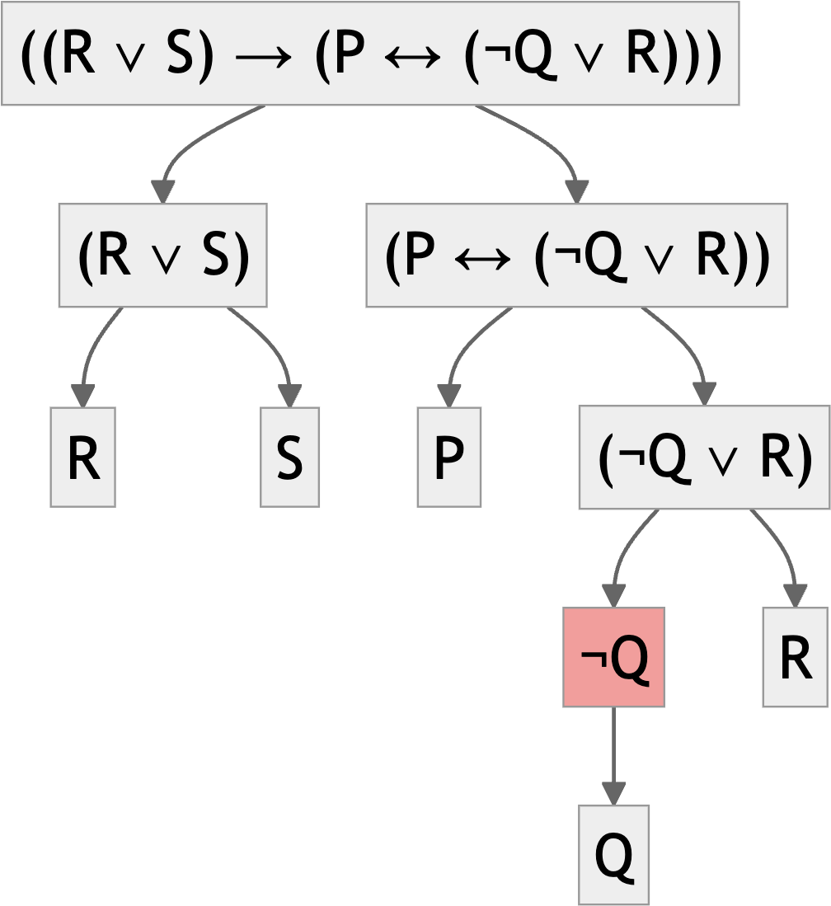

# Argument Forms

## Overview

We're going to get a little clearer on the notions of 'form' and 'structure' from last time.

### Associated Reading

forall x, chapter 4, "First Steps to Symbolization".

## Definition

An argument is valid when

- The truth of the premises guarantees the truth of the conclusion.
- Equivalently, when it is impossible for the premises to be true and the conclusion not true.

## Formal Validity

An argument is formally valid if

- It is valid; and
- Any argument of the same form is valid.

In those cases, we infer that it is valid **because of** its form.

## Three Big Questions About Form

::: {.incremental}

1. Which words get treated as part of the form, and which get replaced by symbols when converting into formal notation?
2. Which words have the same meaning and should be replaced by the same symbol, and which should be treated differently?
3. How do we break the sentence into its constituent parts?
:::

## Part of the Form

I'm going to have a fairly pluralist, pragmatist view on this question.

- This is not to say that pluralism or pragmatism is right - it's just that it's what I'll adopt. (It is to say that I think it's a reasonable approach.)
- For some purposes the 'formal words' are very few, like 'and', 'or', 'not' etc.
- For other purposes the set is more expansive.

## Part of the Form

- If you are studying the logic of causation, you might want to say that 'caused' is a formal word.
- And that would mean any two arguments that have this structure are of the same form.

&nbsp;
:    A caused B.

&nbsp;
:    B caused C.

$\therefore$
:    A caused C.

## Part of the Form

- But for other purposes, 'caused' is just another binary relation between events.
- So those arguments will have the same form as these ones.

&nbsp;
:    A happened near B.

&nbsp;
:    B happened near C.

$\therefore$
:    A happened near C.

## Part of the Form

- What I mean by having a 'pluralist, pragmatist' view about form is that there is no objectively correct answer about whether these are the same form or not.
- For some purposes it will be helpful to treat them as having the same form.
- For other purposes it will not be.
- We're going to start with a notion of form where lots and lots of things have the same form, so very few arguments are valid in virtue of form.

## Three Big Questions About Form

1. Which words get treated as part of the form, and which get replaced by symbols when converting into formal notation?
2. **Which words have the same meaning and should be replaced by the same symbol, and which should be treated differently?**
3. How do we break the sentence into its constituent parts?

## Same/Different

There are problems in both directions here.

- Sometimes we want to treat words with different spelling as representing the same meaning - e.g., 'kangaroo' and 'kangaroos'.
- And sometimes we want to treat words with the same spelling as expressing different meanings.

## Ambiguous Words

In a minute or so, try to come up with some words in English that should be symbolised differently even though they have the same spelling.

- Feel free to chat amongst yourselves.
- After a minute, we'll come up with a list.

## Word Ambiguity and Sentence Ambiguity

Sentences with ambiguous words are usually ambiguous.

But surprisingly, the reverse isn't always true.

Some ambiguous sentences don't rely on ambiguity in the words.

## Relating the First Two Questions

Some kinds of ambiguity are 'resolved' by treating the word as part of the formal system. Consider two possible interpretations of this sentence.

- Nothing is better than world peace.
 
What are the two interpretations of it?

## "Nothing is better than world peace"

::: {.incremental}

1. There is no thing such that it is better than world peace.
2. It is better that there is nothing than that there is world peace.

:::

## Alice

The _Alice in Wonderland_ books are full of this kind of wordplay.

> **Alice**: "I see nobody on the road."    
> **King**: "I only wish I had such eyes. To be able to see Nobody! And at that distance too!"

The King's weird interpretation of Alice attributes the wrong form to her utterance.

## Chomsky

Think about this sentence, which I'm afraid will be all to true for some of you after the break.

> Visiting relatives can be boring.

What are the two interpretations?

. . .

I won't do a show of hands, but I suspect that some of you will have been evidence for each of the readings. (Though I'd be surprised if any of you was evidence for both readings in one break.)

## Ambiguity and Form

- If you include words like 'nothing' and 'nobody' as formal words, then the two readings of the World Peace sentence will have different formal representations.
- And the logic called 'predicate logic' does exactly that; it treats 'nothing' as one of the formal words.
- We're not covering that in this course, though some of you have covered it elsewhere.
- Some more expansive accounts of what should be a formal word are moved by the thought that treating more words as formal removes some possible ambiguities.

## Small Group Activity

- Come up with some examples of ambiguous sentences.
- Ideally, these will be ambiguous sentences that don't have an ambiguous word.
- After a couple of minutes we'll discuss these as a group.

## Three Big Questions About Form

1. Which words get treated as part of the form, and which get replaced by symbols when converting into formal notation?
2. Which words have the same meaning and should be replaced by the same symbol, and which should be treated differently?
3. **How do we break the sentence into its constituent parts?**

## Three Formal Tools

::: {.incremental}

1. Replacing words/sentences with letters.
2. Using parentheses.
3. Replacing 'formal words' with symbols.

:::

# Formal Tools

## Overview

We're going to look at how to translate English sentences into a form where we can use the tools of propositional logic on them.

## Associated Reading

forall x, chapter 5, "Connectives"

## Aside

The book goes into more detail than I'm going into here about the range of English sentences that can be translated (or at least symbolized) using the tools of propositional logic.

## Sentence Letters

- We use letters, usually starting with $p$ and then continuing through the alphabet, for 'atomic' sentences. 
- forall x uses capital letters, others use lowercase. This is a matter of taste.

## Symbols

- "and" is represented by $\wedge$
- "or" is represented by $\vee$
- "not" is represented by $\neg$
- "if" is represented by $\rightarrow$
- "if and only if" is represented by $\leftrightarrow$

## An Easy Example

> It will rain on Monday or it will rain on Tuesday

Basic Sentences

- $M$ = It will rain on Monday
- $T$ = It will rain on Tuesday

Translation

- $M \vee T$

## Another Easy Example

> It will rain on Monday and it will rain on Tuesday

Basic Sentences

- $M$ = It will rain on Monday
- $T$ = It will rain on Tuesday

Translation

- $M \wedge T$

## Only Slightly Harder Example

> If it rains on Monday, it will rain on Tuesday

Basic Sentences

- $M$ = It will rain on Monday
- $T$ = It will rain on Tuesday

Translation

- $M \rightarrow T$

## And A Bit Harder Again

> It will rain on Monday, but it won't rain on Tuesday

Basic Sentences

- $M$ = It will rain on Monday
- $T$ = It will rain on Tuesday

Translation

- $M \wedge \neg T$

## Small Group Exercises

Do translations for as many of these as you get time for. We won't get through them all, but I wanted to make sure you didn't run out of questions!

1. Either it will snow or it will rain, but not both.
2. If it's sunny, we'll go to the beach and have a picnic.
3. We'll leave unless it rains.
4. You'll pass if you study, and you'll fail if you don't.
5. "If it rains on Monday and Tuesday, then the game will be postponed.
6. Either it will rain on Monday and Tuesday, or it will be sunny on Wednesday.
7. It will rain on Monday or Tuesday, but not on both days.
8. If either Alice or Bob comes to the party, then if Carol comes, David won't come.

## Parentheses

- As in math, these tell you what order to compute things in.
- They let you avoid the ambiguity in the following sentence.

- It will rain on Monday and it will rain on Tuesday or it will rain on Wednesday.

## Two Translations

Basic Sentences

- $M$ = It will rain on Monday
- $T$ = It will rain on Tuesday
- $W$ = It will rain on Wednesday

Translations

1. $(M \wedge T) \vee W$
2. $M \wedge (T \vee W)$

## What's the Difference?

1. $(M \wedge T) \vee W$
2. $M \wedge (T \vee W)$

What is a situation where one of these is true but not the other?

::: {.incremental}
- If it only rains on Wednesday, then 1 is true but 2 is false.
- **Are there any others?**
:::

# Recursion

## Overview

We're going to look at how and why we can iterate the translation procedures we've been investigating.

### Associated Reading

forall x, chapter 6, "Sentences of TFL"

## Recursion

The language of propositional logic has some fairly simple composition rules.

- It says what the basic sentences are.
- It has some rules saying that if some things are sentences, so are some other things.

The effect is that there are an infinity of possible sentences.

## Natural Language Recursion

As speakers of a human language, you're used to this kind of recursion. All of these are sentences.

::: {.incremental}
- It will rain.
- Alex thinks that it will rain.
- Kim thinks that Alex thinks that it will rain.
- Alex thinks that Kim thinks that Alex thinks that it will rain.
- And so on, to infinity, without adding any more words.
:::

## Recursive Rule

 - If $S$ is a sentence, and $N$ is a name, then $N$ _thinks that_ $S$ is a sentence.
 - Note that the output of this rule can be the input to a new instance of it.

## Other Examples

**Can you think of other recursive patterns in English? That is, what other structures are there where you can keep embedding things infinitely?**

Bonus question (which I only learned about last week): Can you think of a structure that works in English but *not* most other natural languages?
 
## Formal Language Recursion

The letters $P, Q, R$, etc. are sentences.

If $S$ and $T$ are sentences, then so are:

1. $\neg S$
2. $S \vee T$
3. $S \wedge T$
4. $S \rightarrow T$
5. $S \leftrightarrow T$

## Multiple Steps

So these are all sentences. (Note that I'm playing fast and loose with parentheses here.)

1. $P$
2. $Q$
3. $P \wedge Q$
4. $Q \rightarrow (P \wedge Q)$
5. $\neg P$
6. $Q \vee \neg P$
7. $(Q \rightarrow (P \wedge Q)) \leftrightarrow (Q \vee \neg P)$

The last one follows from the fact that 4 and 6 are sentences.

## Main Connective

For any sentence you can make, there will be a 'last step' in the demonstration that it is a sentence.

- That last step will involve copying down 1 or 2 other sentences, and adding a connective.
- On the previous slide, you copy down 4 and 6, and put a $\leftrightarrow$ between them.
- That connective you add is the **main connective** of the sentence.
- It covers all the material in the sentence.

## Main Connective

A binary connective is the main connective if (and only if) either side of it are two complete sentences.

- $P \wedge (Q \rightarrow R)$

The $\wedge$ is the main connective because either side of it are

- $P$
- $(Q \rightarrow R)$

And they are both sentences.

## Main Connective

A binary connective is the main connective if (and only if) either side of it are two complete sentences.

- $P \wedge (Q \rightarrow R)$

The $\rightarrow$ is not the main connective because either side of it are

- $P \wedge (Q$
- $R)$

And they are not both sentences.

## Examples

What are the main connectives for these sentences?

::: {.incremental}
1. $(P \wedge Q) \vee R$
2. $P \rightarrow (Q \wedge R)$
3. $\neg P \vee (Q \rightarrow R)$
4. $(P \vee Q) \rightarrow (R \wedge S)$
5. $(P \wedge Q) \vee (R \rightarrow S)$
6. $\neg(P \rightarrow Q) \leftrightarrow (R \vee S)$
:::


## A Worked Example

{fig-alt="A tree showing how a sentence is broken down into parts" fig-align="center" height=90}

```{mermaid}
%%{init: {'theme':'neutral', 'themeVariables': {'fontSize':'30px'}}}%%
graph TD
    %%A["((R ∨ S) → (P ↔ (¬Q ∨ R)))"]
    %%B["(R ∨ S)"]
    %%C["(P ↔ (¬Q ∨ R))"]
    %%D["R"]
    %%E["S"]
    %%F["P"]
    %%G["(¬Q ∨ R)"]
    %%H["¬Q"]
    %%I["R"]
    %%J["Q"]
    
    %%A --> B
    %%A --> C
    %%B --> D
    %%B --> E
    %%C --> F
    %%C --> G
    %%G --> H
    %%G --> I
    %%H --> J

   %%style A fill:#ff9999
```

## A Worked Example

{fig-alt="A tree showing how a sentence is broken down into parts" fig-align="center" height=262}

## A Worked Example

{fig-alt="A tree showing how a sentence is broken down into parts" fig-align="center" height=430}

## A Worked Example

{fig-alt="A tree showing how a sentence is broken down into parts" fig-align="center"  height=430}

## A Worked Example

{fig-alt="A tree showing how a sentence is broken down into parts" fig-align="center" height=601}

---

{fig-alt="A tree showing how a sentence is broken down into parts" fig-align="center" height=770}

## For Next Time

- We are going to start on how these connectives help us figure out the truth value of longer sentences.
- And we're going to use that to analyse arguments.