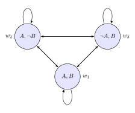
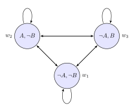
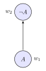
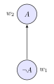
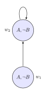
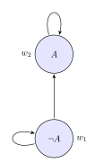
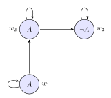
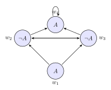
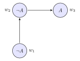

# Truth on Models

## Overview

In this section we'll work through how to determine truth values for modal sentences at particular worlds in a model.

### Associated Reading

- Boxes and Diamonds, sections 3.4-4.5

## Models: A Reminder

As we saw last time, models have three parts:

::: {.incremental}
1. A set of worlds, typically called $W$.
2. A binary accessibility relation on those worlds, typically called $R$.
3. A valuation function on those worlds, typically called $V$.
:::

. . .

We write models as $\langle W, R, V\rangle$.

## Valuations

$V$ is a function from atomic sentence letters to subsets of $W$.

::: {.incremental}
- It tells you which worlds the atomic sentences are true at.
- When an atomic sentence is not true at a world, it is false there.
:::

## Truth at a Point

The general theory of truth is built up in stages from the basic theory. Assume we have a model $\langle W, R, V\rangle$, and a point $w \in W$, and are asking whether an arbitrary sentence is true at $w$ in $\langle W, R, V\rangle$.

## Truth Rules for Propositional Connectives

::: {.incremental}
- $p$ is true at $w$ iff $w \in V(p)$.
- $\neg A$ is true at $w$ iff $A$ is not true at $w$.
- $A \wedge B$ is true at $w$ iff both $A$ is true at $w$ and $B$ is true at $w$.
- $A \vee B$ is true at $w$ iff either $A$ is true at $w$ or $B$ is true at $w$.
- $A \rightarrow B$ is true at $w$ iff either $A$ is false at $w$ or $B$ is true at $w$.
:::

. . .

This just leaves the modal formulas. I'll set out the rules, then do some worked examples.

## Necessary Truth at a Point

First we'll do $\Box A$.

::: {.incremental}
- I'll read this as "Box $A$".
- Intuitively, it means **it must be that A**, where **must** could be metaphysical necessity, epistemic necessity, moral necessity, or anything else.
- And it is true at $w$ just in case $A$ is true at every world $y$ such that $wRy$.
:::

. . .

**Necessary truth is truth at all accessible worlds.**

## Possible Truth at a Point

Now we'll do $\Diamond A$.

::: {.incremental}
- I'll read this as "Diamond $A$".
- Intuitively, it means **it might be that A**, where **might** could be metaphysical possibility, epistemic possibility, moral possibility, or anything else.
- And it is true at $w$ just in case $A$ is true at some world $y$ such that $wRy$.
:::

. . .

**Possible truth is truth at some accessible world.**

## Iterated Modalities

We can run these rules in sequence.

. . .

What does it take for $\Box \Box A$ to be true at $w$?

::: {.incremental}
- It is for $\Box A$ to be true at every $y$ such that $wRy$.
- And that means that $A$ has to be true at every world $z$ such that $yRz$ (for any $y$ such that $wRy$).
:::

## The Step Metaphor

We can think, a little picturesquely, of the accessibility relation as a "step" between worlds.

::: {.incremental}
- If $wRy$, then you can "step" from $w$ to $y$.
- $\Box A$ means that anywhere you can step to from $w$ is a world where $A$ is true.
- $\Box \Box A$ means that anywhere you can get to in two steps from $w$ is a world where $A$ is true.
:::

## Iterated Possibility

We can also iterate diamonds.

. . .

What does it take for $\Diamond \Diamond A$ to be true at $w$?

::: {.incremental}
- It is for $\Diamond A$ to be true at some $y$ such that $wRy$.
- And that means that $A$ has to be true at some world $z$ such that $yRz$ (for some $y$ such that $wRy$).
- In the picturesque terms, you can get from $w$ to an $A$-world in two steps.
:::

## Mixed Modalities: $\Diamond \Box A$

What does it mean for $\Diamond \Box A$ to be true at $w$?

::: {.incremental}
- There is some accessible world where $\Box A$ is true.
- That is, there is some accessible world such that everywhere you can go from there, $A$ is true.
:::

## Mixed Modalities: $\Box \Diamond A$

What does it mean for $\Box \Diamond A$ to be true at $w$?

::: {.incremental}
- At all accessible worlds, $\Diamond A$ is true.
- That is, wherever you go, you can get to some accessible world where $A$ is true.
:::

## Longer Sentences

What does it mean for $\Box(p \vee (q \rightarrow \Diamond r))$ to be true at $w$?

::: {.incremental}
- It's for $p \vee (q \rightarrow \Diamond r)$ to be true everywhere you can get to (in one step) from $w$.
- That is, at every one of those worlds, either $p$ is true or $q \rightarrow \Diamond r$ is true.
- That is, at every one of those worlds, either $p$ is true, or $q$ is false, or $\Diamond r$ is true.
- That is, at every one of those worlds, either $p$ is true, or $q$ is false, or there is some world you can get to where $r$ is true.
:::

## Box and Connectives

The general rule is just to apply the rules for sentences inside the brackets at each world in $W$, and then apply the rule for $\Box$ or $\Diamond$. But there are three special cases worth thinking about.

::: {.incremental}
- $\Box(A \wedge B)$ means that all accessible worlds are both $A$-worlds and $B$-worlds.
- $\Box(A \vee B)$ means that all accessible worlds make at least one of $A$ or $B$ true.
- $\Box(A \rightarrow B)$ means that all accessible $A$-worlds are $B$-worlds.
:::

. . .

We'll use that last one a lot.

# Invalid Formulas

## Overview

In this section we'll show that various formulas are not logical truths by constructing countermodels.

### Associated Reading

- Boxes and Diamonds, section 4.5

## Examples

I'm going to go through several examples and show how there can be models where each of them is false.

## Examples (continued)

Here is what we'll cover:

::: {.columns}
:::: {.column width="50%"}
1. $\Box(A \vee B) \rightarrow (\Box A \vee \Box B)$
2. $(\Diamond A \wedge \Diamond B) \rightarrow \Diamond (A \wedge B)$
3. $A \rightarrow \Box A$
4. $\Box A \rightarrow A$
5. $\Box \Diamond A \rightarrow B$
::::

:::: {.column width="50%"}
6. $\Box \Diamond A \rightarrow A$
7. $\Box \Box A \rightarrow \Box A$
8. $\Box A \rightarrow \Box \Box A$
9. $\Box \Diamond A \rightarrow \Diamond \Box A$
10. $\Box A \rightarrow \Diamond A$
::::
:::

## $\Box(A \vee B) \rightarrow (\Box A \vee \Box B)$

::: {.columns}
::: {.column width="60%"}
:::: {.content-visible when-format="revealjs"}
{width=600px}
::::

:::: {.content-visible when-format="beamer"}
{width=80%}
::::
:::

::: {.column width="40%"}
At all points, either $A$ or $B$ is true, so $\Box(A \vee B)$ is true everywhere. 

But $\Box A$ and $\Box B$ are false everywhere, so the conditional is false everywhere.
:::
:::

## Important Note

Note that this is overkill. We just need to show that the formula can be false somewhere in order to show that it is not a theorem.

## $(\Diamond A \wedge \Diamond B) \rightarrow \Diamond (A \wedge B)$

::: {.columns}
::: {.column width="60%"}
:::: {.content-visible when-format="revealjs"}
{width=600px}
::::

:::: {.content-visible when-format="beamer"}
{width=50%}
::::
:::

::: {.column width="40%"}
At $w_1$, we have $\Diamond A \wedge \Diamond B$ true (since we can access worlds where each is true). 

But nowhere is $A \wedge B$ true, so $\Diamond(A \wedge B)$ is false at $w_1$, making the conditional false.
:::
:::

## $A \rightarrow \Box A$

::: {.columns}
::: {.column width="50%"}
:::: {.content-visible when-format="revealjs"}
{width=300px}
::::

:::: {.content-visible when-format="beamer"}
{width=50%}
::::
:::

::: {.column width="50%"}
- At $w_1$, $A$ is true.
- But $\Box A$ is false, since $w_1$ can access $w_2$, and $A$ is false there.
- So $A \rightarrow \Box A$ is false at $w_1$.
:::
:::

## $\Box A \rightarrow A$

::: {.columns}
::: {.column width="50%"}
:::: {.content-visible when-format="revealjs"}
{width=300px}
::::

:::: {.content-visible when-format="beamer"}
{width=50%}
::::
:::

::: {.column width="50%"}
- At $w_1$, $\Box A$ is true. The only accessible world is $w_2$, and $A$ is true there.
- But $A$ is false at $w_1$.
- So $\Box A \rightarrow A$ is false at $w_1$.
:::
:::

## $\Box \Diamond A \rightarrow B$

::: {.columns}
::: {.column width="50%"}
:::: {.content-visible when-format="revealjs"}
{width=300px}
::::

:::: {.content-visible when-format="beamer"}
{width=50%}
::::
:::

::: {.column width="50%"}
- At $w_1$, $\Box \Diamond A$ is true. The only accessible world is $w_2$, and $\Diamond A$ is true there (since $w_2$ can access itself where $A$ is true).
- But $B$ is false at $w_1$.
- So $\Box \Diamond A \rightarrow B$ is false at $w_1$.
:::
:::

## $\Box \Diamond A \rightarrow A$

::: {.columns}
::: {.column width="50%"}
:::: {.content-visible when-format="revealjs"}
{width=300px}
::::

:::: {.content-visible when-format="beamer"}
{width=50%}
::::
:::

::: {.column width="50%"}
- At $w_1$, $\Box \Diamond A$ is true. At every accessible world, $w_2$ is accessible, and $A$ is true there.
- But $A$ is false at $w_1$.
- So $\Box \Diamond A \rightarrow A$ is false at $w_1$.
:::
:::

## $\Box \Box A \rightarrow \Box A$

::: {.columns}
::: {.column width="50%"}
:::: {.content-visible when-format="revealjs"}
{width=600px}
::::

:::: {.content-visible when-format="beamer"}
{width=80%}
::::
:::

::: {.column width="50%"}
::: {.incremental}
- The only world $w_2$ can access is $w_3$, and $A$ is true there, so $\Box A$ is true at $w_2$.
- The only world $w_1$ can access is $w_2$, and $\Box A$ is true there, so $\Box \Box A$ is true at $w_1$.
- But $\Box A$ is false at $w_1$ (since $w_2$ is accessible and $A$ is false there).
- So $\Box \Box A \rightarrow \Box A$ is false at $w_1$.
:::
:::
:::

## $\Box A \rightarrow \Box \Box A$

::: {.columns}
::: {.column width="50%"}
:::: {.content-visible when-format="revealjs"}
{width=600px}
::::

:::: {.content-visible when-format="beamer"}
{width=80%}
::::
:::

::: {.column width="50%"}
::: {.incremental}
- Since $A$ is false at $w_3$, and $w_2$ can access $w_3$, $\Box A$ is false at $w_2$.
- Since $\Box A$ is false at $w_2$, and $w_1$ can access $w_2$, $\Box \Box A$ is false at $w_1$.
- But $\Box A$ is true at $w_1$ (all accessible worlds—$w_1$ and $w_2$—are $A$-worlds).
- So $\Box A \rightarrow \Box \Box A$ is false at $w_1$.
:::
:::
:::

## $\Box \Diamond A \rightarrow \Diamond \Box A$

::: {.columns}
::: {.column width="50%"}
:::: {.content-visible when-format="revealjs"}
{width=600px}
::::

:::: {.content-visible when-format="beamer"}
{width=80%}
::::
:::

::: {.column width="50%"}
- At $w_1$, from every accessible world ($w_2$ and $w_3$), we can reach an $A$-world ($w_4$), so $\Box \Diamond A$ is true.
- But $\Box A$ is false at both $w_2$ and $w_3$ (since each can access the other where $A$ is false).
- And $\Box A$ is false at $w_1$ itself (since it can access $w_2$ and $w_3$).
- So there's no accessible world where $\Box A$ is true, making $\Diamond \Box A$ false at $w_1$.
:::
:::

## $\Box A \rightarrow \Diamond A$

::: {.columns}
::: {.column width="50%"}
:::: {.content-visible when-format="revealjs"}
{width=600px}
::::

:::: {.content-visible when-format="beamer"}
{width=80%}
::::
:::

::: {.column width="50%"}
- Focus on $w_3$.
- There is no accessible world where $A$ is false, so $\Box A$ is true there.
- But there is no accessible world where $A$ is true, so $\Diamond A$ is false there.
- So $\Box A \rightarrow \Diamond A$ is false at $w_3$.
:::
:::

## Empty Accessibility

Note that in the diagram above, $w_3$ has no outgoing arrows—it cannot access any worlds.

. . .

Whenever there are no accessible worlds, two weird things happen:

::: {.incremental}
1. All $\Box$-sentences (i.e., sentences that start with a $\Box$ that takes scope over the whole sentence) are true.
2. All $\Diamond$-sentences (i.e., sentences that start with a $\Diamond$ that takes scope over the whole sentence) are false.
:::

. . .

This is because $\Box A$ requires $A$ to be true at all accessible worlds (vacuously true if there are none), while $\Diamond A$ requires $A$ to be true at some accessible world (impossible if there are none).

# Valid Formulas

## Some Valid Formulas

Here are some formulas that are valid in all models. That is, they're true at every world in every model.

## Valid Formulas List

::: {.incremental}
1. $\Box(A \rightarrow B) \rightarrow (\Box A \rightarrow \Box B)$
2. $\Box(A \rightarrow B) \rightarrow (\Diamond A \rightarrow \Diamond B)$
3. $\Diamond(A \rightarrow B) \rightarrow (\Box A \rightarrow \Diamond B)$
4. $\Box(A \wedge B) \rightarrow (\Box A \wedge \Box B)$
5. $(\Box A \wedge \Box B) \rightarrow \Box (A \wedge B)$
6. $\Diamond(A \vee B) \rightarrow (\Diamond A \vee \Diamond B)$
7. $(\Diamond A \vee \Diamond B) \rightarrow \Diamond (A \vee B)$
:::

## Why These Are Valid

We'll now go through arguments showing why each of these formulas must be true at every world in every model, regardless of what the accessibility relation looks like.

## Normality: $\Box(A \rightarrow B) \rightarrow (\Box A \rightarrow \Box B)$

As we mentioned last time, this is called the normality axiom. Here's why it must be valid:

::: {.incremental}
- Assume it's false at some world $w$ in some model.
- Then $\Box(A \rightarrow B)$ is true at $w$, and $(\Box A \rightarrow \Box B)$ is false at $w$.
- For the second part to be false, $\Box A$ must be true at $w$ and $\Box B$ must be false at $w$.
- Since $\Box A$ is true at $w$, $A$ is true at every world $y$ such that $wRy$.
- Since $\Box(A \rightarrow B)$ is true at $w$, $A \rightarrow B$ is true at every world $y$ such that $wRy$.
- But if both $A$ and $A \rightarrow B$ are true at $y$, then $B$ must be true at $y$.
- So $B$ is true at all accessible worlds, meaning $\Box B$ is true at $w$; contradicting the assumption that it could be false.
:::

## Formula 2: $\Box(A \rightarrow B) \rightarrow (\Diamond A \rightarrow \Diamond B)$

::: {.incremental}
- Assume it's false at some world $w$.
- Then $\Box(A \rightarrow B)$ is true at $w$, $\Diamond A$ is true at $w$, but $\Diamond B$ is false at $w$.
- Since $\Diamond A$ is true at $w$, there's some accessible world $y$ where $A$ is true.
- Since $\Box(A \rightarrow B)$ is true at $w$, $A \rightarrow B$ is true at $y$.
- But if $A$ and $A \rightarrow B$ are both true at $y$, then $B$ must be true at $y$.
- So there's an accessible world where $B$ is true, meaning $\Diamond B$ is true at $w$; contradicting the assumption that it could be false.
:::

## Formula 3: $\Diamond(A \rightarrow B) \rightarrow (\Box A \rightarrow \Diamond B)$

::: {.incremental}
- Assume it's false at some world $w$.
- Then $\Diamond(A \rightarrow B)$ is true at $w$, $\Box A$ is true at $w$, but $\Diamond B$ is false at $w$.
- Since $\Diamond(A \rightarrow B)$ is true at $w$, there's some accessible world $y$ where $A \rightarrow B$ is true.
- Since $\Box A$ is true at $w$, $A$ is true at $y$.
- But if both $A$ and $A \rightarrow B$ are true at $y$, then $B$ must be true at $y$.
- So there's an accessible world where $B$ is true, meaning $\Diamond B$ is true at $w$; contradicting the assumption that it could be false.
:::

## Formula 4: $\Box(A \wedge B) \rightarrow (\Box A \wedge \Box B)$

::: {.incremental}
- Assume it's false at some world $w$.
- Then $\Box(A \wedge B)$ is true at $w$, but $(\Box A \wedge \Box B)$ is false at $w$.
- So either $\Box A$ is false or $\Box B$ is false at $w$.
- If $\Box A$ is false, there's some accessible $y$ where $A$ is false.
- But $\Box(A \wedge B)$ being true means $A \wedge B$ is true at all accessible worlds, including $y$.
- So $A$ must be true at $y$; contradicting the assumption that it could be false. (The same reasoning works if $\Box B$ is false.)
:::

## Formula 5: $(\Box A \wedge \Box B) \rightarrow \Box (A \wedge B)$

::: {.incremental}
- Assume it's false at some world $w$.
- Then $\Box A$ and $\Box B$ are both true at $w$, but $\Box(A \wedge B)$ is false at $w$.
- So there's some accessible world $y$ where $A \wedge B$ is false.
- For $A \wedge B$ to be false at $y$, either $A$ is false at $y$ or $B$ is false at $y$.
- But $\Box A$ being true at $w$ means $A$ is true at all accessible worlds, including $y$.
- And $\Box B$ being true at $w$ means $B$ is true at all accessible worlds, including $y$.
- So both $A$ and $B$ are true at $y$, meaning $A \wedge B$ is true at $y$; contradicting the assumption that it could be false.
:::

## Formula 6: $\Diamond(A \vee B) \rightarrow (\Diamond A \vee \Diamond B)$

::: {.incremental}
- Assume it's false at some world $w$.
- Then $\Diamond(A \vee B)$ is true at $w$, but both $\Diamond A$ and $\Diamond B$ are false at $w$.
- Since $\Diamond(A \vee B)$ is true, there's some accessible world $y$ where $A \vee B$ is true.
- For $A \vee B$ to be true at $y$, either $A$ is true at $y$ or $B$ is true at $y$ (or both).
- If $A$ is true at $y$, then $\Diamond A$ is true at $w$ (since $y$ is accessible from $w$).
- If $B$ is true at $y$, then $\Diamond B$ is true at $w$ (since $y$ is accessible from $w$).
- Either way, $\Diamond A \vee \Diamond B$ is true at $w$; contradicting the assumption that it could be false.
:::

## Formula 7: $(\Diamond A \vee \Diamond B) \rightarrow \Diamond (A \vee B)$

::: {.incremental}
- Assume it's false at some world $w$.
- Then $\Diamond A \vee \Diamond B$ is true at $w$, but $\Diamond(A \vee B)$ is false at $w$.
- So either $\Diamond A$ is true at $w$ or $\Diamond B$ is true at $w$ (or both).
- If $\Diamond A$ is true at $w$, there's some accessible $y$ where $A$ is true, so $A \vee B$ is true at $y$.
- If $\Diamond B$ is true at $w$, there's some accessible $y$ where $B$ is true, so $A \vee B$ is true at $y$.
- Either way, there's an accessible world where $A \vee B$ is true, meaning $\Diamond(A \vee B)$ is true at $w$; contradicting the assumption that it could be false.
:::

## Key Pattern

Notice the pattern: we assume the formula is false somewhere, work out what that means using the truth conditions for the modal operators and connectives, and derive a contradiction.

This shows these formulas can't be false anywhere, so they're valid in all models.

## For Next Time

We'll look at how to construct proofs in modal logic using tableaux methods.