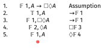
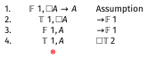
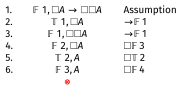
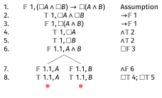
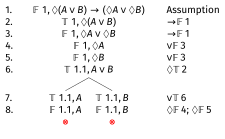
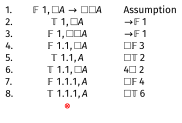

# Frames and Axioms

## What Are Frames

Frames are models without the valuations.

::: {.incremental}
- They are the $\langle W, R \rangle$ part of $\langle W, R, V\rangle$.
- They specify the worlds and the accessibility relation, but not which atomic sentences are true at which worlds.
:::

## Two-Way Equivalence

Some conditions on $R$ are strongly tied to dedicated axioms:

::: {.incremental}
- If the condition on $R$ holds, then the axiom is guaranteed to hold.
- If the condition on $R$ does not hold, then there is guaranteed to be a way to make the axiom fail.
:::

. . .

We'll illustrate this with the following pair:

- $R$ is transitive
- $\Box A \rightarrow \Box \Box A$

## From $R$ to Axiom

In any frame where $R$ is transitive, any instance of this schema is true at any point in any model on the frame:

$$\Box A \rightarrow \Box \Box A$$

. . .

This is a really strong claim. It says you can pick any value you like for the following three things, and $\Box A \rightarrow \Box \Box A$ will be true:

::: {.incremental}
1. Any valuation function $V$ you like.
2. Any point $w$ in $W$ that you like.
3. Any substitution instance for $A$ that you like.
:::

## From Axiom to $R$

The claim here is in a sense weaker, but still interesting. It says that if the $R$ in $\langle W, R \rangle$ is not transitive, then there is some way to make $\Box A \rightarrow \Box \Box A$ false.

. . .

That is, if you pick the right values for the following three things:

::: {.incremental}
1. The point $w$ in $W$
2. The substitution instance for $A$
3. The valuation function $V$
:::

. . .

then $\Box A \rightarrow \Box \Box A$ will be false.

## Picking the Substitution Instance

In this case, it isn't that hard to construct a countermodel:

::: {.incremental}
1. Let $w$ be a point in $W$ such that for some $x, y$, we have $wRx$ and $xRy$, but not $wRy$. (Since $R$ is not transitive, we know such a point exists.)
2. Let $A$ be $p$, i.e., an atomic sentence.
3. Let $V$ make $p$ true at $z$ if and only if $wRz$.
:::

. . .

Then at $w$, $\Box p$ will be true (since $p$ is true everywhere that $w$ can access), but $\Box \Box p$ will be false. That's because we know that $p$ is false at the point $y$ mentioned in step 1.

## Reflexivity

The same equivalence holds between:

- $R$ is reflexive, i.e., for all $x$, $xRx$.
- The axiom $\Box A \rightarrow A$ is valid on the frame.

. . .

**Left-to-right**: If $R$ is reflexive, then $x$ itself is one of the accessible worlds, so if $\Box A$ is true at $x$, then $A$ must also be true at $x$.

. . .

**Right-to-left**: If $R$ is not reflexive, then there is a point $x$ such that $\neg xRx$. Let $A$ be true everywhere but $x$. Then $\Box A$ will be true at $x$, since $A$ is true at all the points it can "see", but $A$ is false at $x$.

## Symmetry

The same equivalence holds between:

- $R$ is symmetric, i.e., for all $x, y$, if $xRy$ then $yRx$.
- The axiom $A \rightarrow \Box \Diamond A$ is valid on the frame.

. . .

**Left-to-right**: If $R$ is symmetric, then everywhere $x$ can see can also see $x$. So if $A$ is true at $x$, then $\Diamond A$ is true at all those worlds. So $\Box \Diamond A$ is true at $x$.

. . .

**Right-to-left**: If $R$ is not symmetric, then there is a pair $x, y$ such that $xRy$ and $\neg yRx$. Let $A$ be true only at $x$. Since $\neg yRx$, $\Diamond A$ is false at $y$. And since $xRy$, $\Box \Diamond A$ is false at $x$.

## Philosophical Significance

As we saw in the previous lecture, when we think about what these models might really mean, the $R$ relation represents a kind of possibility.

. . .

$wRx$ means that if $w$ is how things actually are, then $x$ is a way things might be, in the sense of might that we care about.

## Two Perspectives

The point of these frame-axiom correspondences is that we now have two ways to think about modal questions:

::: {.incremental}
1. We can look at the accessibility relation directly, and this may tell us something about certain modal sentences.
2. Or we can look at the modal sentences, and that can tell us something about the accessibility relation.
:::

. . .

This has become especially important in recent epistemology, where philosophers debate whether knowledge satisfies principles like $\Box A \rightarrow \Box \Box A$ (if you know something, do you know that you know it?). These debates connect directly to questions about the structure of epistemic possibility.

# Simplified Tableaux for S5

## What is S5?

Officially, **S5** is the modal logic where $R$ is an equivalence relation:

::: {.incremental}
- **Reflexive**: Every world accesses itself
- **Symmetric**: If $x$ accesses $y$, then $y$ accesses $x$
- **Transitive**: If $x$ accesses $y$ and $y$ accesses $z$, then $x$ accesses $z$
:::

. . .

Relations that satisfy all three of these features are called **equivalence relations**. They come up most naturally when thinking about things like *Has the same birthday* or *Is the same height*, where we divide people up into non-overlapping groups.

## What is S5?

For reasons I won't go into here, we get the same logic if we make a much simpler assumption about *R*.

We get the same logic if we just say that R is the **universal** relation.

That means for any two worlds $x$ and $y$, $xRy$ holds.

## Simplified Notation for S5

Because all worlds in **S5** can access each other, we don't need to track $R$, and actually we'll leave it out of this part. (It will come back in the next part.)

::: {.incremental}
- We number worlds: 1, 2, 3, etc.
- When we drop the 'simplified', the numbering of worlds will be the first thing that gets less simple.
:::

## Simplified Rules for $\Box$

**If $\Box A$ is true at any world:**

- Then $A$ is true at **all** worlds (both existing and future worlds).

. . .

That is, if $\Box A$ is true at some world, then for **every** world that appears on the tree, we write down that $A$ is true there.

. . .

This rule can never be marked as complete until the tree is complete, because new worlds may be introduced.

## Simplified Rules for $\Box$

**If $\Box A$ is false at world $n$:**

- First, check if there is already a world on the branch where $A$ is false. If so, mark the line as complete without doing anything.
- If not, introduce a **new** world where $A$ is false.
- It has to be new, because all you know is that $A$ is false somewhere, not that it is false at any particular place.

## Simplified Rules for $\Diamond$

**If $\Diamond A$ is true at any world:**

- First, check if there is already a world on the branch where $A$ is true. If so, mark the line as complete without doing anything.
- If not, introduce a **new** world where $A$ is true.
- It has to be new, because all you know is that $A$ is true somewhere, not that it is false at any particular place.

. . .

If this seems familiar, it is because $\Diamond A$ being true means exactly the same thing as $\Box \neg A$ being false

## Simplified Rules for $\Diamond$

**If $\Diamond A$ is false at any world:**

- Then $A$ is false at **all** worlds (both existing and future worlds).
- Like with the true $\Box$ rule, we can't ever mark this as complete until the tree is done; we have to keep applying it as new worlds are introduced.

## Why This Works

In **S5**, since all worlds access all other worlds:

::: {.incremental}
- $\Box A$ means "$A$ is true everywhere"
- $\Diamond A$ means "$A$ is true somewhere"
- When you introduce a new world, it automatically accesses all existing worlds and vice versa
- So boxed formulas immediately apply to new worlds, and new worlds immediately affect all diamond formulas
:::

## Example: $\Diamond \Box A \rightarrow \Box A$ in S5

Let's prove this formula is valid in **S5**:
  
---

\begin{oltableau}
[\sFmla{\False}{1, \Diamond \Box A \rightarrow \Box A}, just = \TAss
    [\sFmla{\True}{1, \Diamond \Box A}, just = {\TRule{\False}{\rightarrow}[1]}
        [\sFmla{\False}{1, \Box A}, just = {\TRule{\False}{\rightarrow}[1]}
            [\sFmla{\True}{2, \Box A}, just = {\TRule{\True}{\Diamond}[2]}
                [\sFmla{\False}{3, A}, just = {\TRule{\False}{\Box}[3]}
                    [\sFmla{\True}{3, A}, just = {\TRule{\True}{\Box}[4]}, close]
                ]
            ]
        ]
    ]
]
\end{oltableau}

::: {.content-visible when-format="revealjs"}
{height=484px}
:::

Note: When $\Box A$ is true at world 2, it immediately makes $A$ true everywhere, including the new world 3.

## Example: $A \rightarrow \Box \Diamond A$

On the next slide we'll show that works everywhere.

Intuitively, the argument is that if $A$ is true, then no matter what's true, the world where $A$ is true is a *possible* world, so $\Diamond A$ will be true there.

---

\begin{oltableau}
[\sFmla{\False}{1, A \rightarrow \Box \Diamond A}, just = \TAss
    [\sFmla{\True}{1, A}, just = {\TRule{\False}{\rightarrow}[1]}
        [\sFmla{\False}{1, \Box \Diamond A}, just = {\TRule{\False}{\rightarrow}[1]}
            [\sFmla{\False}{2, \Diamond A}, just = {\TRule{\False}{\Box}[3]}
                [\sFmla{\False}{1, A}, just = {\TRule{\False}{\Diamond}[4]}, close]
            ]
        ]
    ]
]
\end{oltableau}

::: {.content-visible when-format="revealjs"}
{height=484px}
:::

## Example: $\Box A \rightarrow A$

On the next slide we'll show that works everywhere.

Intuitively, the argument is that if $\Box A$ is true, then it is true everywhere. So it is true here.

This means that **S5** is really not a good logic for moral interpretations of $\Box$, but might be a good logic for other interpretations.

---

::: {.content-visible when-format="revealjs"}
{height=484px}
:::

## Example: $\Box A \rightarrow A$

On the next slide we'll show that works everywhere.

Intuitively, the argument is that if $\Box A$ is true, then it is true everywhere. So it is true here.

This means that **S5** is really not a good logic for moral interpretations of $\Box$, but might be a good logic for other interpretations.

---

\begin{oltableau}
[\sFmla{\False}{1, \Box A \rightarrow A}, just = \TAss
    [\sFmla{\True}{1, \Box A}, just = {\TRule{\False}{\rightarrow}[1]}
        [\sFmla{\False}{1, A}, just = {\TRule{\False}{\rightarrow}[1]}
            [\sFmla{\True}{1, A}, just = {\TRule{\True}{\Box}[2]}, close]
        ]
    ]
]
\end{oltableau}

::: {.content-visible when-format="revealjs"}
{height=484px}
:::

## Example: $\Box A \rightarrow \Box \Box A$

On the next slide we'll show that works everywhere (in **S5**).

Intuitively, the argument is that if $\Box A$ is true, then $A$ is true everywhere. So everywhere you go, $\Box A$ is true there. So it must be the case that $\Box A$ is true, i.e., $\Box \Box A$ is true.

---

\begin{oltableau}
[\sFmla{\False}{1, \Box A \rightarrow \Box \Box A}, just = \TAss
    [\sFmla{\True}{1, \Box A}, just = {\TRule{\False}{\rightarrow}[1]}
        [\sFmla{\False}{1, \Box \Box A}, just = {\TRule{\False}{\rightarrow}[1]}
            [\sFmla{\False}{2, \Box A}, just = {\TRule{\False}{\Box}[3]}
                [\sFmla{\True}{2, A}, just = {\TRule{\True}{\Box}[2]}
                    [\sFmla{\False}{3, A}, just = {\TRule{\False}{\Box}[4]}
                    , close]
                ]
            ]
        ]
    ]
]
\end{oltableau}

::: {.content-visible when-format="revealjs"}
{height=484px}
:::

## Example: An Invalid Formula

Let's show that $A \rightarrow \Box A$ is not valid in **S5**:

---

\begin{oltableau}
[\sFmla{\False}{1, A \rightarrow \Box A}, just = \TAss
    [\sFmla{\True}{1, A}, just = {\TRule{\False}{\rightarrow}[1]}
        [\sFmla{\False}{1, \Box A}, just = {\TRule{\False}{\rightarrow}[1]}
            [\sFmla{\False}{2, A}, just = {\TRule{\False}{\Box}[3]}
            ]
        ]
    ]
]
\end{oltableau}

::: {.content-visible when-format="revealjs"}
{height=484px}
:::

The tableau stays open—we have $A$ true at world 1 but false at world 2. This is consistent in **S5**.

## Advantages of Simplified S5 Tableaux

This tableaux system is much easier to work with than the full one in the textbook.

And **S5** is actually a widely used logic. Many philosophers (though not all) think it is the right modal logic for **metaphysical** necessity. 

Many economists and computer scientists act like it is the right modal logic for **epistemic** necessity (where $\Box A$ means you know that $A$), though this is almost universally rejected by philosophers.

However, for other modal logics, we need the full tableaux system we'll see next.

# Modal Tableaux

## Modal Tableaux Generalised

::: {.incremental}
- On each line, we include reference to a world.
- The line says that a particular proposition is true or false **at a world**.
- The tableau only closes if the tableau says the same proposition is both true and false **at the same world**.
:::

## Referring to Worlds

We refer to a world with a string of numbers, such as 1.2.1.3.

::: {.incremental}
- The string tells you something (but not everything) about $R$ relations.
- World $x$ can always access world $x.y$.
- So there is an $R$-relation from 1.2.1 to 1.2.1.3, and indeed to 1.2.1.$n$ for any $n$.
:::

## Referring to Worlds (continued)

::: {.incremental}
- These don't exhaust the $R$-relations; perhaps there is also an $R$-relation from 1.2.1.3 back to 1.2.1.
- But the relation from $x$ to $x.y$ is guaranteed.
- Note that worlds can be picked out by multiple strings—we do not assume that 1.1 and 1.2 are different, though we don't assume they are the same either.
:::

## Rules for Old Connectives

The rules for the propositional connectives stay as they are.

. . .

The only difference is that you have to note which world you are in.

::: {.incremental}
- If you have that $A \wedge B$ is true at 1.4.7, then you write down that $A$ is true at 1.4.7, and that $B$ is true at 1.4.7.
- If $A \vee B$ is true at 1.6.8, you have two branches: one where $A$ is true at 1.6.8, and the other where $B$ is true at 1.6.8.
:::

## Rules for $\Box$ (True Case)

If $\Box A$ is **true** at $x$, then for any $x.y$ that is already on the tree, we can infer that $A$ is true at $x.y$.

. . .

**Important note**: If there is no $x.y$ on the tree, we can't assume that there is one. $\Box A$ can be true at a world because that world can't access any other world.

## Rules for $\Box$ (False Case)

If $\Box A$ is **false** at $x$, then we have to add a **new** $x.y$, and make $A$ false at $x.y$.

. . .

It is very important that $x.y$ be new:

::: {.incremental}
- We know that $A$ is false at some accessible world, but we don't know which one.
- For any given world already on the tree, $A$ might be true there, as long as it is false somewhere.
- That's why we use a new number.
- Remember that it might be that multiple strings refer to the same world.
:::

## Rules for $\Diamond$ (True Case)

If $\Diamond A$ is **true** at $x$, then we have to add a **new** $x.y$, and make $A$ true at $x.y$.

. . .

It is very important that $x.y$ be new:

::: {.incremental}
- We know that $A$ is true at some accessible world, but we don't know which one.
- For any given world already on the tree, $A$ might be false there, as long as it is true somewhere.
- That's why we use a new number.
:::

## Rules for $\Diamond$ (False Case)

If $\Diamond A$ is **false** at $x$, then for any $x.y$ that is already on the tree, we can infer that $A$ is false at $x.y$.

. . .

**Important note**: If there is no $x.y$ on the tree, we can't assume that there is one. $\Diamond A$ can be false at a world because that world can't access any other world.

## Summary of Modal Rules

| Formula at $x$ | Action |
|----------------|--------|
| $\Box A$ true | Add $A$ true at all existing $x.y$ |
| $\Box A$ false | Add new $x.y$, make $A$ false there |
| $\Diamond A$ true | Add new $x.y$, make $A$ true there |
| $\Diamond A$ false | Add $A$ false at all existing $x.y$ |

# Examples

## Example 1: A Valid Formula

Let's prove: $(\Box A \wedge \Box B) \rightarrow \Box (A \wedge B)$

---

\begin{oltableau}
[\sFmla{\False}{1, (\Box A \land \Box B) \rightarrow \Box (A \land B)}, just =\TAss
    [\sFmla{\True}{1, \Box A \land \Box B}, just = {\TRule{\False}{\rightarrow}[1]}
        [\sFmla{\False}{1, \Box(A \land B)}, just = {\TRule{\False}{\rightarrow}[1]}
            [\sFmla{\True}{1, \Box A}, just = {\TRule{\True}{\land}[2]}
                [\sFmla{\True}{1, \Box B}, just = {\TRule{\True}{\land}[2]}
                    [\sFmla{\False}{1.1, A \land B}, just = {\TRule{\False}{\Box}[3]}
                        [\sFmla{\False}{1.1, A}, just = {\TRule{\False}{\land}[6]}
                            [\sFmla{\True}{1.1, A}, just= {\TRule{\True}{\Box}[4]}, close]
                        ]
                        [\sFmla{\False}{1.1, B}, just = {\TRule{\False}{\land}[6]}
                            [\sFmla{\True}{1.1, B}, just= {\TRule{\True}{\Box}[5]}, close]
                        ]
                    ]
                ]
            ]
        ]
    ]
]
\end{oltableau}

::: {.content-visible when-format="revealjs"}
{height=484px}
:::

## Example 2: Another Valid Formula

Let's prove: $\Diamond (A \vee B) \rightarrow (\Diamond A \vee \Diamond B)$

---

\begin{oltableau}
[\sFmla{\False}{1, \Diamond(A \lor B) \rightarrow (\Diamond A \lor \Diamond B)}, just =\TAss
    [\sFmla{\True}{1, \Diamond(A \lor B)}, just = {\TRule{\False}{\rightarrow}[1]}
        [\sFmla{\False}{1, \Diamond A \lor \Diamond B}, just = {\TRule{\False}{\rightarrow}[1]}
            [\sFmla{\False}{1, \Diamond A}, just = {\TRule{\False}{\lor}[3]}
                [\sFmla{\False}{1, \Diamond B}, just = {\TRule{\False}{\lor}[3]}
                    [\sFmla{\True}{1.1, A \lor B}, just = {\TRule{\True}{\Diamond}[2]}
                        [\sFmla{\True}{1.1, A}, just = {\TRule{\True}{\lor}[6]}
                            [\sFmla{\False}{1.1, A}, just= {\TRule{\False}{\Diamond}[4]}, close]
                        ]
                        [\sFmla{\True}{1.1, B}, just = {\TRule{\True}{\lor}[6]}
                            [\sFmla{\False}{1.1, B}, just= {\TRule{\False}{\Diamond}[5]}, close]
                        ]
                    ]
                ]
            ]
        ]
    ]
]
\end{oltableau}

::: {.content-visible when-format="revealjs"}
{height=484px}
:::

# Other Logics

## K is Special

The logic we have so far is very weak.

::: {.incremental}
- It's called **logic K**, and it puts no restrictions on the $R$-relation.
- Most applications of modal logic do have restrictions on $R$.
- How should we model them?
:::

. . .

The answer is that we model them one at a time by adding special rules.

## KT: The Logic of Reflexive Frames

To model reflexive frames, add two new rules:

::: {.incremental}
1. If $\Box A$ is true at $x$, infer that $A$ is true at $x$.
2. If $\Diamond A$ is false at $x$, infer that $A$ is false at $x$.
:::

. . .

These rules capture the fact that every world can access itself.

## S4: The Logic of Transitive Frames

To model transitive frames, add two new rules:

::: {.incremental}
1. If $\Box A$ is true at $x$, and $x.y$ exists on the tree, add that $\Box A$ is true at $x.y$. (You already should have added that $A$ is true at $x.y$; that's the basic rule for $\Box$.)
2. If $\Diamond A$ is false at $x$, and $x.y$ exists on the tree, add that $\Diamond A$ is false at $x.y$. (You already should have added that $A$ is false at $x.y$; that's the basic rule for $\Diamond$.)
:::

## Example: $\Box A \rightarrow \Box \Box A$ in K

This should fail in logic K. Here's an open tableau showing it's not valid in K:

\begin{oltableau}
[\sFmla{\False}{1, \Box A \rightarrow \Box \Box A}, just = \TAss
    [\sFmla{\True}{1, \Box A}, just = {\TRule{\False}{\rightarrow}[1]}
        [\sFmla{\False}{1, \Box \Box A}, just = {\TRule{\False}{\rightarrow}[1]}
            [\sFmla{\False}{1.1, \Box A}, just = {\TRule{\False}{\Box}[3]}
                [\sFmla{\True}{1.1, A}, just = {\TRule{\True}{\Box}[2]}
                    [\sFmla{\False}{1.1.1, A}, just = {\TRule{\False}{\Box}[4]}
                    ]
                ]
            ]
        ]
    ]
]
\end{oltableau}

::: {.content-visible when-format="revealjs"}
{height=484px}
:::

The tableau stays open—no contradiction. So this formula is not valid in K.

## Example: $\Box A \rightarrow \Box \Box A$ in Logic S4

But now let's apply the rules for logic **S4** as well. After line 5 we need to make one new inference using the transitivity rule.

---

\begin{oltableau}
[\sFmla{\False}{1, \Box A \rightarrow \Box \Box A}, just = \TAss
    [\sFmla{\True}{1, \Box A}, just = {\TRule{\False}{\rightarrow}[1]}
        [\sFmla{\False}{1, \Box \Box A}, just = {\TRule{\False}{\rightarrow}[1]}
            [\sFmla{\False}{1.1, \Box A}, just = {\TRule{\False}{\Box}[3]}
                [\sFmla{\True}{1.1, A}, just = {\TRule{\True}{\Box}[2]}
                    [\sFmla{\True}{1.1, \Box A}, just = {4$\Box$ 2}
                        [\sFmla{\False}{1.1.1, A}, just = {\TRule{\False}{\Box}[4]}
                            [\sFmla{\True}{1.1.1, A}, just = {\TRule{\True}{\Box}[6]}, close]
                        ]
                    ]
                ]
            ]
        ]
    ]
]
\end{oltableau}

::: {.content-visible when-format="revealjs"}
{height=484px}
:::

The tableau closes. So this formula is valid in logic **S4**, as expected.

## Other Modal Logics

The textbook covers several other common modal logics:

::: {.incremental}
- **S5**: Combines reflexivity, symmetry, and transitivity (add rules for all three)
- **KB**: Reflexivity and symmetry
- **KD**: Serial frames (every world accesses at least one world)
:::

. . .

Each has its own philosophical applications and corresponds to different ways of thinking about necessity and possibility.

## For Next Time

We'll keep going with more examples of tableaux.