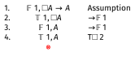
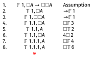
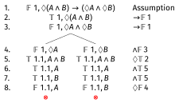
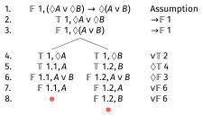
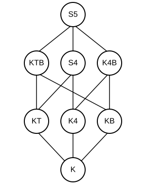
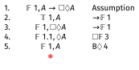
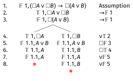

# Assignment 5 Clarification

## A Hard Problem

On Assignment 5, I included this question:

Is $\Box \Diamond p \rightarrow \Diamond \Box p$ a theorem of S5?

. . .

This turned out to be too hard for where we are in the course.

## Why It Was Too Hard

The tableau for this formula doesn't close, but it also doesn't stop.

. . .

::: {.incremental}
- It generates an infinite tree.
- I hadn't explained what to do when tableaux are infinite.
- This is my fault - I should have covered this before including such a question.
:::

## What Happens

Let me show you what happens when we try to build the tableau.

---

\begin{oltableau}
[\sFmla{\False}{1, \Box \Diamond p \rightarrow \Diamond \Box p}, just =\TAss
    [\sFmla{\True}{1, \Box \Diamond p}, just = {\TRule{\False}{\rightarrow}[1]}
        [\sFmla{\False}{1, \Diamond \Box p}, just = {\TRule{\False}{\rightarrow}[1]}
        ]
    ]
]
\end{oltableau}

::: {.content-visible when-format="revealjs"}
{width=600px}
:::

Start with the formula being false at world 1.

---

\begin{oltableau}
[\sFmla{\False}{1, \Box \Diamond p \rightarrow \Diamond \Box p}, just =\TAss
    [\sFmla{\True}{1, \Box \Diamond p}, just = {\TRule{\False}{\rightarrow}[1]}
        [\sFmla{\False}{1, \Diamond \Box p}, just = {\TRule{\False}{\rightarrow}[1]}
            [\sFmla{\True}{1, \Diamond p}, just = {\TRule{\True}{\Box}[2]}
                [\sFmla{\False}{1, \Box p}, just = {\TRule{\False}{\Diamond}[3]}
                ]
            ]
        ]
    ]
]
\end{oltableau}

::: {.content-visible when-format="revealjs"}
{width=600px}
:::

We're in S5, so $\Box \Diamond p$ being true means $\Diamond p$ is true everywhere, and $\Diamond \Box p$ being false means $\Box p$ is false everywhere. In particular, those things must obtain at 1.

---

\begin{oltableau}
[\sFmla{\False}{1, \Box \Diamond p \rightarrow \Diamond \Box p}, just =\TAss
    [\sFmla{\True}{1, \Box \Diamond p}, just = {\TRule{\False}{\rightarrow}[1]}
        [\sFmla{\False}{1, \Diamond \Box p}, just = {\TRule{\False}{\rightarrow}[1]}
            [\sFmla{\True}{1, \Diamond p}, just = {\TRule{\True}{\Box}[2]}
                [\sFmla{\False}{1, \Box p}, just = {\TRule{\False}{\Diamond}[3]}
                    [\sFmla{\True}{2, p}, just = {\TRule{\True}{\Diamond}[4]}
                        [\sFmla{\False}{3, p}, just = {\TRule{\False}{\Box}[5]}
                        ]
                    ]
                ]
            ]
        ]
    ]
]
\end{oltableau}

::: {.content-visible when-format="revealjs"}
{width=600px}
:::

$\Diamond p$ true means we need a world where $p$ is true (world 2); $\Box p$ false means we need a world where $p$ is false (world 3).

---

\begin{oltableau}
[\sFmla{\False}{1, \Box \Diamond p \rightarrow \Diamond \Box p}, just =\TAss
    [\sFmla{\True}{1, \Box \Diamond p}, just = {\TRule{\False}{\rightarrow}[1]}
        [\sFmla{\False}{1, \Diamond \Box p}, just = {\TRule{\False}{\rightarrow}[1]}
            [\sFmla{\True}{1, \Diamond p}, just = {\TRule{\True}{\Box}[2]}
                [\sFmla{\False}{1, \Box p}, just = {\TRule{\False}{\Diamond}[3]}
                    [\sFmla{\True}{2, p}, just = {\TRule{\True}{\Diamond}[4]}
                        [\sFmla{\False}{3, p}, just = {\TRule{\False}{\Box}[5]}
                            [\sFmla{\True}{2, \Diamond p}, just = {\TRule{\True}{\Box}[2]}
                                [\sFmla{\False}{2, \Box p}, just = {\TRule{\False}{\Diamond}[3]}
                                    [\sFmla{\True}{4, p}, just = {\TRule{\True}{\Diamond}[8]}
                                        [\sFmla{\False}{5, p}, just = {\TRule{\False}{\Box}[9]}
                                            [\sFmla{\True}{3, \Diamond p}, just = {\TRule{\True}{\Box}[2]}
                                                [\sFmla{\False}{3, \Box p}, just = {\TRule{\False}{\Diamond}[3]}
                                                ]
                                            ]
                                        ]
                                    ]
                                ]
                            ]
                        ]
                    ]
                ]
            ]
        ]
    ]
]
\end{oltableau}

::: {.content-visible when-format="revealjs"}
{width=600px}
:::

The pattern continues - each world needs a new world where $p$ is true and another where $p$ is false...

## The Pattern Continues

What happens as we keep going?

::: {.incremental}
- At each world we need a new world where $p$ is true (from $\Diamond p$ true) and a new world where $p$ is false (from $\Box p$ false).
- Each of those new worlds also has $\Diamond p$ true and $\Box p$ false (from $\Box \Diamond p$ and $\Diamond \Box p$).
- So each new world requires two more new worlds...
- The pattern continues forever. Uh oh.
:::

## The Tableau is Infinite

The tableau keeps generating new worlds: 1, 2, 3, 4, 5, ...

. . .

At each world $n$:

::: {.incremental}
- $\Diamond p$ is true (from $\Box \Diamond p$) — requires a new world where $p$ is true
- $\Box p$ is false (from $\Diamond \Box p$ false) — requires a new world where $p$ is false
:::

. . .

Since the tableau **never closes** but also never stops, this shows the formula is **not valid** in S5.

## The Countermodel

We can describe the countermodel this represents:

. . .

::: {.incremental}
- **Worlds**: There are infinitely many worlds; i.e., $w_i$ for each positive integer $i$.
- **Accessibility**: In S5, every world accesses every world.
- **Valuation**: $p$ is true at the even numbered worlds, and false at the odd numbered worlds (after 1)
:::

## The Countermodel

At all worlds:
- $\Diamond p$ is true (since $p$ is true at $w_2$)
- So $\Box \Diamond p$ is true
- But $\Box p$ is false (since $p$ is false at $w_3$)
- So $\Diamond \Box p$ is false

Therefore $\Box \Diamond p \rightarrow \Diamond \Box p$ is false at all worlds.

Now we could have just used $w_2$ and $w_3$, but the tableau system doesn't always find the _simplest_ counterexample.

## Apologies

I apologize for not explaining infinite tableaux before including this problem, and not being clear about what to do when a tableau doesn't stop.

I've adjusted the grades on the quiz so everyone got full points on that question, because this was my mistake.

. . .

**Going forward**: If a tableau doesn't close after generating several worlds and you see a repeating pattern, you can:

- Stop and describe the countermodel the infinite branch represents.
- Or note that the tableau appears to be infinite.
- In general, the claim is **not valid** in these cases.

# Quiz This Week

The quiz this week is posted.

We don't have the sample exam yet, because we're still trying to work out just how many questions it should have.

But the format will be similar to this week's quiz.

You'll be asked to do tableaux in various logics; this builds on all of the material so far.

## Cheat Sheet

In the quiz you'll be given a copy of the 'cheat sheet' that is being distributed now. (Or if we find typos in it, you'll find a corrected version!)

So you don't have to memorise anything on here, just remember how to use these rules.

This sheet will also be useful for following along the rest of today's lecture.

# Applications

## Learing from Experiments

The lectures so far have been too abstract; I should have spent more time on why this stuff is a useful tool in philosophy.

So I'm going to spend ten minutes talking through one case that I've alluded to so far.

The point is not that modal logic helps settle a philosophical dispute; that's not what it is for.

The point rather is that it gives us a cleaner way to talk about the disagreement.

The disagreement in question is what to say about learning from experiments.

## Scales

::: {.columns}

:::: {.column}

::::

:::: {.column}
I'll say we're talking about experiments, but that might feel too fancy, because I'm going to use a really really simple example.

Imagine the experimenter, call them E, puts an object on their kitchen scale and records the result.

What do they learn about the mass of the object?
::::

:::

## Device Fallibility

I clearly haven't told you enough to answer that question - you need to know how good the scale is.

Here's what to know about the scale. When the real mass of the object to be weighed is $m$, the observed value is almost always within 0.1% of $m$. So it's within 0.1g for 100g objects, within 1g for 1000g objects, and so on. This is, I think, roughly the accuracy of the scale of the previous slide.

But I want to imagine a scale, unlike that one, that always reads out to 0.1g even when that's beyond it's accuracy.

## Worlds

So imagine our experimenter puts an object on the scale. The real mass of the object (in grams) is some value $m$. And the scale reads $o$. Hopefully these are really close.

In the model we'll use for this, the worlds are pairs $\langle m, o\rangle$, representing what the real mass is, and what the observation is, i.e., what the display says.

So $\langle 817.6, 817.5\rangle$ is the state where the real mass is 817.6 grams, and it reads 817.5 grams, which is pretty good all things considered.

I'll just consider states that are precise to 0.1g, to avoid fussing about infinite fineness.

## Learning From Experiments

Here are three questions that philosophers have worried about concerning this kind of setup.

::: {.incremental}
1. What does the experimenter learn in $\langle m, o\rangle$ when they see $o$ on the scale? That is, what do they come to know?
2. What does the experimenter know that they know after seeing $o$? This is in part a self-directed question, what do they know about their own state of mind? This might be important for when we're thinking about what future experiments they will run.
3. Are the answers to 1 and 2 the same?
:::

. . .

A big dispute, with potentially far reaching implications, has been whether the answer to 3 is _Yes_ or _No_.

## Modal Logic Approach

If we're using modal logic, we start by asking a slightly different question:

Upon seeing $o$, what states are still accessible, i.e., might be real, and which ones are ruled out?

One nice thing about digital scales is that we don't tend to make many mistakes about what the scale says.

So if it reads 817.5, we can rule out any pair $\langle m, o\rangle$ where $o \neq 817.5$.

## Modal Logic Approach

But the question is harder. Let's say the real value is 818.1, so the scale is a bit off. Still within 0.1%, but a bit off.

That is, we're really in the world $\langle 818.1, 817.5\rangle$, though the experimenter can't possibly know that.

Which states are possible for the experimenter?

## Option One

**Anything within 0.1% of the observed value is accessible, anything else is not**.

So in this case, the accessible, epistemically possible, masses are anything from 816.7 to 818.3.

This reflects the fact that it could be a bit off, about 0.8g in 800g or so, in each direction.

So it's good practice to not be certain that the scale is right, and allow a margin of error.

Someone who believes that it's within 816.7 to 818.3 seems to get a true belief by following a good method, so that's knowledge.

## Option One

One important thing to note here is that this argument didn't rely on the value of $m$.

For any value of $m_1$ and $m_2$ between 816.7 and 818.3, the possibilities $\langle m_1, 817.5 \rangle$ can access each other. So accessibility, on this model, is reflexive, symmetric, and transitive.

## Problems with Option One

Option One might be right; it is plausible. But there are a couple of related questions, both turning on the fact that on this model, the experimenter can rule out the mass being 818.4, which is very close to the true value of 818.1.

### Argument One

You shouldn't be able to rule out something that's closer to reality than the accuracy of your measuring equipment. So you shouldn't be able to rule out something 0.3g away from actuality using a scale that's only accurate to 0.8g.

### Argument Two

It would be better if the scale said 818.1, the exact true value. If it had, the experimenter couldn't rule out 818.4. You shouldn't be able to rule out something from a flawed measurement that you couldn't rule out with a perfect measurement.

## Option Two

Both of these arguments point in the direction of the following rule.

**In the world $\langle m, o\rangle$, the accessible worlds are those values of $\langle m', o\rangle$ where $m'$ is within 0.8g of either $m$ or $o$.**

In this case, it would imply that the accessible possibilities are all values of $m$ between 816.7 (the same lower bound) and 818.9 (a higher upper bound).

## Option Two

I won't work through this, because we've taken long enough, but if that's the model you have, then accessibility is reflexive, but not symmetric or transitive.

If it's right, there can be models where the experimenter can know something without knowing that they know it.

This is because 'knows that' is basically a $\Box$ operator on these models. The experimenter knows things that are true at all accessible worlds.

## Philosophical Upshot

We started with what looked like an epistemology question:

- If the experimenter knows something, do they know that they know it?

This looked like it would require some kind of theory about the relationship between perception and introspection.

Instead, we could possibly make progress on it by applying the tools of modal logic, and thinking hard about what is possible given an experiment.

# Tableaux in General

## The Basic Logic: K

**Logic K** is the minimal modal logic.

It is the logic of all the frames you can describe this way.

It's not particularly **philosophically** interesting. I don't really know any philosophical applications where **K** is the right way to think about some situation.

But it's a helpful base case, because lots of applications build on **K**.

## World Numbers

In the simple tableaux for **S5**, the worlds are just numbered 1, 2, 3,...

In the more general system, the world numbers look like $1.3.1.2$.

The internal structure of this is meaningful.

In general, there is an $R$ relation between world $x$ and world $x.y$. There may be others, but there are at least these ones.

## World Numbers

So if we get to $1.3.1.2$, we know that there are also worlds $1$, $1.3$, and $1.3.1$.

Moreover, we know

- World $1$ can access world $1.3$. I.e., $w_1Rw_{1.3}$
- World $1.3$ can access world $1.3.1$. I.e., $w_{1.3}Rw_{1.3.1}$
- World $1.3.1$ can access world $1.3.1.2$. I.e., $w_{1.3.1}Rw_{1.3.1.2}$

## True $\Box$ sentences

The new rule is that if $\Box A$ is true at $x$, then $A$ is true at $x.y$ every time that appears on the branch.

- We do **not** have to say that $A$ is true everywhere.
- But we do have to keep applying this rule whenever a new world of the form $x.y$ appears on the branch.

## True $\Diamond$ sentences

The new rule is that if $\Diamond A$ is true at $x$, then we have to introduce a world $x.y$ where $A$ is true.

- This is more restrictive than the old rule, since there are constraints on how we introduce the world.
- But it also just has to be applied once, and then we're done.

## The Other Two Rules

### False $\Box$ Sentences

These are just like true $\Diamond$ sentences. We introduce a new world with number $x.y$ where the underlying sentence is false.

### False $\Diamond$ Sentences

These are just like true $\Box$ sentences. Whenever $x.y$ appears on the tree, we say that the underlying sentence is false.

## Logic K

Logic K corresponds to frames with no restrictions on $R$ at all.

. . .

::: {.incremental}
- This makes it very general, but also very weak.
- There are not that many things that are valid on it.
- Many formulas that "seem obviously true" are not theorems of **K**.
:::

## K Example 1: A Non-Theorem

Let's show that $\Box A \rightarrow A$ is **not** valid in **K**.

\begin{oltableau}
[\sFmla{\False}{1, \Box A \rightarrow A}, just = \TAss
    [\sFmla{\True}{1, \Box A}, just = {\TRule{\False}{\rightarrow}[1]}
        [\sFmla{\False}{1, A}, just = {\TRule{\False}{\rightarrow}[1]}
        ]
    ]
]
\end{oltableau}

::: {.content-visible when-format="revealjs"}
{width=600px}
:::

Start by assuming it's false.

---

\begin{oltableau}
[\sFmla{\False}{1, \Box A \rightarrow A}, just = \TAss
    [\sFmla{\True}{1, \Box A}, just = {\TRule{\False}{\rightarrow}[1]}
        [\sFmla{\False}{1, A}, just = {\TRule{\False}{\rightarrow}[1]}
        ]
    ]
]
\end{oltableau}

::: {.content-visible when-format="revealjs"}
{width=600px}
:::

. . .

And that's it. The tree is open.

. . .

::: {.incremental}
- There are no worlds of the form $1.y$ on the tree.
- So we never infer $A$ true at world $1$ from $\Box A$ being true at $1$.
- This shows **K** allows frames where world 1 can't access any worlds (not even itself).
:::

## K Example 2: $\Box A \rightarrow \Box \Box A$

Let's show this is also not valid in **K**.

---

\begin{oltableau}
[\sFmla{\False}{1, \Box A \rightarrow \Box \Box A}, just = \TAss
    [\sFmla{\True}{1, \Box A}, just = {\TRule{\False}{\rightarrow}[1]}
        [\sFmla{\False}{1, \Box \Box A}, just = {\TRule{\False}{\rightarrow}[1]}
            [\sFmla{\False}{1.1, \Box A}, just = {\TRule{\False}{\Box}[3]}
                [\sFmla{\True}{1.1, A}, just = {\TRule{\True}{\Box}[2]}
                    [\sFmla{\False}{1.1.1, A}, just = {\TRule{\False}{\Box}[4]}
                    ]
                ]
            ]
        ]
    ]
]
\end{oltableau}

::: {.content-visible when-format="revealjs"}
{width=700px}
:::

The tree stays open. This represents a non-transitive accessibility relation.

## The Counterexample

Here we can read off a more sensible counterexample.

- There are three worlds, $1$, $1.1$, and $1.1.1$.
- The only $R$-relations are forced, so 1R1.1, and 1.1R1.1.1.
- $A$ is true at the first two, and false at the third.
- So $\Box A$ is true at $1$; everywhere it can access makes $A$ true.
- But $\Box \Box A$ is false, since there is somewhere it can reach in two steps where $A$ is false.

## Adding Conditions to K

We can add special rules to **K** to capture different frame conditions:

::: {.incremental}
- **T**: Reflexivity ($xRx$ for all $x$)
- **B**: Symmetry (if $xRy$ then $yRx$)
- **4**: Transitivity (if $xRy$ and $yRz$ then $xRz$)
:::

. . .

These are associate with particular axioms:

::: {.incremental}
- **T**: $\Box A \rightarrow A$
- **B**: $A \rightarrow \Box \Diamond A$
- **4**: $\Box A \rightarrow \Box \Box A$
:::

## The T Rules

To add reflexivity to K, add these two rules:

. . .

**T-Box Rule**: If $\Box A$ is true at $x$, then add that $A$ is true at $x$.

. . .

**T-Diamond Rule**: If $\Diamond A$ is false at $x$, then add that $A$ is false at $x$.

. . .

These capture the fact that every world can access itself.

## General Pattern

In moving to **KT** we added new rules for the open-ended cases, true $\Box$ and false $\Diamond$.

We did not add rules for the one-shot cases, false $\Box$ and true $\Diamond$.

That's going to be the general pattern as we go through.

Those one-shot rules are done; but we'll keep tinkering with what happens with the other rules.

## KT Example: $\Box A \rightarrow A$

Now let's prove this is valid in KT.

\begin{oltableau}
[\sFmla{\False}{1, \Box A \rightarrow A}, just = \TAss
    [\sFmla{\True}{1, \Box A}, just = {\TRule{\False}{\rightarrow}[1]}
        [\sFmla{\False}{1, A}, just = {\TRule{\False}{\rightarrow}[1]}
            [\sFmla{\True}{1, A}, just = {\TRule{\Box}{\text{T}}[2]}, close]
        ]
    ]
]
\end{oltableau}

::: {.content-visible when-format="revealjs"}
{width=600px}
:::

The T$\Box$ rule directly gives us the contradiction.

## The 4 Rules

To add transitivity to **K**, add these two rules:

. . .

**4-Box Rule**: If $\Box A$ is true at $x$, and $x.y$ is on the tree, then add that $\Box A$ is true at $x.y$.

. . .

**4-Diamond Rule**: If $\Diamond A$ is false at $x$, and $x.y$ is on the tree, then add that $\Diamond A$ is false at $x.y$.

. . .

Note: You already add $A$ true/false by the basic **K** rules.

The **4** rules add the *modal formula itself*.

## KT4 Example: $\Box A \rightarrow \Box \Box A$

This is valid in **KT4** (also called **S4**). Let's prove it.

---

\begin{oltableau}
[\sFmla{\False}{1, \Box A \rightarrow \Box \Box A}, just = \TAss
    [\sFmla{\True}{1, \Box A}, just = {\TRule{\False}{\rightarrow}[1]}
        [\sFmla{\False}{1, \Box \Box A}, just = {\TRule{\False}{\rightarrow}[1]}
            [\sFmla{\False}{1.1, \Box A}, just = {\TRule{\False}{\Box}[3]}
                [\sFmla{\True}{1.1, A}, just = {\TRule{\True}{\Box}[2]}
                    [\sFmla{\True}{1.1, \Box A}, just = {\TRule{\Box}{\text{4}}[2]}, 
                        [\sFmla{\False}{1.1.1, A}, just = {\TRule{\False}{\Box}[4]}
                            [\sFmla{\True}{1.1.1, A}, just = {\TRule{\True}{\Box}[6]}, close]
                        ]
                    ]
                ]
            ]
        ]
    ]
]
\end{oltableau}

::: {.content-visible when-format="revealjs"}
{width=600px}
:::

The **4**-rule carries $\Box A$ down to 1.1, which gives us the contradiction.

## The B Rules

To add symmetry to **K**, add these two rules:

. . .

**B-Box Rule**: If $\Box A$ is true at $x.y$, then add that $A$ is true at $x$.

. . .

**B-Diamond Rule**: If $\Diamond A$ is false at $x.y$, then add that $A$ is false at $x$.

. . .

These capture the idea that accessibility goes both ways.

## Combining Conditions

These conditions can be combined:

::: {.incremental}
- **KT** = K + reflexivity
- **K4** = K + transitivity
- **KB** = K + symmetry
- **KT4** (= **S4**) = K + reflexivity + transitivity
- **KTB** = K + reflexivity + symmetry
- **KB4** = K + symmetry + transitivity
- **KTB4** (= **S5**) = K + reflexivity + symmetry + transitivity
:::

## S5 is Special

When you combine all three conditions (reflexivity, symmetry, transitivity), you get an **equivalence relation**.

. . .

::: {.incremental}
- This is the strongest of the standard modal logics.
- It has the most theorems.
- It's equivalent to making $R$ the universal relation.
- That's why we could use simplified tableaux for S5.
:::

# Examples

## Example 1: $\Diamond(A \wedge B) \rightarrow (\Diamond A \wedge \Diamond B)$ in K

---

\begin{oltableau}
[\sFmla{\False}{1, \Diamond(A \land B) \rightarrow (\Diamond A \land \Diamond B)}, just = \TAss
]
\end{oltableau}

::: {.content-visible when-format="revealjs"}
{width=600px}
:::

Start by assuming it's false.

---

\begin{oltableau}
[\sFmla{\False}{1, \Diamond(A \land B) \rightarrow (\Diamond A \land \Diamond B)}, just = \TAss
    [\sFmla{\True}{1, \Diamond(A \land B)}, just = {\TRule{\False}{\rightarrow}[1]}
        [\sFmla{\False}{1, \Diamond A \land \Diamond B}, just = {\TRule{\False}{\rightarrow}[1]}
        ]
    ]
]
\end{oltableau}

::: {.content-visible when-format="revealjs"}
{width=600px}
:::

False conditional means true antecedent and false consequent.

---

\begin{oltableau}
[\sFmla{\False}{1, \Diamond(A \land B) \rightarrow (\Diamond A \land \Diamond B)}, just = \TAss
    [\sFmla{\True}{1, \Diamond(A \land B)}, just = {\TRule{\False}{\rightarrow}[1]}
        [\sFmla{\False}{1, \Diamond A \land \Diamond B}, just = {\TRule{\False}{\rightarrow}[1]}
            [\sFmla{\False}{1, \Diamond A}, just = {\TRule{\False}{\land}[3]}]
            [\sFmla{\False}{1, \Diamond B}, just = {\TRule{\False}{\land}[3]}]
        ]
    ]
]
\end{oltableau}

::: {.content-visible when-format="revealjs"}
{width=600px}
:::

False conjunction branches.

---

\begin{oltableau}
[\sFmla{\False}{1, \Diamond(A \land B) \rightarrow (\Diamond A \land \Diamond B)}, just = \TAss
    [\sFmla{\True}{1, \Diamond(A \land B)}, just = {\TRule{\False}{\rightarrow}[1]}
        [\sFmla{\False}{1, \Diamond A \land \Diamond B}, just = {\TRule{\False}{\rightarrow}[1]}
            [\sFmla{\False}{1, \Diamond A}, just = {\TRule{\False}{\land}[3]}
                [\sFmla{\True}{1.1, A \land B}, just = {\TRule{\True}{\Diamond}[2]}
                    [\sFmla{\True}{1.1, A}, just = {\TRule{\True}{\land}[5]}
                        [\sFmla{\True}{1.1, B}, just = {\TRule{\True}{\land}[5]}
                            [\sFmla{\False}{1.1, A}, just = {\TRule{\False}{\Diamond}[4]}, close]
                        ]
                    ]
                ]
            ]
            [\sFmla{\False}{1, \Diamond B}, just = {\TRule{\False}{\land}[3]}
                [\sFmla{\True}{1.1, A \land B}, just = {\TRule{\True}{\Diamond}[2]}
                    [\sFmla{\True}{1.1, A}, just = {\TRule{\True}{\land}[5]}
                        [\sFmla{\True}{1.1, B}, just = {\TRule{\True}{\land}[5]}
                            [\sFmla{\False}{1.1, B}, just = {\TRule{\False}{\Diamond}[4]}, close]
                        ]
                    ]
                ]
            ]
        ]
    ]
]
\end{oltableau}

::: {.content-visible when-format="revealjs"}
{width=600px}
:::

Both branches close. This is a theorem of K.

## Example 2: $(\Diamond A \vee \Diamond B) \rightarrow \Diamond(A \vee B)$ in K

Let's show this is a theorem in **K**.

---

\begin{oltableau}
[\sFmla{\False}{1, (\Diamond A \lor \Diamond B) \rightarrow \Diamond(A \lor B)}, just = \TAss
    [\sFmla{\True}{1, \Diamond A \lor \Diamond B}, just = {\TRule{\False}{\rightarrow}[1]}
        [\sFmla{\False}{1, \Diamond(A \lor B)}, just = {\TRule{\False}{\rightarrow}[1]}
        ]
    ]
]
\end{oltableau}

::: {.content-visible when-format="revealjs"}
{width=600px}
:::

---

\begin{oltableau}
[\sFmla{\False}{1, (\Diamond A \lor \Diamond B) \rightarrow \Diamond(A \lor B)}, just = \TAss
    [\sFmla{\True}{1, \Diamond A \lor \Diamond B}, just = {\TRule{\False}{\rightarrow}[1]}
        [\sFmla{\False}{1, \Diamond(A \lor B)}, just = {\TRule{\False}{\rightarrow}[1]}
            [\sFmla{\True}{1, \Diamond A}, just = {\TRule{\True}{\lor}[2]}
            ]
            [\sFmla{\True}{1, \Diamond B}, just = {\TRule{\True}{\lor}[2]}
            ]
        ]
    ]
]
\end{oltableau}

::: {.content-visible when-format="revealjs"}
{width=600px}
:::

The disjunction branches.

---

\begin{oltableau}
[\sFmla{\False}{1, (\Diamond A \lor \Diamond B) \rightarrow \Diamond(A \lor B)}, just = \TAss
    [\sFmla{\True}{1, \Diamond A \lor \Diamond B}, just = {\TRule{\False}{\rightarrow}[1]}
        [\sFmla{\False}{1, \Diamond(A \lor B)}, just = {\TRule{\False}{\rightarrow}[1]}
            [\sFmla{\True}{1, \Diamond A}, just = {\TRule{\True}{\lor}[2]}
                [\sFmla{\True}{1.1, A}, just = {\TRule{\True}{\Diamond}[4]}
                    [\sFmla{\False}{1.1, A \lor B}, just = {\TRule{\False}{\Diamond}[3]}
                        [\sFmla{\False}{1.1, A}, just = {\TRule{\False}{\lor}[6]}, close]
                    ]
                ]
            ]
            [\sFmla{\True}{1, \Diamond B}, just = {\TRule{\True}{\lor}[2]}
                [\sFmla{\True}{1.2, B}, just = {\TRule{\True}{\Diamond}[4]}
                    [\sFmla{\False}{1.2, A \lor B}, just = {\TRule{\False}{\Diamond}[3]}
                        [\sFmla{\False}{1.2, A}, just = {\TRule{\False}{\lor}[6]}
                            [\sFmla{\False}{1.2, B}, just = {\TRule{\False}{\lor}[6]}, close]
                        ]
                    ]
                ]
            ]
        ]
    ]
]
\end{oltableau}

::: {.content-visible when-format="revealjs"}
{width=600px}
:::

Both branches close, so this **is** valid in K.

## Example 3: $A \rightarrow \Box \Diamond A$ in KT

This should fail in KT. Let's show it.

---

\begin{oltableau}
[\sFmla{\False}{1, A \rightarrow \Box \Diamond A}, just = \TAss
    [\sFmla{\True}{1, A}, just = {\TRule{\False}{\rightarrow}[1]}
        [\sFmla{\False}{1, \Box \Diamond A}, just = {\TRule{\False}{\rightarrow}[1]}
            [\sFmla{\False}{1.1, \Diamond A}, just = {\TRule{\False}{\Box}[3]}
                [\sFmla{\False}{1.1, A}, just = {\TRule{\Diamond}{\text{T}}[4]}
                ]
            ]
        ]
    ]
]
\end{oltableau}

::: {.content-visible when-format="revealjs"}
{width=600px}
:::

The tree stays open. So this is not valid in **KT**.

Note that after line 4 we've completed all the rules we needed to use in **K**, so the first four lines show it is not a theorem in **K**.

## The Landscape of Modal Logics

::: {.columns}

:::: {.column width="50%"}

{height=600px}

::::

:::: {.column width="50%"}

::: {.incremental}
- **Stronger logics are higher** in the diagram
- If a formula is **valid in a weaker logic**, it is **valid in all stronger logics** above it
- If a formula is **not valid in a stronger logic**, it is **not valid in any weaker logic** below it
:::

::::

:::

## Example 4: $A \rightarrow \Box \Diamond A$ in KB

But this does hold in **KB**. Let's see this.

---

\begin{oltableau}
[\sFmla{\False}{1, A \rightarrow \Box \Diamond A}, just = \TAss
    [\sFmla{\True}{1, A}, just = {\TRule{\False}{\rightarrow}[1]}
        [\sFmla{\False}{1, \Box \Diamond A}, just = {\TRule{\False}{\rightarrow}[1]}
            [\sFmla{\False}{1.1, \Diamond A}, just = {\TRule{\False}{\Box}[3]}
                    [\sFmla{\False}{1, A}, just = {\TRule{\Diamond}{\text{B}}[4]}, close]
            ]
        ]
    ]
]
\end{oltableau}

::: {.content-visible when-format="revealjs"}
{width=600px}
:::

The B$\Diamond$ rule gives us the contradiction.

## Example 5: $\Box(A \rightarrow B) \rightarrow (\Box A \rightarrow \Box B)$ in K

This is the K axiom - it should be valid even in K.

---

\begin{oltableau}
[\sFmla{\False}{1, \Box(A \rightarrow B) \rightarrow (\Box A \rightarrow \Box B)}, just = \TAss
    [\sFmla{\True}{1, \Box(A \rightarrow B)}, just = {\TRule{\False}{\rightarrow}[1]}
        [\sFmla{\False}{1, \Box A \rightarrow \Box B}, just = {\TRule{\False}{\rightarrow}[1]}
        ]
    ]
]
\end{oltableau}

::: {.content-visible when-format="revealjs"}
{width=600px}
:::

---

\begin{oltableau}
[\sFmla{\False}{1, \Box(A \rightarrow B) \rightarrow (\Box A \rightarrow \Box B)}, just = \TAss
    [\sFmla{\True}{1, \Box(A \rightarrow B)}, just = {\TRule{\False}{\rightarrow}[1]}
        [\sFmla{\False}{1, \Box A \rightarrow \Box B}, just = {\TRule{\False}{\rightarrow}[1]}
            [\sFmla{\True}{1, \Box A}, just = {\TRule{\False}{\rightarrow}[3]}
                [\sFmla{\False}{1, \Box B}, just = {\TRule{\False}{\rightarrow}[3]}
                ]
            ]
        ]
    ]
]
\end{oltableau}

::: {.content-visible when-format="revealjs"}
{width=600px}
:::

---

\begin{oltableau}
[\sFmla{\False}{1, \Box(A \rightarrow B) \rightarrow (\Box A \rightarrow \Box B)}, just = \TAss
    [\sFmla{\True}{1, \Box(A \rightarrow B)}, just = {\TRule{\False}{\rightarrow}[1]}
        [\sFmla{\False}{1, \Box A \rightarrow \Box B}, just = {\TRule{\False}{\rightarrow}[1]}
            [\sFmla{\True}{1, \Box A}, just = {\TRule{\False}{\rightarrow}[3]}
                [\sFmla{\False}{1, \Box B}, just = {\TRule{\False}{\rightarrow}[3]}
                    [\sFmla{\False}{1.1, B}, just = {\TRule{\False}{\Box}[5]}
                        [\sFmla{\True}{1.1, A \rightarrow B}, just = {\TRule{\True}{\Box}[2]}
                            [\sFmla{\True}{1.1, A}, just = {\TRule{\True}{\Box}[4]}
                            ]
                        ]
                    ]
                ]
            ]
        ]
    ]
]
\end{oltableau}

::: {.content-visible when-format="revealjs"}
{width=600px}
:::

---

\begin{oltableau}
[\sFmla{\False}{1, \Box(A \rightarrow B) \rightarrow (\Box A \rightarrow \Box B)}, just = \TAss
    [\sFmla{\True}{1, \Box(A \rightarrow B)}, just = {\TRule{\False}{\rightarrow}[1]}
        [\sFmla{\False}{1, \Box A \rightarrow \Box B}, just = {\TRule{\False}{\rightarrow}[1]}
            [\sFmla{\True}{1, \Box A}, just = {\TRule{\False}{\rightarrow}[3]}
                [\sFmla{\False}{1, \Box B}, just = {\TRule{\False}{\rightarrow}[3]}
                    [\sFmla{\False}{1.1, B}, just = {\TRule{\False}{\Box}[5]}
                        [\sFmla{\True}{1.1, A \rightarrow B}, just = {\TRule{\True}{\Box}[2]}
                            [\sFmla{\True}{1.1, A}, just = {\TRule{\True}{\Box}[4]}
                                [\sFmla{\False}{1.1, A}, just = {\TRule{\True}{\rightarrow}[7]}, close]
                                [\sFmla{\True}{1.1, B}, just = {\TRule{\True}{\rightarrow}[7]}, close]
                            ]
                        ]
                    ]
                ]
            ]
        ]
    ]
]
\end{oltableau}

::: {.content-visible when-format="revealjs"}
{width=600px}
:::

Both branches close, so this is valid.

Indeed, this is the canonical axiom for **K**.

## Example 5: $\Box(A \rightarrow B) \rightarrow (\Box A \rightarrow \Box B)$ in K

Another way to think about this is that it's saying that if you have

- $\Box(A \rightarrow B)$; and
- $\Box A$

you can derive

- $\Box B$

The general principle is that if an argument is valid, then putting a box in front of every premise and in front of the conclusion will preserve validity.

## Example 6: $(\Box A \vee \Box B) \rightarrow \Box(A \vee B)$ in K

---

\begin{oltableau}
[\sFmla{\False}{1, (\Box A \lor \Box B) \rightarrow \Box(A \lor B)}, just = \TAss
    [\sFmla{\True}{1, \Box A \lor \Box B}, just = {\TRule{\False}{\rightarrow}[1]}
        [\sFmla{\False}{1, \Box(A \lor B)}, just = {\TRule{\False}{\rightarrow}[1]}
        ]
    ]
]
\end{oltableau}

::: {.content-visible when-format="revealjs"}
{width=600px}
:::

---

\begin{oltableau}
[\sFmla{\False}{1, (\Box A \lor \Box B) \rightarrow \Box(A \lor B)}, just = \TAss
    [\sFmla{\True}{1, \Box A \lor \Box B}, just = {\TRule{\False}{\rightarrow}[1]}
        [\sFmla{\False}{1, \Box(A \lor B)}, just = {\TRule{\False}{\rightarrow}[1]}
            [\sFmla{\True}{1, \Box A}, just = {\TRule{\True}{\lor}[2]}
                [\sFmla{\False}{1.1, A \lor B}, just = {\TRule{\False}{\Box}[3]}
                    [\sFmla{\True}{1.1, A}, just = {\TRule{\True}{\Box}[4]}
                        [\sFmla{\False}{1.1, A}, just = {\TRule{\False}{\lor}[5]}, close]
                    ]
                ]
            ]
            [\sFmla{\True}{1, \Box B}, just = {\TRule{\True}{\lor}[2]}
                [\sFmla{\False}{1.1, A \lor B}, just = {\TRule{\False}{\Box}[3]}
                    [\sFmla{\True}{1.1, B}, just = {\TRule{\True}{\Box}[4]}
                        [\sFmla{\False}{1.1, A}, just = {\TRule{\False}{\lor}[5]}
                            [\sFmla{\False}{1.1, B}, just = {\TRule{\False}{\lor}[5]}, close]
                        ]
                    ]
                ]
            ]
        ]
    ]
]
\end{oltableau}

::: {.content-visible when-format="revealjs"}
{width=600px}
:::

This is valid in K. Intuitively, if either one of $\Box A$ or $\Box B$ is true, we can derive $\Box(A \lor B)$

## Example 7: $(\Diamond A \wedge \Diamond B) \rightarrow \Diamond(A \wedge B)$ in K

This should fail; different worlds might make  - worlds $\Diamond A$ and $\Diamond B$ true.

And the special case where $B = \neg A$ also suggests it is invalid.

---

\begin{oltableau}
[\sFmla{\False}{1, (\Diamond A \land \Diamond B) \rightarrow \Diamond(A \land B)}, just = \TAss
    [\sFmla{\True}{1, \Diamond A \land \Diamond B}, just = {\TRule{\False}{\rightarrow}[1]}
        [\sFmla{\False}{1, \Diamond(A \land B)}, just = {\TRule{\False}{\rightarrow}[1]}
            [\sFmla{\True}{1, \Diamond A}, just = {\TRule{\True}{\land}[2]}
                [\sFmla{\True}{1, \Diamond B}, just = {\TRule{\True}{\land}[2]}
                ]
            ]
        ]
    ]
]
\end{oltableau}

::: {.content-visible when-format="revealjs"}
{width=600px}
:::

---

\begin{oltableau}
[\sFmla{\False}{1, (\Diamond A \land \Diamond B) \rightarrow \Diamond(A \land B)}, just = \TAss
    [\sFmla{\True}{1, \Diamond A \land \Diamond B}, just = {\TRule{\False}{\rightarrow}[1]}
        [\sFmla{\False}{1, \Diamond(A \land B)}, just = {\TRule{\False}{\rightarrow}[1]}
            [\sFmla{\True}{1, \Diamond A}, just = {\TRule{\True}{\land}[2]}
                [\sFmla{\True}{1, \Diamond B}, just = {\TRule{\True}{\land}[2]}
                    [\sFmla{\True}{1.1, A}, just = {\TRule{\True}{\Diamond}[4]}
                        [\sFmla{\True}{1.2, B}, just = {\TRule{\True}{\Diamond}[5]}
                        ]
                    ]
                ]
            ]
        ]
    ]
]
\end{oltableau}

::: {.content-visible when-format="revealjs"}
{width=600px}
:::

---

\begin{oltableau}
[\sFmla{\False}{1, (\Diamond A \land \Diamond B) \rightarrow \Diamond(A \land B)}, just = \TAss
    [\sFmla{\True}{1, \Diamond A \land \Diamond B}, just = {\TRule{\False}{\rightarrow}[1]}
        [\sFmla{\False}{1, \Diamond(A \land B)}, just = {\TRule{\False}{\rightarrow}[1]}
            [\sFmla{\True}{1, \Diamond A}, just = {\TRule{\True}{\land}[2]}
                [\sFmla{\True}{1, \Diamond B}, just = {\TRule{\True}{\land}[2]}
                    [\sFmla{\True}{1.1, A}, just = {\TRule{\True}{\Diamond}[4]}
                        [\sFmla{\True}{1.2, B}, just = {\TRule{\True}{\Diamond}[5]}
                            [\sFmla{\False}{1.1, A \land B}, just = {\TRule{\False}{\Diamond}[3]}
                                [\sFmla{\False}{1.2, A \land B}, just = {\TRule{\False}{\Diamond}[3]}
                                ]
                            ]
                        ]
                    ]
                ]
            ]
        ]
    ]
]
\end{oltableau}

::: {.content-visible when-format="revealjs"}
{width=600px}
:::

The tree stays open. World 1.1 has $A$ but might not have $B$, and world 1.2 has $B$ but might not have $A$.