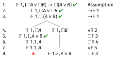
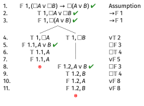

# Example 1: $\Diamond(A \wedge B) \rightarrow (\Diamond A \wedge \Diamond B)$ in K

## Example 1: $\Diamond(A \wedge B) \rightarrow (\Diamond A \wedge \Diamond B)$ in K

---

\begin{oltableau}
[\sFmla{\False}{1, \Diamond(A \land B) \rightarrow (\Diamond A \land \Diamond B)}, just = \TAss
]
\end{oltableau}

::: {.content-visible when-format="revealjs"}
{width=600px}
:::

Start by assuming it's false.

---

\begin{oltableau}
[\sFmla{\False}{1, \Diamond(A \land B) \rightarrow (\Diamond A \land \Diamond B)}, just = \TAss
    [\sFmla{\True}{1, \Diamond(A \land B)}, just = {\TRule{\False}{\rightarrow}[1]}
        [\sFmla{\False}{1, \Diamond A \land \Diamond B}, just = {\TRule{\False}{\rightarrow}[1]}
        ]
    ]
]
\end{oltableau}

::: {.content-visible when-format="revealjs"}
{width=600px}
:::

False conditional means true antecedent and false consequent.

---

\begin{oltableau}
[\sFmla{\False}{1, \Diamond(A \land B) \rightarrow (\Diamond A \land \Diamond B)}, just = \TAss
    [\sFmla{\True}{1, \Diamond(A \land B)}, just = {\TRule{\False}{\rightarrow}[1]}
        [\sFmla{\False}{1, \Diamond A \land \Diamond B}, just = {\TRule{\False}{\rightarrow}[1]}
            [\sFmla{\True}{1.1, A \land B}, just = {\TRule{\True}{\Diamond}[2]}
            ]
        ]
    ]
]
\end{oltableau}

::: {.content-visible when-format="revealjs"}
{width=600px}
:::

True diamond introduces world 1.1.

---

\begin{oltableau}
[\sFmla{\False}{1, \Diamond(A \land B) \rightarrow (\Diamond A \land \Diamond B)}, just = \TAss
    [\sFmla{\True}{1, \Diamond(A \land B)}, just = {\TRule{\False}{\rightarrow}[1]}
        [\sFmla{\False}{1, \Diamond A \land \Diamond B}, just = {\TRule{\False}{\rightarrow}[1]}
            [\sFmla{\True}{1.1, A \land B}, just = {\TRule{\True}{\Diamond}[2]}
                [\sFmla{\True}{1.1, A}, just = {\TRule{\True}{\land}[4]}
                    [\sFmla{\True}{1.1, B}, just = {\TRule{\True}{\land}[4]}
                    ]
                ]
            ]
        ]
    ]
]
\end{oltableau}

::: {.content-visible when-format="revealjs"}
{width=600px}
:::

True conjunction gives us both $A$ and $B$ at 1.1.

---

\begin{oltableau}
[\sFmla{\False}{1, \Diamond(A \land B) \rightarrow (\Diamond A \land \Diamond B)}, just = \TAss
    [\sFmla{\True}{1, \Diamond(A \land B)}, just = {\TRule{\False}{\rightarrow}[1]}
        [\sFmla{\False}{1, \Diamond A \land \Diamond B}, just = {\TRule{\False}{\rightarrow}[1]}
            [\sFmla{\True}{1.1, A \land B}, just = {\TRule{\True}{\Diamond}[2]}
                [\sFmla{\True}{1.1, A}, just = {\TRule{\True}{\land}[4]}
                    [\sFmla{\True}{1.1, B}, just = {\TRule{\True}{\land}[4]}
                        [\sFmla{\False}{1, \Diamond A}, just = {\TRule{\False}{\land}[3]}
                            [\sFmla{\False}{1.1, A}, just = {\TRule{\False}{\Diamond}[7]}, close]
                        ]
                        [\sFmla{\False}{1, \Diamond B}, just = {\TRule{\False}{\land}[3]}
                            [\sFmla{\False}{1.2, B}, just = {\TRule{\False}{\Diamond}[7]}, move by=1,close]
                        ]
                    ]
                ]
            ]
        ]
    ]
]
\end{oltableau}

::: {.content-visible when-format="revealjs"}
{width=600px}
:::

When we introduce worlds that make the $\Diamond$ sentences true, both branches close. So this is valid in **K**.

# Example 2: $(\Diamond A \vee \Diamond B) \rightarrow \Diamond(A \vee B)$ in K

## Example 2: $(\Diamond A \vee \Diamond B) \rightarrow \Diamond(A \vee B)$ in K

Let's show this is a theorem in **K**.

---

\begin{oltableau}
[\sFmla{\False}{1, (\Diamond A \lor \Diamond B) \rightarrow \Diamond(A \lor B)}, just = \TAss
    [\sFmla{\True}{1, \Diamond A \lor \Diamond B}, just = {\TRule{\False}{\rightarrow}[1]}
        [\sFmla{\False}{1, \Diamond(A \lor B)}, just = {\TRule{\False}{\rightarrow}[1]}
        ]
    ]
]
\end{oltableau}

::: {.content-visible when-format="revealjs"}
{width=600px}
:::

---

\begin{oltableau}
[\sFmla{\False}{1, (\Diamond A \lor \Diamond B) \rightarrow \Diamond(A \lor B)}, just = \TAss
    [\sFmla{\True}{1, \Diamond A \lor \Diamond B}, just = {\TRule{\False}{\rightarrow}[1]}
        [\sFmla{\False}{1, \Diamond(A \lor B)}, just = {\TRule{\False}{\rightarrow}[1]}
            [\sFmla{\True}{1, \Diamond A}, just = {\TRule{\True}{\lor}[2]}
            ]
            [\sFmla{\True}{1, \Diamond B}, just = {\TRule{\True}{\lor}[2]}
            ]
        ]
    ]
]
\end{oltableau}

::: {.content-visible when-format="revealjs"}
{width=600px}
:::

The disjunction branches.

---

\begin{oltableau}
[\sFmla{\False}{1, (\Diamond A \lor \Diamond B) \rightarrow \Diamond(A \lor B)}, just = \TAss
    [\sFmla{\True}{1, \Diamond A \lor \Diamond B}, just = {\TRule{\False}{\rightarrow}[1]}
        [\sFmla{\False}{1, \Diamond(A \lor B)}, just = {\TRule{\False}{\rightarrow}[1]}
            [\sFmla{\True}{1, \Diamond A}, just = {\TRule{\True}{\lor}[2]}
                [\sFmla{\True}{1.1, A}, just = {\TRule{\True}{\Diamond}[4]}
                    [\sFmla{\False}{1.1, A \lor B}, just = {\TRule{\False}{\Diamond}[3]}
                        [\sFmla{\False}{1.1, A}, just = {\TRule{\False}{\lor}[6]}, close]
                    ]
                ]
            ]
            [\sFmla{\True}{1, \Diamond B}, just = {\TRule{\True}{\lor}[2]}
                [\sFmla{\True}{1.2, B}, just = {\TRule{\True}{\Diamond}[4]}
                    [\sFmla{\False}{1.2, A \lor B}, just = {\TRule{\False}{\Diamond}[3]}
                        [\sFmla{\False}{1.2, A}, just = {\TRule{\False}{\lor}[6]}
                            [\sFmla{\False}{1.2, B}, just = {\TRule{\False}{\lor}[6]}, close]
                        ]
                    ]
                ]
            ]
        ]
    ]
]
\end{oltableau}

::: {.content-visible when-format="revealjs"}
{width=600px}
:::

Both branches close, so this **is** valid in K.

# Example 3: $A \rightarrow \Box \Diamond A$ in KT

## Example 3: $A \rightarrow \Box \Diamond A$ in KT

This should fail in KT. Let's show it.

---

\begin{oltableau}
[\sFmla{\False}{1, A \rightarrow \Box \Diamond A}, just = \TAss
    [\sFmla{\True}{1, A}, just = {\TRule{\False}{\rightarrow}[1]}
        [\sFmla{\False}{1, \Box \Diamond A}, just = {\TRule{\False}{\rightarrow}[1]}
            [\sFmla{\False}{1.1, \Diamond A}, just = {\TRule{\False}{\Box}[3]}
                [\sFmla{\False}{1.1, A}, just = {\TRule{\Diamond}{\text{T}}[4]}
                ]
            ]
        ]
    ]
]
\end{oltableau}

::: {.content-visible when-format="revealjs"}
{width=600px}
:::

The tree stays open. So this is not valid in **KT**.

Note that after line 4 we've completed all the rules we needed to use in **K**, so the first four lines show it is not a theorem in **K**.

## The Landscape of Modal Logics

::: {.columns}

:::: {.column width="50%"}

{height=600px}

::::

:::: {.column width="50%"}

::: {.incremental}
- **Stronger logics are higher** in the diagram
- If a formula is **valid in a weaker logic**, it is **valid in all stronger logics** above it
- If a formula is **not valid in a stronger logic**, it is **not valid in any weaker logic** below it
:::

::::

:::

# Example 4: $A \rightarrow \Box \Diamond A$ in KB

## Example 4: $A \rightarrow \Box \Diamond A$ in KB

But this does hold in **KB**. Let's see this.

---

\begin{oltableau}
[\sFmla{\False}{1, A \rightarrow \Box \Diamond A}, just = \TAss
    [\sFmla{\True}{1, A}, just = {\TRule{\False}{\rightarrow}[1]}
        [\sFmla{\False}{1, \Box \Diamond A}, just = {\TRule{\False}{\rightarrow}[1]}
            [\sFmla{\False}{1.1, \Diamond A}, just = {\TRule{\False}{\Box}[3]}
                    [\sFmla{\False}{1, A}, just = {\TRule{\Diamond}{\text{B}}[4]}, close]
            ]
        ]
    ]
]
\end{oltableau}

::: {.content-visible when-format="revealjs"}
{width=600px}
:::

The B$\Diamond$ rule gives us the contradiction.

# Example 5: $\Box(A \rightarrow B) \rightarrow (\Box A \rightarrow \Box B)$ in K

## Example 5: $\Box(A \rightarrow B) \rightarrow (\Box A \rightarrow \Box B)$ in K

This is the K axiom - it should be valid even in K.

---

\begin{oltableau}
[\sFmla{\False}{1, \Box(A \rightarrow B) \rightarrow (\Box A \rightarrow \Box B)}, just = \TAss
    [\sFmla{\True}{1, \Box(A \rightarrow B)}, just = {\TRule{\False}{\rightarrow}[1]}
        [\sFmla{\False}{1, \Box A \rightarrow \Box B}, just = {\TRule{\False}{\rightarrow}[1]}
        ]
    ]
]
\end{oltableau}

::: {.content-visible when-format="revealjs"}
{width=600px}
:::

---

\begin{oltableau}
[\sFmla{\False}{1, \Box(A \rightarrow B) \rightarrow (\Box A \rightarrow \Box B)}, just = \TAss
    [\sFmla{\True}{1, \Box(A \rightarrow B)}, just = {\TRule{\False}{\rightarrow}[1]}
        [\sFmla{\False}{1, \Box A \rightarrow \Box B}, just = {\TRule{\False}{\rightarrow}[1]}
            [\sFmla{\True}{1, \Box A}, just = {\TRule{\False}{\rightarrow}[3]}
                [\sFmla{\False}{1, \Box B}, just = {\TRule{\False}{\rightarrow}[3]}
                ]
            ]
        ]
    ]
]
\end{oltableau}

::: {.content-visible when-format="revealjs"}
{width=600px}
:::

---

\begin{oltableau}
[\sFmla{\False}{1, \Box(A \rightarrow B) \rightarrow (\Box A \rightarrow \Box B)}, just = \TAss
    [\sFmla{\True}{1, \Box(A \rightarrow B)}, just = {\TRule{\False}{\rightarrow}[1]}
        [\sFmla{\False}{1, \Box A \rightarrow \Box B}, just = {\TRule{\False}{\rightarrow}[1]}
            [\sFmla{\True}{1, \Box A}, just = {\TRule{\False}{\rightarrow}[3]}
                [\sFmla{\False}{1, \Box B}, just = {\TRule{\False}{\rightarrow}[3]}
                    [\sFmla{\False}{1.1, B}, just = {\TRule{\False}{\Box}[5]}
                        [\sFmla{\True}{1.1, A \rightarrow B}, just = {\TRule{\True}{\Box}[2]}
                            [\sFmla{\True}{1.1, A}, just = {\TRule{\True}{\Box}[4]}
                            ]
                        ]
                    ]
                ]
            ]
        ]
    ]
]
\end{oltableau}

::: {.content-visible when-format="revealjs"}
{width=600px}
:::

---

\begin{oltableau}
[\sFmla{\False}{1, \Box(A \rightarrow B) \rightarrow (\Box A \rightarrow \Box B)}, just = \TAss
    [\sFmla{\True}{1, \Box(A \rightarrow B)}, just = {\TRule{\False}{\rightarrow}[1]}
        [\sFmla{\False}{1, \Box A \rightarrow \Box B}, just = {\TRule{\False}{\rightarrow}[1]}
            [\sFmla{\True}{1, \Box A}, just = {\TRule{\False}{\rightarrow}[3]}
                [\sFmla{\False}{1, \Box B}, just = {\TRule{\False}{\rightarrow}[3]}
                    [\sFmla{\False}{1.1, B}, just = {\TRule{\False}{\Box}[5]}
                        [\sFmla{\True}{1.1, A \rightarrow B}, just = {\TRule{\True}{\Box}[2]}
                            [\sFmla{\True}{1.1, A}, just = {\TRule{\True}{\Box}[4]}
                                [\sFmla{\False}{1.1, A}, just = {\TRule{\True}{\rightarrow}[7]}, close]
                                [\sFmla{\True}{1.1, B}, just = {\TRule{\True}{\rightarrow}[7]}, close]
                            ]
                        ]
                    ]
                ]
            ]
        ]
    ]
]
\end{oltableau}

::: {.content-visible when-format="revealjs"}
{width=600px}
:::

Both branches close, so this is valid.

Indeed, this is the canonical axiom for **K**.

## Example 5: $\Box(A \rightarrow B) \rightarrow (\Box A \rightarrow \Box B)$ in K

Another way to think about this is that it's saying that if you have

- $\Box(A \rightarrow B)$; and
- $\Box A$

you can derive

- $\Box B$

The general principle is that if an argument is valid, then putting a box in front of every premise and in front of the conclusion will preserve validity.

# Example 6: $(\Box A \vee \Box B) \rightarrow \Box(A \vee B)$ in K

## Example 6: $(\Box A \vee \Box B) \rightarrow \Box(A \vee B)$ in K

---

\begin{oltableau}
[\sFmla{\False}{1, (\Box A \lor \Box B) \rightarrow \Box(A \lor B)}, just = \TAss
    [\sFmla{\True}{1, \Box A \lor \Box B}, just = {\TRule{\False}{\rightarrow}[1]}
        [\sFmla{\False}{1, \Box(A \lor B)}, just = {\TRule{\False}{\rightarrow}[1]}
        ]
    ]
]
\end{oltableau}

::: {.content-visible when-format="revealjs"}
{width=600px}
:::

---

\begin{oltableau}
[\sFmla{\False}{1, (\Box A \lor \Box B) \rightarrow \Box(A \lor B)}, just = \TAss
    [\sFmla{\True}{1, \Box A \lor \Box B}, just = {\TRule{\False}{\rightarrow}[1]}
        [\sFmla{\False}{1, \Box(A \lor B)}, just = {\TRule{\False}{\rightarrow}[1]}
            [\sFmla{\True}{1, \Box A}, just = {\TRule{\True}{\lor}[2]}
                [\sFmla{\False}{1.1, A \lor B}, just = {\TRule{\False}{\Box}[3]}
                    [\sFmla{\True}{1.1, A}, just = {\TRule{\True}{\Box}[4]}
                        [\sFmla{\False}{1.1, A}, just = {\TRule{\False}{\lor}[5]}, close]
                    ]
                ]
            ]
            [\sFmla{\True}{1, \Box B}, just = {\TRule{\True}{\lor}[2]}
                [\sFmla{\False}{1.1, A \lor B}, just = {\TRule{\False}{\Box}[3]}
                    [\sFmla{\True}{1.1, B}, just = {\TRule{\True}{\Box}[4]}
                        [\sFmla{\False}{1.1, A}, just = {\TRule{\False}{\lor}[5]}
                            [\sFmla{\False}{1.1, B}, just = {\TRule{\False}{\lor}[5]}, close]
                        ]
                    ]
                ]
            ]
        ]
    ]
]
\end{oltableau}

::: {.content-visible when-format="revealjs"}
{width=600px}
:::

This is valid in K. Intuitively, if either one of $\Box A$ or $\Box B$ is true, we can derive $\Box(A \lor B)$

# Example 7: $(\Diamond A \wedge \Diamond B) \rightarrow \Diamond(A \wedge B)$ in K

## Example 7: $(\Diamond A \wedge \Diamond B) \rightarrow \Diamond(A \wedge B)$ in K

This should fail; different worlds might make  - worlds $\Diamond A$ and $\Diamond B$ true.

And the special case where $B = \neg A$ also suggests it is invalid.

---

\begin{oltableau}
[\sFmla{\False}{1, (\Diamond A \land \Diamond B) \rightarrow \Diamond(A \land B)}, just = \TAss
    [\sFmla{\True}{1, \Diamond A \land \Diamond B}, just = {\TRule{\False}{\rightarrow}[1]}
        [\sFmla{\False}{1, \Diamond(A \land B)}, just = {\TRule{\False}{\rightarrow}[1]}
            [\sFmla{\True}{1, \Diamond A}, just = {\TRule{\True}{\land}[2]}
                [\sFmla{\True}{1, \Diamond B}, just = {\TRule{\True}{\land}[2]}
                ]
            ]
        ]
    ]
]
\end{oltableau}

::: {.content-visible when-format="revealjs"}
{width=600px}
:::

---

\begin{oltableau}
[\sFmla{\False}{1, (\Diamond A \land \Diamond B) \rightarrow \Diamond(A \land B)}, just = \TAss
    [\sFmla{\True}{1, \Diamond A \land \Diamond B}, just = {\TRule{\False}{\rightarrow}[1]}
        [\sFmla{\False}{1, \Diamond(A \land B)}, just = {\TRule{\False}{\rightarrow}[1]}
            [\sFmla{\True}{1, \Diamond A}, just = {\TRule{\True}{\land}[2]}
                [\sFmla{\True}{1, \Diamond B}, just = {\TRule{\True}{\land}[2]}
                    [\sFmla{\True}{1.1, A}, just = {\TRule{\True}{\Diamond}[4]}
                        [\sFmla{\True}{1.2, B}, just = {\TRule{\True}{\Diamond}[5]}
                        ]
                    ]
                ]
            ]
        ]
    ]
]
\end{oltableau}

::: {.content-visible when-format="revealjs"}
{width=600px}
:::

---

\begin{oltableau}
[\sFmla{\False}{1, (\Diamond A \land \Diamond B) \rightarrow \Diamond(A \land B)}, just = \TAss
    [\sFmla{\True}{1, \Diamond A \land \Diamond B}, just = {\TRule{\False}{\rightarrow}[1]}
        [\sFmla{\False}{1, \Diamond(A \land B)}, just = {\TRule{\False}{\rightarrow}[1]}
            [\sFmla{\True}{1, \Diamond A}, just = {\TRule{\True}{\land}[2]}
                [\sFmla{\True}{1, \Diamond B}, just = {\TRule{\True}{\land}[2]}
                    [\sFmla{\True}{1.1, A}, just = {\TRule{\True}{\Diamond}[4]}
                        [\sFmla{\True}{1.2, B}, just = {\TRule{\True}{\Diamond}[5]}
                            [\sFmla{\False}{1.1, A \land B}, just = {\TRule{\False}{\Diamond}[3]}
                                [\sFmla{\False}{1.2, A \land B}, just = {\TRule{\False}{\Diamond}[3]}
                                ]
                            ]
                        ]
                    ]
                ]
            ]
        ]
    ]
]
\end{oltableau}

::: {.content-visible when-format="revealjs"}
{width=600px}
:::

The tree stays open. World 1.1 has $A$ but might not have $B$, and world 1.2 has $B$ but might not have $A$.

## Example 7: $\Diamond A \wedge \Diamond B \rightarrow \Diamond(A \wedge B)$ in K

This should fail - worlds accessible from 1 might be different.

---

\begin{oltableau}
[\sFmla{\False}{1, (\Diamond A \land \Diamond B) \rightarrow \Diamond(A \land B)}, just = \TAss
    [\sFmla{\True}{1, \Diamond A \land \Diamond B}, just = {\TRule{\False}{\rightarrow}[1]}
        [\sFmla{\False}{1, \Diamond(A \land B)}, just = {\TRule{\False}{\rightarrow}[1]}
            [\sFmla{\True}{1, \Diamond A}, just = {\TRule{\True}{\land}[2]}
                [\sFmla{\True}{1, \Diamond B}, just = {\TRule{\True}{\land}[2]}
                ]
            ]
        ]
    ]
]
\end{oltableau}

::: {.content-visible when-format="revealjs"}
{width=600px}
:::

---

\begin{oltableau}
[\sFmla{\False}{1, (\Diamond A \land \Diamond B) \rightarrow \Diamond(A \land B)}, just = \TAss
    [\sFmla{\True}{1, \Diamond A \land \Diamond B}, just = {\TRule{\False}{\rightarrow}[1]}
        [\sFmla{\False}{1, \Diamond(A \land B)}, just = {\TRule{\False}{\rightarrow}[1]}
            [\sFmla{\True}{1, \Diamond A}, just = {\TRule{\True}{\land}[2]}
                [\sFmla{\True}{1, \Diamond B}, just = {\TRule{\True}{\land}[2]}
                    [\sFmla{\True}{1.1, A}, just = {\TRule{\True}{\Diamond}[4]}
                        [\sFmla{\True}{1.2, B}, just = {\TRule{\True}{\Diamond}[5]}
                        ]
                    ]
                ]
            ]
        ]
    ]
]
\end{oltableau}

::: {.content-visible when-format="revealjs"}
{width=600px}
:::

---

\begin{oltableau}
[\sFmla{\False}{1, (\Diamond A \land \Diamond B) \rightarrow \Diamond(A \land B)}, just = \TAss
    [\sFmla{\True}{1, \Diamond A \land \Diamond B}, just = {\TRule{\False}{\rightarrow}[1]}
        [\sFmla{\False}{1, \Diamond(A \land B)}, just = {\TRule{\False}{\rightarrow}[1]}
            [\sFmla{\True}{1, \Diamond A}, just = {\TRule{\True}{\land}[2]}
                [\sFmla{\True}{1, \Diamond B}, just = {\TRule{\True}{\land}[2]}
                    [\sFmla{\True}{1.1, A}, just = {\TRule{\True}{\Diamond}[4]}
                        [\sFmla{\True}{1.2, B}, just = {\TRule{\True}{\Diamond}[5]}
                            [\sFmla{\False}{1.1, A \land B}, just = {\TRule{\False}{\Diamond}[3]}
                                [\sFmla{\False}{1.2, A \land B}, just = {\TRule{\False}{\Diamond}[3]}
                                ]
                            ]
                        ]
                    ]
                ]
            ]
        ]
    ]
]
\end{oltableau}

::: {.content-visible when-format="revealjs"}
{width=600px}
:::

The tree stays open! World 1.1 has $A$ but might not have $B$, and world 1.2 has $B$ but might not have $A$.

# Example 8: $\Box(A \vee B) \rightarrow (\Box A \vee \Diamond B)$ in K

## Example 8: $\Box(A \vee B) \rightarrow (\Box A \vee \Diamond B)$ in K

---

\begin{oltableau}
[\sFmla{\False}{1, \Box(A \lor B) \rightarrow (\Box A \lor \Diamond B)}, just = \TAss
    [\sFmla{\True}{1, \Box(A \lor B)}, just = {\TRule{\False}{\rightarrow}[1]}
        [\sFmla{\False}{1, \Box A \lor \Diamond B}, just = {\TRule{\False}{\rightarrow}[1]}
        ]
    ]
]
\end{oltableau}

::: {.content-visible when-format="revealjs"}
{width=600px}
:::

---

\begin{oltableau}
[\sFmla{\False}{1, \Box(A \lor B) \rightarrow (\Box A \lor \Diamond B)}, just = \TAss
    [\sFmla{\True}{1, \Box(A \lor B)}, just = {\TRule{\False}{\rightarrow}[1]}
        [\sFmla{\False}{1, \Box A \lor \Diamond B}, just = {\TRule{\False}{\rightarrow}[1]}
            [\sFmla{\False}{1, \Box A}, just = {\TRule{\False}{\lor}[3]}
                [\sFmla{\False}{1, \Diamond B}, just = {\TRule{\False}{\lor}[3]}
                ]
            ]
        ]
    ]
]
\end{oltableau}

::: {.content-visible when-format="revealjs"}
{width=600px}
:::

---

\begin{oltableau}
[\sFmla{\False}{1, \Box(A \lor B) \rightarrow (\Box A \lor \Diamond B)}, just = \TAss
    [\sFmla{\True}{1, \Box(A \lor B)}, just = {\TRule{\False}{\rightarrow}[1]}
        [\sFmla{\False}{1, \Box A \lor \Diamond B}, just = {\TRule{\False}{\rightarrow}[1]}
            [\sFmla{\False}{1, \Box A}, just = {\TRule{\False}{\lor}[3]}
                [\sFmla{\False}{1, \Diamond B}, just = {\TRule{\False}{\lor}[3]}
                    [\sFmla{\False}{1.1, A}, just = {\TRule{\False}{\Box}[4]}
                        [\sFmla{\True}{1.1, A \lor B}, just = {\TRule{\True}{\Box}[2]}
                            [\sFmla{\False}{1.1, B}, just = {\TRule{\False}{\Diamond}[5]}
                            ]
                        ]
                    ]
                ]
            ]
        ]
    ]
]
\end{oltableau}

::: {.content-visible when-format="revealjs"}
{width=600px}
:::

---

\begin{oltableau}
[\sFmla{\False}{1, \Box(A \lor B) \rightarrow (\Box A \lor \Diamond B)}, just = \TAss
    [\sFmla{\True}{1, \Box(A \lor B)}, just = {\TRule{\False}{\rightarrow}[1]}
        [\sFmla{\False}{1, \Box A \lor \Diamond B}, just = {\TRule{\False}{\rightarrow}[1]}
            [\sFmla{\False}{1, \Box A}, just = {\TRule{\False}{\lor}[3]}
                [\sFmla{\False}{1, \Diamond B}, just = {\TRule{\False}{\lor}[3]}
                    [\sFmla{\False}{1.1, A}, just = {\TRule{\False}{\Box}[4]}
                        [\sFmla{\True}{1.1, A \lor B}, just = {\TRule{\True}{\Box}[2]}
                            [\sFmla{\False}{1.1, B}, just = {\TRule{\False}{\Diamond}[5]}
                                [\sFmla{\True}{1.1, A}, just = {\TRule{\True}{\lor}[7]}, close]
                                [\sFmla{\True}{1.1, B}, just = {\TRule{\True}{\lor}[7]}, close]
                            ]
                        ]
                    ]
                ]
            ]
        ]
    ]
]
\end{oltableau}

::: {.content-visible when-format="revealjs"}
{width=600px}
:::

This closes! Valid in K.

# Example 9: $\Box A \rightarrow A$ in KT

## Example 9: $\Box A \rightarrow A$ in KT

We already did this one - it closes immediately with the T$\Box$ rule.

# Example 10: $\Diamond \Box A \rightarrow A$ in KT

## Example 10: $\Diamond \Box A \rightarrow A$ in KT

---

\begin{oltableau}
[\sFmla{\False}{1, \Diamond \Box A \rightarrow A}, just = \TAss
    [\sFmla{\True}{1, \Diamond \Box A}, just = {\TRule{\False}{\rightarrow}[1]}
        [\sFmla{\False}{1, A}, just = {\TRule{\False}{\rightarrow}[1]}
        ]
    ]
]
\end{oltableau}

::: {.content-visible when-format="revealjs"}
{width=600px}
:::

---

\begin{oltableau}
[\sFmla{\False}{1, \Diamond \Box A \rightarrow A}, just = \TAss
    [\sFmla{\True}{1, \Diamond \Box A}, just = {\TRule{\False}{\rightarrow}[1]}
        [\sFmla{\False}{1, A}, just = {\TRule{\False}{\rightarrow}[1]}
            [\sFmla{\True}{1.1, \Box A}, just = {\TRule{\True}{\Diamond}[2]}
                [\sFmla{\True}{1.1, A}, just = {\TRule{\Box}{\text{T}}[4]}
                ]
            ]
        ]
    ]
]
\end{oltableau}

::: {.content-visible when-format="revealjs"}
{width=600px}
:::

The tree stays open in KT - we can't get $A$ back to world 1.

# Example 11: $\Diamond \Box A \rightarrow A$ in KTB

## Example 11: $\Diamond \Box A \rightarrow A$ in KTB

---

\begin{oltableau}
[\sFmla{\False}{1, \Diamond \Box A \rightarrow A}, just = \TAss
    [\sFmla{\True}{1, \Diamond \Box A}, just = {\TRule{\False}{\rightarrow}[1]}
        [\sFmla{\False}{1, A}, just = {\TRule{\False}{\rightarrow}[1]}
            [\sFmla{\True}{1.1, \Box A}, just = {\TRule{\True}{\Diamond}[2]}
                [\sFmla{\True}{1.1, A}, just = {\TRule{\Box}{\text{T}}[4]}
                    [\sFmla{\True}{1, A}, just = {\TRule{\Box}{\text{B}}[5]}, close]
                ]
            ]
        ]
    ]
]
\end{oltableau}

::: {.content-visible when-format="revealjs"}
{width=600px}
:::

With the B$\Box$ rule, it closes!

# Example 12: $\Box(A \wedge B) \leftrightarrow (\Box A \wedge \Box B)$ in K

## Example 12: $\Box(A \wedge B) \leftrightarrow (\Box A \wedge \Box B)$ in K

Let's do just the left-to-right direction.

---

\begin{oltableau}
[\sFmla{\False}{1, \Box(A \land B) \rightarrow (\Box A \land \Box B)}, just = \TAss
    [\sFmla{\True}{1, \Box(A \land B)}, just = {\TRule{\False}{\rightarrow}[1]}
        [\sFmla{\False}{1, \Box A \land \Box B}, just = {\TRule{\False}{\rightarrow}[1]}
        ]
    ]
]
\end{oltableau}

::: {.content-visible when-format="revealjs"}
{width=600px}
:::

---

\begin{oltableau}
[\sFmla{\False}{1, \Box(A \land B) \rightarrow (\Box A \land \Box B)}, just = \TAss
    [\sFmla{\True}{1, \Box(A \land B)}, just = {\TRule{\False}{\rightarrow}[1]}
        [\sFmla{\False}{1, \Box A \land \Box B}, just = {\TRule{\False}{\rightarrow}[1]}
            [\sFmla{\False}{1, \Box A}, just = {\TRule{\False}{\land}[3]}
                [\sFmla{\False}{1.1, A}, just = {\TRule{\False}{\Box}[4]}
                    [\sFmla{\True}{1.1, A \land B}, just = {\TRule{\True}{\Box}[2]}
                        [\sFmla{\True}{1.1, A}, just = {\TRule{\True}{\land}[6]}, close]
                    ]
                ]
            ]
            [\sFmla{\False}{1, \Box B}, just = {\TRule{\False}{\land}[3]}
                [\sFmla{\False}{1.1, B}, just = {\TRule{\False}{\Box}[4]}
                    [\sFmla{\True}{1.1, A \land B}, just = {\TRule{\True}{\Box}[2]}
                        [\sFmla{\True}{1.1, B}, just = {\TRule{\True}{\land}[6]}, close]
                    ]
                ]
            ]
        ]
    ]
]
\end{oltableau}

::: {.content-visible when-format="revealjs"}
{width=600px}
:::

Valid in K!

# Example 13: $\Diamond(A \vee B) \leftrightarrow (\Diamond A \vee \Diamond B)$ in K

## Example 13: $\Diamond(A \vee B) \leftrightarrow (\Diamond A \vee \Diamond B)$ in K

We already showed one direction. Let's do the other direction.

---

\begin{oltableau}
[\sFmla{\False}{1, (\Diamond A \lor \Diamond B) \rightarrow \Diamond(A \lor B)}, just = \TAss
    [\sFmla{\True}{1, \Diamond A \lor \Diamond B}, just = {\TRule{\False}{\rightarrow}[1]}
        [\sFmla{\False}{1, \Diamond(A \lor B)}, just = {\TRule{\False}{\rightarrow}[1]}
            [\sFmla{\True}{1, \Diamond A}, just = {\TRule{\True}{\lor}[2]}
                [\sFmla{\True}{1.1, A}, just = {\TRule{\True}{\Diamond}[4]}
                    [\sFmla{\False}{1.1, A \lor B}, just = {\TRule{\False}{\Diamond}[3]}
                        [\sFmla{\False}{1.1, A}, just = {\TRule{\False}{\lor}[6]}, close]
                    ]
                ]
            ]
            [\sFmla{\True}{1, \Diamond B}, just = {\TRule{\True}{\lor}[2]}
                [\sFmla{\True}{1.1, B}, just = {\TRule{\True}{\Diamond}[4]}
                    [\sFmla{\False}{1.1, A \lor B}, just = {\TRule{\False}{\Diamond}[3]}
                        [\sFmla{\False}{1.1, B}, just = {\TRule{\False}{\lor}[6]}, close]
                    ]
                ]
            ]
        ]
    ]
]
\end{oltableau}

::: {.content-visible when-format="revealjs"}
{width=600px}
:::

So the biconditional is valid in K!

# Example 14: More Practice with T

## Example 14: More Practice with T

$\Diamond A \rightarrow \Diamond \Diamond A$ in K vs KT

---

In K:

\begin{oltableau}
[\sFmla{\False}{1, \Diamond A \rightarrow \Diamond \Diamond A}, just = \TAss
    [\sFmla{\True}{1, \Diamond A}, just = {\TRule{\False}{\rightarrow}[1]}
        [\sFmla{\False}{1, \Diamond \Diamond A}, just = {\TRule{\False}{\rightarrow}[1]}
            [\sFmla{\True}{1.1, A}, just = {\TRule{\True}{\Diamond}[2]}
                [\sFmla{\False}{1.1, \Diamond A}, just = {\TRule{\False}{\Diamond}[3]}
                ]
            ]
        ]
    ]
]
\end{oltableau}

::: {.content-visible when-format="revealjs"}
{width=600px}
:::

Stays open in K!

---

In KT:

\begin{oltableau}
[\sFmla{\False}{1, \Diamond A \rightarrow \Diamond \Diamond A}, just = \TAss
    [\sFmla{\True}{1, \Diamond A}, just = {\TRule{\False}{\rightarrow}[1]}
        [\sFmla{\False}{1, \Diamond \Diamond A}, just = {\TRule{\False}{\rightarrow}[1]}
            [\sFmla{\True}{1.1, A}, just = {\TRule{\True}{\Diamond}[2]}
                [\sFmla{\False}{1.1, \Diamond A}, just = {\TRule{\False}{\Diamond}[3]}
                    [\sFmla{\False}{1.1, A}, just = {\TRule{\Diamond}{\text{T}}[5]}, close]
                ]
            ]
        ]
    ]
]
\end{oltableau}

::: {.content-visible when-format="revealjs"}
{width=600px}
:::

Closes in KT!

# Example 15: Symmetry in Action

## Example 15: Symmetry in Action

$\Box A \rightarrow \Diamond A$ in K vs KB

---

In K:

\begin{oltableau}
[\sFmla{\False}{1, \Box A \rightarrow \Diamond A}, just = \TAss
    [\sFmla{\True}{1, \Box A}, just = {\TRule{\False}{\rightarrow}[1]}
        [\sFmla{\False}{1, \Diamond A}, just = {\TRule{\False}{\rightarrow}[1]}
        ]
    ]
]
\end{oltableau}

::: {.content-visible when-format="revealjs"}
{width=600px}
:::

Stays open - world 1 might not access any worlds!

---

In KB:

\begin{oltableau}
[\sFmla{\False}{1, \Box A \rightarrow \Diamond A}, just = \TAss
    [\sFmla{\True}{1, \Box A}, just = {\TRule{\False}{\rightarrow}[1]}
        [\sFmla{\False}{1, \Diamond A}, just = {\TRule{\False}{\rightarrow}[1]}
        ]
    ]
]
\end{oltableau}

::: {.content-visible when-format="revealjs"}
{width=600px}
:::

Still stays open in KB alone! This needs reflexivity (T) to close.

---

In KT:

\begin{oltableau}
[\sFmla{\False}{1, \Box A \rightarrow \Diamond A}, just = \TAss
    [\sFmla{\True}{1, \Box A}, just = {\TRule{\False}{\rightarrow}[1]}
        [\sFmla{\False}{1, \Diamond A}, just = {\TRule{\False}{\rightarrow}[1]}
            [\sFmla{\True}{1, A}, just = {\TRule{\Box}{\text{T}}[2]}
                [\sFmla{\False}{1, A}, just = {\TRule{\Diamond}{\text{T}}[3]}, close]
            ]
        ]
    ]
]
\end{oltableau}

::: {.content-visible when-format="revealjs"}
{width=600px}
:::

Closes in KT!

# Example 16: $\Diamond A \rightarrow \Box \Diamond A$ in S5

## Example 16: $\Diamond A \rightarrow \Box \Diamond A$ in S5

This is a characteristic theorem of S5 - let's prove it step by step using simplified S5.

---

\begin{oltableau}
[\sFmla{\False}{1, \Diamond A \rightarrow \Box \Diamond A}, just = \TAss
]
\end{oltableau}

::: {.content-visible when-format="revealjs"}
{width=600px}
:::

Start with it being false at 1.

---

\begin{oltableau}
[\sFmla{\False}{1, \Diamond A \rightarrow \Box \Diamond A}, just = \TAss
    [\sFmla{\True}{1, \Diamond A}, just = {\TRule{\False}{\rightarrow}[1]}
        [\sFmla{\False}{1, \Box \Diamond A}, just = {\TRule{\False}{\rightarrow}[1]}
        ]
    ]
]
\end{oltableau}

::: {.content-visible when-format="revealjs"}
{width=600px}
:::

False conditional: true antecedent, false consequent.

---

\begin{oltableau}
[\sFmla{\False}{1, \Diamond A \rightarrow \Box \Diamond A}, just = \TAss
    [\sFmla{\True}{1, \Diamond A}, just = {\TRule{\False}{\rightarrow}[1]}
        [\sFmla{\False}{1, \Box \Diamond A}, just = {\TRule{\False}{\rightarrow}[1]}
            [\sFmla{\True}{2, A}, just = {\TRule{\True}{\Diamond}[2]}
                [\sFmla{\False}{3, \Diamond A}, just = {\TRule{\False}{\Box}[3]}
                ]
            ]
        ]
    ]
]
\end{oltableau}

::: {.content-visible when-format="revealjs"}
{width=600px}
:::

True $\Diamond$ sentences and false $\Box$ sentences have to be made true somewhere - not necessarily the same 'somewhere'.

---

\begin{oltableau}
[\sFmla{\False}{1, \Diamond A \rightarrow \Box \Diamond A}, just = \TAss
    [\sFmla{\True}{1, \Diamond A}, just = {\TRule{\False}{\rightarrow}[1]}
        [\sFmla{\False}{1, \Box \Diamond A}, just = {\TRule{\False}{\rightarrow}[1]}
            [\sFmla{\True}{2, A}, just = {\TRule{\True}{\Diamond}[2]}
                [\sFmla{\False}{3, \Diamond A}, just = {\TRule{\False}{\Box}[3]}
                    [\sFmla{\False}{2, A}, just = {\TRule{\False}{\Diamond}[5]}, close]
                ]
            ]
        ]
    ]
]
\end{oltableau}

::: {.content-visible when-format="revealjs"}
{width=600px}
:::

False $\Diamond$ sentences are false everywhere - that is, the part inside the $\Diamond$ is false everywhere. So $A$ is false at world 2. But we just said $A$ is true at world 2! This closes, so it's a theorem of S5.

# Example 17: $\Box \Diamond A \rightarrow A$ in S5

## Example 17: $\Box \Diamond A \rightarrow A$ in S5

Let's test whether this is valid in S5. (Spoiler: it's not!)

---

\begin{oltableau}
[\sFmla{\False}{1, \Box \Diamond A \rightarrow A}, just = \TAss
]
\end{oltableau}

::: {.content-visible when-format="revealjs"}
{width=600px}
:::

Start with it being false at 1.

---

\begin{oltableau}
[\sFmla{\False}{1, \Box \Diamond A \rightarrow A}, just = \TAss
    [\sFmla{\True}{1, \Box \Diamond A}, just = {\TRule{\False}{\rightarrow}[1]}
        [\sFmla{\False}{1, A}, just = {\TRule{\False}{\rightarrow}[1]}
        ]
    ]
]
\end{oltableau}

::: {.content-visible when-format="revealjs"}
{width=600px}
:::

False conditional.

---

\begin{oltableau}
[\sFmla{\False}{1, \Box \Diamond A \rightarrow A}, just = \TAss
    [\sFmla{\True}{1, \Box \Diamond A}, just = {\TRule{\False}{\rightarrow}[1]}
        [\sFmla{\False}{1, A}, just = {\TRule{\False}{\rightarrow}[1]}
            [\sFmla{\True}{1, \Diamond A}, just = {\TRule{\True}{\Box}[2]}
            ]
        ]
    ]
]
\end{oltableau}

::: {.content-visible when-format="revealjs"}
{width=600px}
:::

The unboxed part of a box sentence is true everywhere, so it is true here.

---

\begin{oltableau}
[\sFmla{\False}{1, \Box \Diamond A \rightarrow A}, just = \TAss
    [\sFmla{\True}{1, \Box \Diamond A}, just = {\TRule{\False}{\rightarrow}[1]}
        [\sFmla{\False}{1, A}, just = {\TRule{\False}{\rightarrow}[1]}
            [\sFmla{\True}{1, \Diamond A}, just = {\TRule{\True}{\Box}[2]}
                [\sFmla{\True}{2, A}, just = {\TRule{\True}{\Diamond}[4]}
                ]
            ]
        ]
    ]
]
\end{oltableau}

::: {.content-visible when-format="revealjs"}
{width=600px}
:::

True $\Diamond$ sentences have to be made true by some world. It can't be world 1, since $A$ is false there.

---

\begin{oltableau}
[\sFmla{\False}{1, \Box \Diamond A \rightarrow A}, just = \TAss
    [\sFmla{\True}{1, \Box \Diamond A}, just = {\TRule{\False}{\rightarrow}[1]}
        [\sFmla{\False}{1, A}, just = {\TRule{\False}{\rightarrow}[1]}
            [\sFmla{\True}{1, \Diamond A}, just = {\TRule{\True}{\Box}[2]}
                [\sFmla{\True}{2, A}, just = {\TRule{\True}{\Diamond}[4]}
                    [\sFmla{\True}{2, \Diamond A}, just = {\TRule{\True}{\Box}[2]}
                    ]
                ]
            ]
        ]
    ]
]
\end{oltableau}

::: {.content-visible when-format="revealjs"}
{width=600px}
:::

True $\Box$ sentences are true, unboxed, everywhere.

---

Now if we follow the rules mechanically we would add a new world 3 to make line 6 true, and the cycle would continue. But if we think through what the lines are saying, we can see that we can stop here:

::: {.incremental}
- Line 6 ($\Diamond A$ true at 2) has to be made true somehow
- But line 5 says that world 2 itself makes line 6 true (since $A$ is true at 2)
- So there isn't anything extra to do
:::

## Describing the Countermodel

So here is a model where this formula fails:

::: {.incremental}
- There are two worlds: $w_1$ and $w_2$
- At $w_1$, $A$ is false
- At $w_2$, $A$ is true
- Because $w_2$ exists, $\Diamond A$ is true everywhere
- So $\Box \Diamond A$ is true everywhere
- But at $w_1$, $\Box \Diamond A$ is true and $A$ is false
- Therefore at $w_1$, $\Box \Diamond A \rightarrow A$ is false
:::

. . .

This shows that $\Box \Diamond A \rightarrow A$ is **not** valid in S5.

# Example 18: $\Box(\Box A \rightarrow A) \rightarrow \Box A$ in KT4

## Example 18: $\Box(\Box A \rightarrow A) \rightarrow \Box A$ in KT4

---

\begin{oltableau}
[\sFmla{\False}{1, \Box(\Box A \rightarrow A) \rightarrow \Box A}, just = \TAss
    [\sFmla{\True}{1, \Box(\Box A \rightarrow A)}, just = {\TRule{\False}{\rightarrow}[1]}
        [\sFmla{\False}{1, \Box A}, just = {\TRule{\False}{\rightarrow}[1]}
        ]
    ]
]
\end{oltableau}

::: {.content-visible when-format="revealjs"}
{width=600px}
:::

---

\begin{oltableau}
[\sFmla{\False}{1, \Box(\Box A \rightarrow A) \rightarrow \Box A}, just = \TAss
    [\sFmla{\True}{1, \Box(\Box A \rightarrow A)}, just = {\TRule{\False}{\rightarrow}[1]}
        [\sFmla{\False}{1, \Box A}, just = {\TRule{\False}{\rightarrow}[1]}
            [\sFmla{\True}{1, \Box A \rightarrow A}, just = {\TRule{\Box}{\text{T}}[2]}
                [\sFmla{\False}{1.1, A}, just = {\TRule{\False}{\Box}[3]}
                    [\sFmla{\True}{1.1, \Box A \rightarrow A}, just = {\TRule{\True}{\Box}[2]}
                    ]
                ]
            ]
        ]
    ]
]
\end{oltableau}

::: {.content-visible when-format="revealjs"}
{width=600px}
:::

---

\begin{oltableau}
[\sFmla{\False}{1, \Box(\Box A \rightarrow A) \rightarrow \Box A}, just = \TAss
    [\sFmla{\True}{1, \Box(\Box A \rightarrow A)}, just = {\TRule{\False}{\rightarrow}[1]}
        [\sFmla{\False}{1, \Box A}, just = {\TRule{\False}{\rightarrow}[1]}
            [\sFmla{\True}{1, \Box A \rightarrow A}, just = {\TRule{\Box}{\text{T}}[2]}
                [\sFmla{\False}{1.1, A}, just = {\TRule{\False}{\Box}[3]}
                    [\sFmla{\True}{1.1, \Box A \rightarrow A}, just = {\TRule{\True}{\Box}[2]}
                        [\sFmla{\False}{1.1, \Box A}, just = {\TRule{\True}{\rightarrow}[6]}
                            [\sFmla{\False}{1.1.1, A}, just = {\TRule{\False}{\Box}[7]}
                                [\sFmla{\True}{1.1, A}, just = {\TRule{\Box}{\text{T}}[6]}, close]
                            ]
                        ]
                        [\sFmla{\True}{1.1, A}, just = {\TRule{\True}{\rightarrow}[6]}, close]
                    ]
                ]
            ]
        ]
    ]
]
\end{oltableau}

::: {.content-visible when-format="revealjs"}
{width=600px}
:::

Valid in KT4!

# Example 19: $\Diamond \Box A \rightarrow \Box \Diamond A$ in S5

## Example 19: $\Diamond \Box A \rightarrow \Box \Diamond A$ in S5

We'll use simplified S5 notation for this.

---

\begin{oltableau}
[\sFmla{\False}{1, \Diamond \Box A \rightarrow \Box \Diamond A}, just = \TAss
    [\sFmla{\True}{1, \Diamond \Box A}, just = {\TRule{\False}{\rightarrow}[1]}
        [\sFmla{\False}{1, \Box \Diamond A}, just = {\TRule{\False}{\rightarrow}[1]}
        ]
    ]
]
\end{oltableau}

::: {.content-visible when-format="revealjs"}
{width=600px}
:::

---

\begin{oltableau}
[\sFmla{\False}{1, \Diamond \Box A \rightarrow \Box \Diamond A}, just = \TAss
    [\sFmla{\True}{1, \Diamond \Box A}, just = {\TRule{\False}{\rightarrow}[1]}
        [\sFmla{\False}{1, \Box \Diamond A}, just = {\TRule{\False}{\rightarrow}[1]}
            [\sFmla{\True}{2, \Box A}, just = {\TRule{\True}{\Diamond}[2]}
                [\sFmla{\False}{3, \Diamond A}, just = {\TRule{\False}{\Box}[3]}
                ]
            ]
        ]
    ]
]
\end{oltableau}

::: {.content-visible when-format="revealjs"}
{width=600px}
:::

---

\begin{oltableau}
[\sFmla{\False}{1, \Diamond \Box A \rightarrow \Box \Diamond A}, just = \TAss
    [\sFmla{\True}{1, \Diamond \Box A}, just = {\TRule{\False}{\rightarrow}[1]}
        [\sFmla{\False}{1, \Box \Diamond A}, just = {\TRule{\False}{\rightarrow}[1]}
            [\sFmla{\True}{2, \Box A}, just = {\TRule{\True}{\Diamond}[2]}
                [\sFmla{\False}{3, \Diamond A}, just = {\TRule{\False}{\Box}[3]}
                    [\sFmla{\True}{3, A}, just = {\TRule{\True}{\Box}[4]}
                        [\sFmla{\False}{3, A}, just = {\TRule{\False}{\Diamond}[5]}, close]
                    ]
                ]
            ]
        ]
    ]
]
\end{oltableau}

::: {.content-visible when-format="revealjs"}
{width=600px}
:::

Closes in S5!

# Example 20: $\neg \Box \neg A \rightarrow \Diamond A$ in K

## Example 20: $\neg \Box \neg A \rightarrow \Diamond A$ in K

---

\begin{oltableau}
[\sFmla{\False}{1, \neg \Box \neg A \rightarrow \Diamond A}, just = \TAss
    [\sFmla{\True}{1, \neg \Box \neg A}, just = {\TRule{\False}{\rightarrow}[1]}
        [\sFmla{\False}{1, \Diamond A}, just = {\TRule{\False}{\rightarrow}[1]}
            [\sFmla{\False}{1, \Box \neg A}, just = {\TRule{\True}{\neg}[2]}
                [\sFmla{\False}{1.1, \neg A}, just = {\TRule{\False}{\Box}[4]}
                    [\sFmla{\True}{1.1, A}, just = {\TRule{\False}{\neg}[5]}
                        [\sFmla{\False}{1.1, A}, just = {\TRule{\False}{\Diamond}[3]}, close]
                    ]
                ]
            ]
        ]
    ]
]
\end{oltableau}

::: {.content-visible when-format="revealjs"}
{width=600px}
:::

Valid in K! This shows that $\neg \Box \neg A$ and $\Diamond A$ are equivalent.
