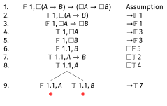

# Example 2: $(\Diamond A \vee \Diamond B) \rightarrow \Diamond(A \vee B)$ in K

## Example 2: $(\Diamond A \vee \Diamond B) \rightarrow \Diamond(A \vee B)$ in K

Let's show this is a theorem in **K**.

---

\begin{oltableau}
[\sFmla{\False}{1, (\Diamond A \lor \Diamond B) \rightarrow \Diamond(A \lor B)}, checked, just = \TAss
    [\sFmla{\True}{1, \Diamond A \lor \Diamond B}, just = {\TRule{\False}{\rightarrow}[1]}
        [\sFmla{\False}{1, \Diamond(A \lor B)}, just = {\TRule{\False}{\rightarrow}[1]}
        ]
    ]
]
\end{oltableau}

::: {.content-visible when-format="revealjs"}
{width=600px}
:::

---

\begin{oltableau}
[\sFmla{\False}{1, (\Diamond A \lor \Diamond B) \rightarrow \Diamond(A \lor B)}, checked, just = \TAss
    [\sFmla{\True}{1, \Diamond A \lor \Diamond B}, checked, just = {\TRule{\False}{\rightarrow}[1]}
        [\sFmla{\False}{1, \Diamond(A \lor B)}, just = {\TRule{\False}{\rightarrow}[1]}
            [\sFmla{\True}{1, \Diamond A}, just = {\TRule{\True}{\lor}[2]}
            ]
            [\sFmla{\True}{1, \Diamond B}, just = {\TRule{\True}{\lor}[2]}
            ]
        ]
    ]
]
\end{oltableau}

::: {.content-visible when-format="revealjs"}
{width=600px}
:::

The disjunction branches. We can't do anything with the other line yet because there isn't yet a 1.1.

---

\begin{oltableau}
[\sFmla{\False}{1, (\Diamond A \lor \Diamond B) \rightarrow \Diamond(A \lor B)}, checked, just = \TAss
    [\sFmla{\True}{1, \Diamond A \lor \Diamond B}, checked, just = {\TRule{\False}{\rightarrow}[1]}
        [\sFmla{\False}{1, \Diamond(A \lor B)}, just = {\TRule{\False}{\rightarrow}[1]}
            [\sFmla{\True}{1, \Diamond A}, checked, just = {\TRule{\True}{\lor}[2]}
                [\sFmla{\True}{1.1, A}, just = {\TRule{\True}{\Diamond}[4]}
                ]
            ]
            [\sFmla{\True}{1, \Diamond B}, just = {\TRule{\True}{\lor}[2]}
            ]
        ]
    ]
]
\end{oltableau}

::: {.content-visible when-format="revealjs"}
{width=600px}
:::

On the left branch, the True $\Diamond$ rule introduces world 1.1 with $A$ true there.

---

\begin{oltableau}
[\sFmla{\False}{1, (\Diamond A \lor \Diamond B) \rightarrow \Diamond(A \lor B)}, checked, just = \TAss
    [\sFmla{\True}{1, \Diamond A \lor \Diamond B}, checked, just = {\TRule{\False}{\rightarrow}[1]}
        [\sFmla{\False}{1, \Diamond(A \lor B)}, just = {\TRule{\False}{\rightarrow}[1]}
            [\sFmla{\True}{1, \Diamond A}, checked, just = {\TRule{\True}{\lor}[2]}
                [\sFmla{\True}{1.1, A}, just = {\TRule{\True}{\Diamond}[4]}
                    [\sFmla{\False}{1.1, A \lor B}, just = {\TRule{\False}{\Diamond}[3]}
                    ]
                ]
            ]
            [\sFmla{\True}{1, \Diamond B}, just = {\TRule{\True}{\lor}[2]}
            ]
        ]
    ]
]
\end{oltableau}

::: {.content-visible when-format="revealjs"}
{width=600px}
:::

Now world 1.1 exists, so the False $\Diamond$ rule (line 3) applies: $A \lor B$ must be false at 1.1.

---

\begin{oltableau}
[\sFmla{\False}{1, (\Diamond A \lor \Diamond B) \rightarrow \Diamond(A \lor B)}, checked, just = \TAss
    [\sFmla{\True}{1, \Diamond A \lor \Diamond B}, checked, just = {\TRule{\False}{\rightarrow}[1]}
        [\sFmla{\False}{1, \Diamond(A \lor B)}, just = {\TRule{\False}{\rightarrow}[1]}
            [\sFmla{\True}{1, \Diamond A}, checked, just = {\TRule{\True}{\lor}[2]}
                [\sFmla{\True}{1.1, A}, just = {\TRule{\True}{\Diamond}[4]}
                    [\sFmla{\False}{1.1, A \lor B}, checked, just = {\TRule{\False}{\Diamond}[3]}
                        [\sFmla{\False}{1.1, A}, just = {\TRule{\False}{\lor}[6]}, close]
                    ]
                ]
            ]
            [\sFmla{\True}{1, \Diamond B}, just = {\TRule{\True}{\lor}[2]}
            ]
        ]
    ]
]
\end{oltableau}

::: {.content-visible when-format="revealjs"}
{width=600px}
:::

The False $\lor$ rule gives $\mathbb{F}\, 1.1{:} A$, which clashes with line 5. The left branch closes. Now work on the right branch.

---

\begin{oltableau}
[\sFmla{\False}{1, (\Diamond A \lor \Diamond B) \rightarrow \Diamond(A \lor B)}, checked, just = \TAss
    [\sFmla{\True}{1, \Diamond A \lor \Diamond B}, checked, just = {\TRule{\False}{\rightarrow}[1]}
        [\sFmla{\False}{1, \Diamond(A \lor B)}, just = {\TRule{\False}{\rightarrow}[1]}
            [\sFmla{\True}{1, \Diamond A}, checked, just = {\TRule{\True}{\lor}[2]}
                [\sFmla{\True}{1.1, A}, just = {\TRule{\True}{\Diamond}[4]}
                    [\sFmla{\False}{1.1, A \lor B}, checked, just = {\TRule{\False}{\Diamond}[3]}
                        [\sFmla{\False}{1.1, A}, just = {\TRule{\False}{\lor}[6]}, close]
                    ]
                ]
            ]
            [\sFmla{\True}{1, \Diamond B}, checked, just = {\TRule{\True}{\lor}[2]}
                [\sFmla{\True}{1.2, B}, just = {\TRule{\True}{\Diamond}[4]}, move by=2
                ]
            ]
        ]
    ]
]
\end{oltableau}

::: {.content-visible when-format="revealjs"}
{width=600px}
:::

On the right branch, the True $\Diamond$ rule introduces world 1.2 with $B$ true there.

---

\begin{oltableau}
[\sFmla{\False}{1, (\Diamond A \lor \Diamond B) \rightarrow \Diamond(A \lor B)}, checked, just = \TAss
    [\sFmla{\True}{1, \Diamond A \lor \Diamond B}, checked, just = {\TRule{\False}{\rightarrow}[1]}
        [\sFmla{\False}{1, \Diamond(A \lor B)}, just = {\TRule{\False}{\rightarrow}[1]}
            [\sFmla{\True}{1, \Diamond A}, checked, just = {\TRule{\True}{\lor}[2]}
                [\sFmla{\True}{1.1, A}, just = {\TRule{\True}{\Diamond}[4]}
                    [\sFmla{\False}{1.1, A \lor B}, checked, just = {\TRule{\False}{\Diamond}[3]}
                        [\sFmla{\False}{1.1, A}, just = {\TRule{\False}{\lor}[6]}, close]
                    ]
                ]
            ]
            [\sFmla{\True}{1, \Diamond B}, checked, just = {\TRule{\True}{\lor}[2]}
                [\sFmla{\True}{1.2, B}, just = {\TRule{\True}{\Diamond}[4]}, move by=2
                    [\sFmla{\False}{1.2, A \lor B}, just = {\TRule{\False}{\Diamond}[3]}
                    ]
                ]
            ]
        ]
    ]
]
\end{oltableau}

::: {.content-visible when-format="revealjs"}
{width=600px}
:::

World 1.2 now exists, so the False $\Diamond$ rule (line 3) applies again: $A \lor B$ must be false at 1.2.

---

\begin{oltableau}
[\sFmla{\False}{1, (\Diamond A \lor \Diamond B) \rightarrow \Diamond(A \lor B)}, checked, just = \TAss
    [\sFmla{\True}{1, \Diamond A \lor \Diamond B}, checked, just = {\TRule{\False}{\rightarrow}[1]}
        [\sFmla{\False}{1, \Diamond(A \lor B)}, just = {\TRule{\False}{\rightarrow}[1]}
            [\sFmla{\True}{1, \Diamond A}, checked, just = {\TRule{\True}{\lor}[2]}
                [\sFmla{\True}{1.1, A}, just = {\TRule{\True}{\Diamond}[4]}
                    [\sFmla{\False}{1.1, A \lor B}, checked, just = {\TRule{\False}{\Diamond}[3]}
                        [\sFmla{\False}{1.1, A}, just = {\TRule{\False}{\lor}[6]}, close]
                    ]
                ]
            ]
            [\sFmla{\True}{1, \Diamond B}, checked, just = {\TRule{\True}{\lor}[2]}
                [\sFmla{\True}{1.2, B}, just = {\TRule{\True}{\Diamond}[4]}, move by=2
                    [\sFmla{\False}{1.2, A \lor B}, checked, just = {\TRule{\False}{\Diamond}[3]}
                        [\sFmla{\False}{1.2, A}, just = {\TRule{\False}{\lor}[9]}
                            [\sFmla{\False}{1.2, B}, just = {\TRule{\False}{\lor}[9]}, close]
                        ]
                    ]
                ]
            ]
        ]
    ]
]
\end{oltableau}

::: {.content-visible when-format="revealjs"}
{width=600px}
:::

Both branches close, so this **is** valid in K.
