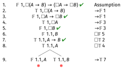

# Example 5: $\Box(A \rightarrow B) \rightarrow (\Box A \rightarrow \Box B)$ in K

## Example 5: $\Box(A \rightarrow B) \rightarrow (\Box A \rightarrow \Box B)$ in K

This is the K axiom - it should be valid even in K.

---

\begin{oltableau}
[\sFmla{\False}{1, \Box(A \rightarrow B) \rightarrow (\Box A \rightarrow \Box B)}, checked, just = \TAss
    [\sFmla{\True}{1, \Box(A \rightarrow B)}, just = {\TRule{\False}{\rightarrow}[1]}
        [\sFmla{\False}{1, \Box A \rightarrow \Box B}, just = {\TRule{\False}{\rightarrow}[1]}
        ]
    ]
]
\end{oltableau}

::: {.content-visible when-format="revealjs"}
{width=600px}
:::

False conditional means true antecedent and false consequent.

---

\begin{oltableau}
[\sFmla{\False}{1, \Box(A \rightarrow B) \rightarrow (\Box A \rightarrow \Box B)}, checked, just = \TAss
    [\sFmla{\True}{1, \Box(A \rightarrow B)}, just = {\TRule{\False}{\rightarrow}[1]}
        [\sFmla{\False}{1, \Box A \rightarrow \Box B}, checked, just = {\TRule{\False}{\rightarrow}[1]}
            [\sFmla{\True}{1, \Box A}, just = {\TRule{\False}{\rightarrow}[3]}
                [\sFmla{\False}{1, \Box B}, just = {\TRule{\False}{\rightarrow}[3]}
                ]
            ]
        ]
    ]
]
\end{oltableau}

::: {.content-visible when-format="revealjs"}
{width=600px}
:::

The nested false conditional unpacks: $\Box A$ must be true and $\Box B$ must be false at world 1.

---

\begin{oltableau}
[\sFmla{\False}{1, \Box(A \rightarrow B) \rightarrow (\Box A \rightarrow \Box B)}, checked, just = \TAss
    [\sFmla{\True}{1, \Box(A \rightarrow B)}, just = {\TRule{\False}{\rightarrow}[1]}
        [\sFmla{\False}{1, \Box A \rightarrow \Box B}, checked, just = {\TRule{\False}{\rightarrow}[1]}
            [\sFmla{\True}{1, \Box A}, just = {\TRule{\False}{\rightarrow}[3]}
                [\sFmla{\False}{1, \Box B}, checked, just = {\TRule{\False}{\rightarrow}[3]}
                    [\sFmla{\False}{1.1, B}, just = {\TRule{\False}{\Box}[5]}
                    ]
                ]
            ]
        ]
    ]
]
\end{oltableau}

::: {.content-visible when-format="revealjs"}
{width=600px}
:::

False $\Box$ introduces world 1.1: $B$ must be false there.

---

\begin{oltableau}
[\sFmla{\False}{1, \Box(A \rightarrow B) \rightarrow (\Box A \rightarrow \Box B)}, checked, just = \TAss
    [\sFmla{\True}{1, \Box(A \rightarrow B)}, just = {\TRule{\False}{\rightarrow}[1]}
        [\sFmla{\False}{1, \Box A \rightarrow \Box B}, checked, just = {\TRule{\False}{\rightarrow}[1]}
            [\sFmla{\True}{1, \Box A}, just = {\TRule{\False}{\rightarrow}[3]}
                [\sFmla{\False}{1, \Box B}, checked, just = {\TRule{\False}{\rightarrow}[3]}
                    [\sFmla{\False}{1.1, B}, just = {\TRule{\False}{\Box}[5]}
                        [\sFmla{\True}{1.1, A \rightarrow B}, just = {\TRule{\True}{\Box}[2]}
                            [\sFmla{\True}{1.1, A}, just = {\TRule{\True}{\Box}[4]}
                            ]
                        ]
                    ]
                ]
            ]
        ]
    ]
]
\end{oltableau}

::: {.content-visible when-format="revealjs"}
{width=600px}
:::

World 1.1 now exists, so both True $\Box$ rules fire: $A \rightarrow B$ is true at 1.1 (from line 2), and $A$ is true at 1.1 (from line 4). Note these are reusable rules, so lines 2 and 4 stay unchecked.

---

\begin{oltableau}
[\sFmla{\False}{1, \Box(A \rightarrow B) \rightarrow (\Box A \rightarrow \Box B)}, checked, just = \TAss
    [\sFmla{\True}{1, \Box(A \rightarrow B)}, just = {\TRule{\False}{\rightarrow}[1]}
        [\sFmla{\False}{1, \Box A \rightarrow \Box B}, checked, just = {\TRule{\False}{\rightarrow}[1]}
            [\sFmla{\True}{1, \Box A}, just = {\TRule{\False}{\rightarrow}[3]}
                [\sFmla{\False}{1, \Box B}, checked, just = {\TRule{\False}{\rightarrow}[3]}
                    [\sFmla{\False}{1.1, B}, just = {\TRule{\False}{\Box}[5]}
                        [\sFmla{\True}{1.1, A \rightarrow B}, checked, just = {\TRule{\True}{\Box}[2]}
                            [\sFmla{\True}{1.1, A}, just = {\TRule{\True}{\Box}[4]}
                                [\sFmla{\False}{1.1, A}, just = {\TRule{\True}{\rightarrow}[7]}, close]
                                [\sFmla{\True}{1.1, B}, just = {\TRule{\True}{\rightarrow}[7]}, close]
                            ]
                        ]
                    ]
                ]
            ]
        ]
    ]
]
\end{oltableau}

::: {.content-visible when-format="revealjs"}
{width=600px}
:::

The true conditional at 1.1 branches: either $A$ is false at 1.1 (clashing with line 8) or $B$ is true at 1.1 (clashing with line 6). Both branches close, so this is valid in **K**.

## Example 5: $\Box(A \rightarrow B) \rightarrow (\Box A \rightarrow \Box B)$ in K

Another way to think about this is that it's saying that if you have

- $\Box(A \rightarrow B)$; and
- $\Box A$

you can derive

- $\Box B$

The general principle is that if an argument is valid, then putting a box in front of every premise and in front of the conclusion will preserve validity.

