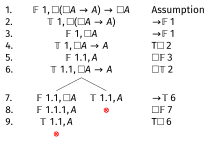
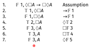

# Example 13: $\neg \Box(A \wedge \neg \Box A)$ in K

## Example 13: $\neg \Box(A \wedge \neg \Box A)$ in K

---

\begin{oltableau}
[\sFmla{\False}{1, \neg \Box(A \wedge \neg \Box A)}, checked, just = \TAss
    [\sFmla{\True}{1, \Box(A \wedge \neg \Box A)}, just = {\TRule{\False}{\neg}[1]}
    ]
]
\end{oltableau}

::: {.content-visible when-format="revealjs"}
{width=600px}
:::

Assume the formula is false at world 1. False $\neg$ gives us $\Box(A \wedge \neg \Box A)$ true at world 1.

---

## Example 13: $\neg \Box(A \wedge \neg \Box A)$ in K

Line 2 is True $\Box$, which is a reusable rule — it can only fire when we have an accessible world.

But no accessible worlds have been introduced, and no other rules apply. The tree stays open.

The countermodel: a single world $w_1$ with no accessible worlds at all. $\Box(A \wedge \neg \Box A)$ is vacuously true there (no accessible worlds to check), so $\neg \Box(A \wedge \neg \Box A)$ is false at $w_1$, as required.

# Example 14: $\neg \Box(A \wedge \neg \Box A)$ in KT

## Example 14: $\neg \Box(A \wedge \neg \Box A)$ in KT

In **KT** every world accesses itself, so the True $\Box$ rule now has somewhere to fire. Let's start from where we were.

---

\begin{oltableau}
[\sFmla{\False}{1, \neg \Box(A \wedge \neg \Box A)}, checked, just = \TAss
    [\sFmla{\True}{1, \Box(A \wedge \neg \Box A)}, just = {\TRule{\False}{\neg}[1]}
    ]
]
\end{oltableau}

::: {.content-visible when-format="revealjs"}
{width=600px}
:::

In KT, world 1 accesses itself, so we can apply the True $\Box$ rule at world 1.

---

\begin{oltableau}
[\sFmla{\False}{1, \neg \Box(A \wedge \neg \Box A)}, checked, just = \TAss
    [\sFmla{\True}{1, \Box(A \wedge \neg \Box A)}, just = {\TRule{\False}{\neg}[1]}
        [\sFmla{\True}{1, A \wedge \neg \Box A}, just = {\TRule{\Box}{\text{T}}[2]}
        ]
    ]
]
\end{oltableau}

::: {.content-visible when-format="revealjs"}
{width=600px}
:::

The T$\Box$ rule (line 2) gives us $A \wedge \neg \Box A$ true at world 1: since $\Box(A \wedge \neg \Box A)$ is true at 1 and 1 accesses itself, the formula inside the box must hold at 1.

---

\begin{oltableau}
[\sFmla{\False}{1, \neg \Box(A \wedge \neg \Box A)}, checked, just = \TAss
    [\sFmla{\True}{1, \Box(A \wedge \neg \Box A)}, just = {\TRule{\False}{\neg}[1]}
        [\sFmla{\True}{1, A \wedge \neg \Box A}, checked, just = {\TRule{\Box}{\text{T}}[2]}
            [\sFmla{\True}{1, A}, just = {\TRule{\True}{\wedge}[3]}
                [\sFmla{\True}{1, \neg \Box A}, just = {\TRule{\True}{\wedge}[3]}
                ]
            ]
        ]
    ]
]
\end{oltableau}

::: {.content-visible when-format="revealjs"}
{width=600px}
:::

True $\wedge$ (line 3) gives both conjuncts: $A$ true at 1 (line 4) and $\neg \Box A$ true at 1 (line 5). Line 3 is checked.

---

\begin{oltableau}
[\sFmla{\False}{1, \neg \Box(A \wedge \neg \Box A)}, checked, just = \TAss
    [\sFmla{\True}{1, \Box(A \wedge \neg \Box A)}, just = {\TRule{\False}{\neg}[1]}
        [\sFmla{\True}{1, A \wedge \neg \Box A}, checked, just = {\TRule{\Box}{\text{T}}[2]}
            [\sFmla{\True}{1, A}, just = {\TRule{\True}{\wedge}[3]}
                [\sFmla{\True}{1, \neg \Box A}, checked, just = {\TRule{\True}{\wedge}[3]}
                    [\sFmla{\False}{1, \Box A}, just = {\TRule{\True}{\neg}[5]}
                        [\sFmla{\False}{1.1, A}, just = {\TRule{\False}{\Box}[6]}
                        ]
                    ]
                ]
            ]
        ]
    ]
]
\end{oltableau}

::: {.content-visible when-format="revealjs"}
{width=600px}
:::

True $\neg$ (line 5) gives $\Box A$ false at 1 (line 6). False $\Box$ (line 6) introduces world 1.1 with $A$ false there (line 7). Lines 5 and 6 are checked.

---

\begin{oltableau}
[\sFmla{\False}{1, \neg \Box(A \wedge \neg \Box A)}, checked, just = \TAss
    [\sFmla{\True}{1, \Box(A \wedge \neg \Box A)}, just = {\TRule{\False}{\neg}[1]}
        [\sFmla{\True}{1, A \wedge \neg \Box A}, checked, just = {\TRule{\Box}{\text{T}}[2]}
            [\sFmla{\True}{1, A}, just = {\TRule{\True}{\wedge}[3]}
                [\sFmla{\True}{1, \neg \Box A}, checked, just = {\TRule{\True}{\wedge}[3]}
                    [\sFmla{\False}{1, \Box A}, just = {\TRule{\True}{\neg}[5]}
                        [\sFmla{\False}{1.1, A}, just = {\TRule{\False}{\Box}[6]}
                            [\sFmla{\True}{1.1, A \wedge \neg \Box A}, checked, just = {\TRule{\True}{\Box}[2]}
                                [\sFmla{\True}{1.1, A}, just = {\TRule{\True}{\wedge}[8]}, close]
                            ]
                        ]
                    ]
                ]
            ]
        ]
    ]
]
\end{oltableau}

::: {.content-visible when-format="revealjs"}
{width=600px}
:::

True $\Box$ (line 2) is reusable: now that world 1.1 exists, it fires there too, giving $A \wedge \neg \Box A$ true at 1.1 (line 8). True $\wedge$ on line 8 gives $A$ true at 1.1 (line 9) — but line 7 says $A$ is false at 1.1. Contradiction. The branch closes. This formula is **valid** in **KT**.

## Why is this valid?

::: {.incremental}
- Assume $\Box(A \wedge \neg \Box A)$ is true at $w_1$: at every accessible world, $A$ is true and $\Box A$ is false.
- By the T condition, $w_1$ accesses itself, so $A \wedge \neg \Box A$ holds at $w_1$ itself.
- In particular, $\neg \Box A$ is true at $w_1$: so $\Box A$ is false at $w_1$.
- But $\Box A$ false at $w_1$ means there is some accessible world where $A$ fails.
- That contradicts our assumption that $A$ holds at every accessible world (including $w_1$ itself, by the T condition).
:::

. . .

The T condition is essential: it forces $w_1$ to be a witness against its own assumption. In K, a world with no accessible worlds escapes this argument entirely.

## Interpretation

Let $\Box A$ mean that our Hero, let's call them Hero, knows that $A$.

Since Hero can only know true things, we want $\Box A \rightarrow A$ to always be true. So the logic for this box should be at least **KT**.

And this proof shows that there is a kind of claim Hero cannot know, namely that $A$ is true and Hero doesn't know it.

This is a bit odd because of course there could be a lot of things Hero doesn't know.

This creates what the philosopher Roy Sorensen called *blindspots*.
