# Midterm

## Logistics

- The exam will be ten questions long.
- Each question will be like one of the ones on this week's quiz.
- The difference is that it will ask you to draw the tree.
- I'll hopefully post the sample questions tomorrow.
- It will be here, with answers to be done on paper.
- We'll find a separate room (to be announced) for folks needing accommodations.
- You'll get the cheat sheet, but otherwise it is closed book.

# Quiz 6

## Question 1

### $\Box(A \vee B) \rightarrow (\Diamond A \vee \Box B) \text{ is a theorem of } \textbf{KT}$

---

\begin{oltableau}
    [\sFmla{\False}{1, \Box (A \lor  B) \rightarrow  (\Diamond A \lor  \Box B)}, checked, just = \TAss
        [\sFmla{\True}{1, \Box (A \lor  B)}, just = {\TRule{\False}{\rightarrow}[1]}
            [\sFmla{\False}{1, \Diamond A \lor  \Box B}, checked, just = {\TRule{\False}{\rightarrow}[1]}
                [\sFmla{\False}{1, \Diamond A}, just = {\TRule{\False}{\lor}[3]}
                    [\sFmla{\False}{1, \Box B}, checked, just = {\TRule{\False}{\lor}[1]}
                        [\sFmla{\False}{1.1, B}, just = {\TRule{\False}{\Box}[5]}
                            [\sFmla{\True}{1.1, A \lor  B}, checked, just = {\TRule{\True}{\Box}[2]}
                                [\sFmla{\True}{1.1, A}, just = {\TRule{\True}{\lor}[7]}
                                    [\sFmla{\False}{1.1, A}, just = {\TRule{\False}{\Diamond}[4]}, close]
                                ]
                                [\sFmla{\True}{1.1, B}, just = {\TRule{\True}{\lor}[7]}, close]
                            ]
                        ]
                    ]
                ]
            ]
        ]
    ]
\end{oltableau}

::: {.content-visible when-format="revealjs"}
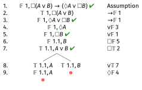
:::

## Question 2

### $\Box (A \rightarrow B) \rightarrow (A \rightarrow \Box B) \text{ is not a theorem of } \textbf{KT}$

---

\begin{oltableau}
    [\sFmla{\False}{1, \Box (A \rightarrow  B) \rightarrow  (A \rightarrow  \Box B)}, checked, just = \TAss
        [\sFmla{\True}{1, \Box (A \rightarrow  B)}, just = {\TRule{\False}{\rightarrow}[1]}
            [\sFmla{\False}{1, A \rightarrow  \Box B}, checked, just = {\TRule{\False}{\rightarrow}[1]}
                [\sFmla{\True}{1, A}, just = {\TRule{\False}{\rightarrow}[3]}
                    [\sFmla{\False}{1, \Box B}, just = {\TRule{\False}{\rightarrow}[3]}
                        [\sFmla{\True}{1, A \rightarrow  B}, checked, just = {\TRule{\Box}{\text{T}}[2]}
                            [\sFmla{\False}{1, A}, just = {\TRule{\True}{\rightarrow}[6]}, close]
                            [\sFmla{\True}{1, B}, just = {\TRule{\True}{\rightarrow}[6]}
                                [\sFmla{\False}{1.1, B}, just = {\TRule{\False}{\Box}[5]}
                                    [\sFmla{\True}{1.1, A \rightarrow  B}, checked, just = {\TRule{\True}{\Box}[2]}
                                        [\sFmla{\False}{1.1, A}, just = {\TRule{\True}{\rightarrow}[9]}]
                                        [\sFmla{\True}{1.1, B}, just = {\TRule{\True}{\rightarrow}[9]}, close]
                                    ]
                                ]
                            ]
                        ]
                    ]
                ]
            ]
        ]
    ]
\end{oltableau}

::: {.content-visible when-format="revealjs"}
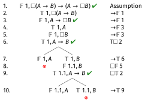
:::

## Question 2

The middle branch stays open, and the open-ended instruction at line 2 has been applied everywhere that's needed.

The counterexample is where $A$ and $B$ are both true at $w_1$ and both false at $w_{1.1}$.

## Question 3

### $\Box A \rightarrow (A \wedge \Box \Box A) \text{ is not a theorem of } \textbf{K4}$

---

\begin{oltableau}
    [\sFmla{\False}{1, \Box A \rightarrow  (A \wedge  \Box \Box A)}, checked, just = \TAss
        [\sFmla{\True}{1, \Box A}, just = {\TRule{\False}{\rightarrow}[1]}
            [\sFmla{\False}{1, A \wedge  \Box \Box A}, checked, just = {\TRule{\False}{\rightarrow}[1]}
                [\sFmla{\False}{1, A}, just = {\TRule{\False}{\wedge}[3]}]
                [\sFmla{\False}{1, \Box \Box A}, checked, just = {\TRule{\False}{\wedge}[3]}
                    [\sFmla{\False}{1.1, \Box A}, just = {\TRule{\False}{\Box}[4]}
                        [\sFmla{\True}{1.1, \Box A}, just = {\TRule{\Box}{\text{4}}[2]}, close]
                    ]
                ]
            ]
        ]
    ]
\end{oltableau}

::: {.content-visible when-format="revealjs"}
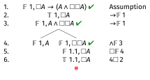
:::

## Question 3

The left hand branch stays open. The counterexample is the somewhat degenerate model where $w_1$ can't access anything, and has $A$ false.

## Question 4

### $\Diamond (A \rightarrow \Diamond B) \rightarrow (\Box A \rightarrow \Diamond (A \wedge B)) \text{ is a theorem of } \textbf{K4}$

---

\begin{oltableau}
    [\sFmla{\False}{1, \Diamond (A \rightarrow  \Diamond B) \rightarrow  (\Box A \rightarrow  \Diamond (A \wedge  B))}, checked, just = \TAss
        [\sFmla{\True}{1, \Diamond (A \rightarrow  \Diamond B)}, checked, just = {\TRule{\False}{\rightarrow}[1]}
            [\sFmla{\False}{1, \Box A \rightarrow  \Diamond (A \wedge  B)}, checked, just = {\TRule{\False}{\rightarrow}[1]}
                [\sFmla{\True}{1, \Box A}, just = {\TRule{\False}{\rightarrow}[3]}
                    [\sFmla{\False}{1, \Diamond (A \wedge  B)}, just = {\TRule{\False}{\rightarrow}[3]}
                        [\sFmla{\True}{1.1, A \rightarrow  \Diamond B}, checked, just = {\TRule{\True}{\Diamond}[2]}
                            [\sFmla{\True}{1.1, A}, just = {\TRule{\True}{\Box}[4]}
                                [\sFmla{\False}{1.1, A \wedge  B}, just = {\TRule{\False}{\Diamond}[5]}
                                    [\sFmla{\False}{1.1, A}, just = {\TRule{\True}{\rightarrow}[6]}, close]
                                    [\sFmla{\True}{1.1, \Diamond B}, checked, just = {\TRule{\True}{\rightarrow}[6]}
                                        [\sFmla{\True}{1.1, \Box A}, just = {\TRule{\Box}{\text{4}}[4]}
                                            [\sFmla{\False}{1.1, \Diamond (A \wedge  B)}, just = {\TRule{\Diamond}{\text{4}}[5]}
                                                [\sFmla{\True}{1.1.1, B}, just = {\TRule{\True}{\Diamond}[9]}
                                                    [\sFmla{\True}{1.1.1, A}, just = {\TRule{\True}{\Box}[10]}
                                                        [\sFmla{\False}{1.1.1, A \wedge  B}, checked, just = {\TRule{\False}{\Diamond}[11]}
                                                            [\sFmla{\False}{1.1.1, A}, just = {\TRule{\False}{\wedge}[14]}, close]
                                                            [\sFmla{\False}{1.1.1, B}, just = {\TRule{\False}{\wedge}[14]}, close]
                                                        ]
                                                    ]
                                                ]
                                            ]
                                        ]
                                    ]
                                ]
                            ]
                        ]
                    ]
                ]
            ]
        ]
    ]
\end{oltableau}

::: {.content-visible when-format="revealjs"}
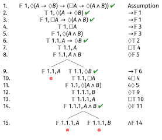
:::

---

## Question 5

### $\Diamond (A \wedge B) \rightarrow \Box \Diamond (C \rightarrow B) \text{ is not a theorem of } \textbf{S4}$

--- 

\begin{oltableau}
    [\sFmla{\False}{1, \Diamond (A \wedge  B) \rightarrow  \Box \Diamond (C \rightarrow  B)}, checked, just = \TAss
        [\sFmla{\True}{1, \Diamond (A \wedge  B)}, checked, just = {\TRule{\False}{\rightarrow}[1]}
            [\sFmla{\False}{1, \Box \Diamond (C \rightarrow  B)}, checked, just = {\TRule{\False}{\rightarrow}[1]}
                [\sFmla{\True}{1.1, A \wedge  B}, checked, just = {\TRule{\True}{\Diamond}[2]}
                    [\sFmla{\True}{1.1, A}, just = {\TRule{\True}{\wedge}[4]}
                        [\sFmla{\True}{1.1, B}, just = {\TRule{\True}{\wedge}[4]}
                            [\sFmla{\False}{1.2, \Diamond (C \rightarrow  B)}, just = {\TRule{\False}{\Box}[3]}
                                [\sFmla{\False}{1.2, C \rightarrow  B}, checked, just = {\TRule{\Diamond}{\text{T}}[7]}
                                    [\sFmla{\True}{1.2, C}, just = {\TRule{\False}{\rightarrow}[8]}
                                        [\sFmla{\False}{1.2, B}, just = {\TRule{\False}{\rightarrow}[8]}]
                                    ]
                                ]
                            ]
                        ]
                    ]
                ]
            ]
        ]
    ]
\end{oltableau}

::: {.content-visible when-format="revealjs"}

:::

## Question 5

The trunk stays open, and we've applied the open-ended rule everywhere it needs to be applied. 

The countermodel has $w_1$, which can access $w_{1.1}$ and $w_{1.2}$. At $w_{1.1}$ both $A$ and $B$ are true. At $w_{1.2}$, $C$ is true and $B$ is false. 

Any way of filling in the other values will still create a counterexample.

## Question 6

### $\Diamond \Diamond A \rightarrow (\Diamond A \wedge \Diamond \Diamond \Diamond A) \text{ is a theorem of } \textbf{S4}$

---

\begin{oltableau}
    [\sFmla{\False}{1, \Diamond \Diamond A \rightarrow  (\Diamond A \wedge  \Diamond \Diamond \Diamond A)}, checked, just = \TAss
        [\sFmla{\True}{1, \Diamond \Diamond A}, checked, just = {\TRule{\False}{\rightarrow}[1]}
            [\sFmla{\False}{1, \Diamond A \wedge  \Diamond \Diamond \Diamond A}, checked, just = {\TRule{\False}{\rightarrow}[1]}
                [\sFmla{\True}{1.1, \Diamond A}, just = {\TRule{\True}{\Diamond}[2]}
                    [\sFmla{\False}{1, \Diamond A}, just = {\TRule{\False}{\wedge}[3]}
                        [\sFmla{\False}{1.1, \Diamond A}, just = {\TRule{\Diamond}{\text{4}}[5]}, close]
                    ]
                    [\sFmla{\False}{1, \Diamond \Diamond \Diamond A}, just = {\TRule{\False}{\wedge}[3]}
                        [\sFmla{\False}{1, \Diamond \Diamond A}, just = {\TRule{\Diamond}{\text{T}}[6]}, move by = 2, close]
                    ]
                ]
            ]
        ]
    ]
\end{oltableau}

::: {.content-visible when-format="revealjs"}
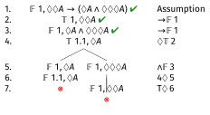
:::

There are a lot of ways to close this one; this is the quickest I found but it's definitely not the only one.

## Question 7

### $\Diamond \Box A \rightarrow \Diamond A \text{ is a theorem of } \textbf{KTB}$

---

\begin{oltableau}
    [\sFmla{\False}{1, \Diamond \Box A \rightarrow  \Diamond A}, checked, just = \TAss
        [\sFmla{\True}{1, \Diamond \Box A}, checked, just = {\TRule{\False}{\rightarrow}[1]}
            [\sFmla{\False}{1, \Diamond A}, just = {\TRule{\False}{\rightarrow}[1]}
                [\sFmla{\True}{1.1, \Box A}, just = {\TRule{\True}{\Diamond}[2]}
                    [\sFmla{\True}{1, A}, just = {\TRule{\Box}{\text{B}}[4]}
                        [\sFmla{\False}{1, A}, just = {\TRule{\Diamond}{\text{T}}[3]}, close]
                    ]
                ]
            ]
        ]
    ]
\end{oltableau}

::: {.content-visible when-format="revealjs"}
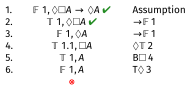
:::

## Question 8

### $(\Box A \wedge \Box B) \rightarrow \Box \Box (A \rightarrow B) \text{ is a not theorem of } \textbf{KTB}$

---

\begin{oltableau}
    [\sFmla{\False}{1, (\Box A \wedge  \Box B) \rightarrow  \Box \Box (A \rightarrow  B)}, checked, just = \TAss
        [\sFmla{\True}{1, \Box A \wedge  \Box B}, checked, just = {\TRule{\False}{\rightarrow}[1]}
            [\sFmla{\False}{1, \Box \Box (A \rightarrow  B)}, checked, just = {\TRule{\False}{\rightarrow}[1]}
                [\sFmla{\True}{1, \Box A}, just = {\TRule{\True}{\wedge}[2]}
                    [\sFmla{\True}{1, \Box B}, just = {\TRule{\True}{\wedge}[2]}
                        [\sFmla{\True}{1, A}, just = {\TRule{\Box}{\text{T}}[4]}
                            [\sFmla{\True}{1, B}, just = {\TRule{\Box}{\text{T}}[5]}
                                [\sFmla{\False}{1.1, \Box (A \rightarrow  B)}, checked, just = {\TRule{\False}{\Box}[3]}
                                    [\sFmla{\True}{1.1, A}, just = {\TRule{\True}{\Box}[6]}
                                        [\sFmla{\True}{1.1, B}, just = {\TRule{\True}{\Box}[7]}
                                            [\sFmla{\False}{1.1.1, A \rightarrow  B}, checked, just = {\TRule{\False}{\Box}[8]}
                                                [\sFmla{\True}{1.1.1, A}, just = {\TRule{\False}{\rightarrow}[11]}
                                                    [\sFmla{\False}{1.1.1, B}, just = {\TRule{\False}{\rightarrow}[11]}]
                                                ]
                                            ]
                                        ]
                                    ]
                                ]
                            ]
                        ]
                    ]
                ]
            ]
        ]
    ]
\end{oltableau}

::: {.content-visible when-format="revealjs"}
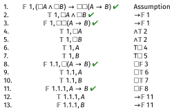
:::

## Question 8

The tableau is open. 

The countermodel takes a bit more work to describe than the previous ones. 

There are three worlds, $w_1$, $w_{1.1}$ and $w_{1.1.1}$. 

Every world can access every world \textit{except}, $w_1$ and $w_{1.1.1}$ can access each other. 

By the naming convention, $w_1Rw_{1.1}$ and $w_{1.1}Rw_{1.1.1}$; adding reflexivity and symmetry get us the rest of the relations.

$A$ is true at all three worlds, $B$ is true at the first and second, but not the third.

# Practice Exam

## Question 1

### $\Box(\Box p \rightarrow (q \vee r)) \vee \Box(\Box q \rightarrow p)$ in \textbf{S5}

---

\begin{oltableau}
    [\sFmla{\False}{1, \Box (\Box p \rightarrow  (q \lor  r)) \lor  \Box (\Box q \rightarrow  p)}, checked, just = \TAss
        [\sFmla{\False}{1, \Box (\Box p \rightarrow  (q \lor  r))}, checked, just = {\TRule{\False}{\lor}[1]}
            [\sFmla{\False}{1, \Box (\Box q \rightarrow  p)}, checked, just = {\TRule{\False}{\lor}[1]}
                [\sFmla{\False}{2, \Box p \rightarrow  (q \lor  r)}, checked, just = {\TRule{\False}{\Box}[2]}
                    [\sFmla{\True}{2, \Box p}, just = {\TRule{\False}{\rightarrow}[4]}
                        [\sFmla{\False}{2, q \lor  r}, checked, just = {\TRule{\False}{\rightarrow}[4]}
                            [\sFmla{\False}{2, q}, just = {\TRule{\False}{\lor}[6]}
                                [\sFmla{\False}{2, r}, just = {\TRule{\False}{\lor}[2]}
                                    [\sFmla{\False}{3, \Box q \rightarrow  p}, just = {\TRule{\False}{\Box}[3]}
                                        [\sFmla{\True}{3, \Box q}, just = {\TRule{\False}{\rightarrow}[9]}
                                            [\sFmla{\False}{3, p}, just = {\TRule{\False}{\rightarrow}[9]}
                                                [\sFmla{\True}{3, p}, just = {\TRule{\True}{\Box}[5]}, close]
                                            ]
                                        ]
                                    ]
                                ]
                            ]
                        ]
                    ]
                ]
            ]
        ]
    ]
\end{oltableau}

::: {.content-visible when-format="revealjs"}
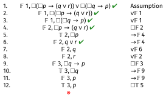
:::

The only branch closes, so this is \textbf{valid} in \textbf{S5}.

## Question 2

### $\Diamond \Box (p \rightarrow q) \rightarrow (\Box p \rightarrow \Diamond q)$ in \textbf{S5}

---

\begin{oltableau}
    [\sFmla{\False}{1, \Diamond \Box (p \rightarrow  q) \rightarrow  (\Box p \rightarrow  \Diamond q)}, checked, just = \TAss
        [\sFmla{\True}{1, \Diamond \Box (p \rightarrow  q)}, checked, just = {\TRule{\False}{\rightarrow}[1]}
            [\sFmla{\False}{1, \Box p \rightarrow  \Diamond q}, checked, just = {\TRule{\False}{\rightarrow}[1]}
                [\sFmla{\True}{1, \Box p}, just = {\TRule{\False}{\rightarrow}[3]}
                    [\sFmla{\False}{1, \Diamond q}, just = {\TRule{\False}{\rightarrow}[3]}
                        [\sFmla{\True}{2, \Box (p \rightarrow  q)}, just = {\TRule{\True}{\Diamond}[2]}
                            [\sFmla{\True}{2, p \rightarrow  q}, checked, just = {\TRule{\True}{\Box}[2]}
                                [\sFmla{\True}{2, p}, just = {\TRule{\True}{\Box}[4]}
                                    [\sFmla{\False}{2, q}, just = {\TRule{\False}{\Diamond}[5]}
                                        [\sFmla{\False}{2, p}, just = {\TRule{\True}{\rightarrow}[7]}, close]
                                        [\sFmla{\True}{2, q}, just = {\TRule{\True}{\rightarrow}[7]}, close]
                                    ]
                                ]
                            ]
                        ]
                    ]
                ]
            ]
        ]
    ]
\end{oltableau}

::: {.content-visible when-format="revealjs"}
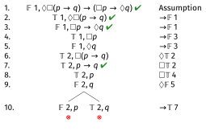
:::

Both branches close, so this is \textbf{valid} in \textbf{S5}.

## Question 3

### $\Box (p \vee q) \rightarrow (\Diamond (\neg q \vee r) \rightarrow \Diamond (p \vee r))$ in \textbf{S5}

---

\begin{oltableau}
    [\sFmla{\False}{1, \Box (p \lor  q) \rightarrow  (\Diamond (\neg q \lor  r) \rightarrow  \Diamond (p \lor  r))}, checked, just = \TAss
        [\sFmla{\True}{1, \Box (p \lor  q)}, just = {\TRule{\False}{\rightarrow}[1]}
            [\sFmla{\False}{1, \Diamond (\neg q \lor  r) \rightarrow  \Diamond (p \lor  r)}, checked, just = {\TRule{\False}{\rightarrow}[1]}
                [\sFmla{\True}{1, \Diamond (\neg q \lor  r)}, checked, just = {\TRule{\False}{\rightarrow}[3]}
                    [\sFmla{\False}{1, \Diamond (p \lor  r)}, just = {\TRule{\False}{\rightarrow}[3]}
                        [\sFmla{\True}{2, \neg q \lor  r}, checked, just = {\TRule{\True}{\Diamond}[4]}
                            [\sFmla{\True}{2, p \lor  q}, checked, just = {\TRule{\True}{\Box}[1]}
                                [\sFmla{\False}{2, p \lor  r}, checked, just = {\TRule{\False}{\Diamond}[5]}
                                    [\sFmla{\False}{2, p}, just = {\TRule{\False}{\lor}[8]}
                                        [\sFmla{\False}{2, r}, just = {\TRule{\False}{\lor}[8]}
                                            [\sFmla{\True}{2, p}, just = {\TRule{\True}{\lor}[7]}, close]
                                            [\sFmla{\True}{2, q}, just = {\TRule{\True}{\lor}[7]}
                                                [\sFmla{\True}{2, \neg q}, checked, just = {\TRule{\True}{\lor}[6]}
                                                    [\sFmla{\False}{2, q}, just = {\TRule{\True}{\neg}[12]}, close]
                                                ]
                                                [\sFmla{\True}{2, r}, just = {\TRule{\True}{\lor}[6]}, close]
                                            ]
                                        ]
                                    ]
                                ]
                            ]
                        ]
                    ]
                ]
            ]
        ]
    ]
\end{oltableau}

::: {.content-visible when-format="revealjs"}
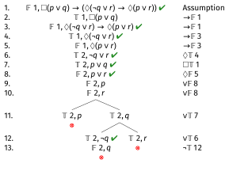
:::

All branches close, so this is \textbf{valid} in \textbf{S5}.

## Question 4

### $(\neg \Diamond p \vee \neg \Diamond \Diamond p) \rightarrow \neg \Diamond \Diamond \Diamond p$ in \textbf{S5}

---

\begin{oltableau}
    [\sFmla{\False}{1, (\neg \Diamond p \lor  \neg \Diamond \Diamond p) \rightarrow  \neg \Diamond \Diamond \Diamond p}, checked, just = \TAss
        [\sFmla{\True}{1, \neg \Diamond p \lor  \neg \Diamond \Diamond p}, checked, just = {\TRule{\False}{\rightarrow}[1]}
            [\sFmla{\False}{1, \neg \Diamond \Diamond \Diamond p}, checked, just = {\TRule{\False}{\rightarrow}[1]}
                [\sFmla{\True}{1, \Diamond \Diamond \Diamond p}, checked, just = {\TRule{\False}{\neg}[3]}
                    [\sFmla{\True}{2, \Diamond \Diamond p}, checked, just = {\TRule{\True}{\Diamond}[4]}
                        [\sFmla{\True}{3, \Diamond p}, checked, just = {\TRule{\True}{\Diamond}[5]}
                            [\sFmla{\True}{4, p}, just = {\TRule{\True}{\Diamond}[6]}
                                [\sFmla{\True}{1, \neg \Diamond p}, checked, just = {\TRule{\True}{\lor}[2]}
                                    [\sFmla{\False}{1, \Diamond p}, just = {\TRule{\True}{\neg}[8]}
                                        [\sFmla{\False}{4, p}, just = {\TRule{\False}{\Diamond}[9]}, close]
                                    ]
                                ]
                                [\sFmla{\True}{1, \neg \Diamond \Diamond p}, checked, just = {\TRule{\True}{\lor}[2]}
                                    [\sFmla{\False}{1, \Diamond \Diamond p}, just = {\TRule{\True}{\neg}[8]}, move by = 2
                                        [\sFmla{\False}{3, \Diamond p}, just = {\TRule{\False}{\Diamond}[11]}, close]
                                    ]
                                ]
                            ]
                        ]
                    ]
                ]
            ]
        ]
    ]
\end{oltableau}

::: {.content-visible when-format="revealjs"}
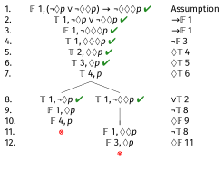
:::

Both branches close, so this is \textbf{valid} in \textbf{S5}. There are many ways to close this one; this is the fastest I found, but it's definitely not the only way.

## Question 5

### $(\Diamond p \wedge \Box q) \rightarrow \Diamond q$ in \textbf{K}

---

\begin{oltableau}
    [\sFmla{\False}{1, (\Diamond p \wedge  \Box q) \rightarrow  \Diamond q}, checked, just = \TAss
        [\sFmla{\True}{1, \Diamond p \wedge  \Box q}, checked, just = {\TRule{\False}{\rightarrow}[1]}
            [\sFmla{\False}{1, \Diamond q}, just = {\TRule{\False}{\rightarrow}[1]}
                [\sFmla{\True}{1, \Diamond p}, checked, just = {\TRule{\True}{\wedge}[2]}
                    [\sFmla{\True}{1, \Box q}, just = {\TRule{\True}{\wedge}[2]}
                        [\sFmla{\True}{1.1, p}, just = {\TRule{\True}{\Diamond}[4]}
                            [\sFmla{\False}{1.1, q}, just = {\TRule{\False}{\Diamond}[3]}
                                [\sFmla{\True}{1.1, q}, just = {\TRule{\True}{\Box}[5]}, close]
                            ]
                        ]
                    ]
                ]
            ]
        ]
    ]
\end{oltableau}

::: {.content-visible when-format="revealjs"}
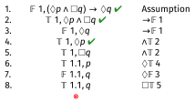
:::

The trunk closes, so it is \textbf{valid} in \textbf{K}. The role of $\Diamond p$ in this one is weird.

## Question 6

### $\Box (p \wedge \neg p) \vee \Diamond (q \vee \neg q)$ in \textbf{K}

---

\begin{oltableau}
    [\sFmla{\False}{1, \Box (p \wedge  \neg p) \lor  \Diamond (q \lor  \neg q)}, checked, just = \TAss
        [\sFmla{\False}{1, \Box (p \wedge  \neg p)}, checked, just = {\TRule{\False}{\lor}[1]}
            [\sFmla{\False}{1, \Diamond (q \lor  \neg q)}, just = {\TRule{\False}{\lor}[1]}
                [\sFmla{\False}{1.1, p \wedge  \neg p}, just = {\TRule{\False}{\Box}[2]}
                    [\sFmla{\False}{1.1, q \lor  \neg q}, checked, just = {\TRule{\False}{\Diamond}[3]}
                        [\sFmla{\False}{1.1, q}, just = {\TRule{\False}{\wedge}[5]}
                            [\sFmla{\False}{1.1, \neg q}, checked, just = {\TRule{\False}{\lor}[5]}
                                [\sFmla{\True}{1.1, q}, just = {\TRule{\False}{\neg}[7]}, close]
                            ]
                        ]
                    ]
                ]
            ]
        ]
    ]
\end{oltableau}

::: {.content-visible when-format="revealjs"}
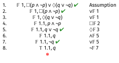
:::

This is also valid, and it's also wrong for the same reason. 

## Question 6

Not at all on the test digression. 

This example shows that \textbf{K} has a very weird property. It is not **Halldén-complete**. 

A logician, Sören Halldén, in the 1950s noticed that some logics have the odd property that $X \vee Y$ is a theorem even though (a) neither $X$ nor $Y$ is, and (b) $X$ and $Y$ have no variables in common. 

We've come to call such logics Halldén-incomplete, and the opposite property Halldén-completeness. 

In general, the logics that are interesting and get used in philosophical applications are Halldén-complete.

## Question 7

### $\Box \neg(p \vee \neg q) \rightarrow \Box p$ in \textbf{K}

---

\begin{oltableau}
    [\sFmla{\False}{1, \Box \neg (p \lor  \neg q) \rightarrow  \Box p}, checked, just = \TAss
        [\sFmla{\True}{1, \Box \neg (p \lor  \neg q)}, just = {\TRule{\True}{\rightarrow}[1]}
            [\sFmla{\False}{1, \Box p}, checked, just = {\TRule{\False}{\rightarrow}[1]}
                [\sFmla{\False}{1.1, p}, just = {\TRule{\False}{\Box}[3]}
                    [\sFmla{\True}{1.1, \neg (p \lor  \neg q)}, checked, just = {\TRule{\True}{\Box}[2]}
                        [\sFmla{\False}{1.1, p \lor  \neg q}, checked, just = {\TRule{\True}{\neg}[5]}
                            [\sFmla{\False}{1.1, p}, just = {\TRule{\False}{\lor}[6]}
                                [\sFmla{\False}{1.1, \neg q}, checked, just = {\TRule{\False}{\lor}[6]}
                                    [\sFmla{\True}{1.1, q}, just = {\TRule{\False}{\neg}[8]}]
                                ]
                            ]
                        ]
                    ]
                ]
            ]
        ]
    ]
\end{oltableau}

::: {.content-visible when-format="revealjs"}
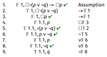
:::

The tree is open, so this is not a theorem, it is \textbf{invalid} in \textbf{K}. The countermodel has two worlds: $w_1$ and $w_1.1$, with $w_1Rw_{1.1}$. At $w_{1.1}$, $p$ is false and $q$ is true.

## Question 8

### $\Box(p \rightarrow (q \wedge r)) \rightarrow (\Diamond \Diamond p \rightarrow \Diamond (q \vee s))$ in \textbf{K}

---

\begin{oltableau}
    [\sFmla{\False}{1, \Box (p \rightarrow  (q \wedge  r)) \rightarrow  (\Diamond \Diamond p \rightarrow  \Diamond (q \lor  s))}, checked, just = \TAss
        [\sFmla{\True}{1, \Box (p \rightarrow  (q  \wedge  r))}, just = {\TRule{\False}{\rightarrow}[1]}
            [\sFmla{\False}{1, \Diamond \Diamond p \rightarrow  \Diamond (q \lor  s)}, checked, just = {\TRule{\False}{\rightarrow}[1]}
                [\sFmla{\True}{1, \Diamond \Diamond p}, checked, just = {\TRule{\False}{\rightarrow}[3]}
                    [\sFmla{\False}{1, \Diamond (q \lor  s)}, just = {\TRule{\False}{\rightarrow}[3]}
                        [\sFmla{\True}{1.1, \Diamond p}, checked, just = {\TRule{\True}{\Diamond}[4]}
                            [\sFmla{\True}{1.1, \Box (p \rightarrow  (q  \wedge  r))}, just = {\TRule{\Box}{\text{4}}[2]}
                                [\sFmla{\False}{1.1, \Diamond (q \lor  s)}, just = {\TRule{\Diamond}{\text{4}}[5]}
                                    [\sFmla{\True}{1.1.1, p}, just = {\TRule{\True}{\Diamond}[6]}
                                        [\sFmla{\True}{1.1.1, p \rightarrow  (q \wedge  r)}, just = {\TRule{\True}{\Box}[7]}
                                            [\sFmla{\False}{1.1.1, p}, just = {\TRule{\True}{\rightarrow}[10]}, close]
                                            [\sFmla{\True}{1.1.1, q \wedge  r}, checked, just = {\TRule{\True}{\rightarrow}[10]}
                                                [\sFmla{\True}{1.1.1, q}, just = {\TRule{\True}{\wedge}[11]}
                                                    [\sFmla{\True}{1.1.1, r}, just = {\TRule{\True}{\wedge}[11]}
                                                        [\sFmla{\False}{1.1.1, q \lor  s}, just = {\TRule{\False}{\Diamond}[8]}
                                                            [\sFmla{\False}{1.1.1, q}, just = {\TRule{\False}{\lor}[14]}, close]
                                                        ]
                                                    ]
                                                ]
                                            ]
                                        ]
                                    ]
                                ]
                            ]
                        ]
                    ]
                ]
            ]
        ]
    ]
\end{oltableau}

::: {.content-visible when-format="revealjs"}
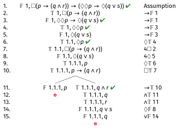
:::

All the branches close, so this is valid.

## Question 9

### $(\Diamond \Box p \wedge \Diamond \Box q) \rightarrow \Diamond(p \wedge q)$ in \textbf{K}

---

\begin{oltableau}
    [\sFmla{\False}{1, (p \wedge  \Diamond \Box p) \rightarrow  \Box p}, checked, just = \TAss
        [\sFmla{\True}{1, p \wedge  \Diamond \Box p}, checked, just = {\TRule{\False}{\rightarrow}[1]}
            [\sFmla{\False}{1, \Box p}, checked, just = {\TRule{\False}{\rightarrow}[1]}
                [\sFmla{\True}{1, p}, just = {\TRule{\True}{\wedge}[2]}
                    [\sFmla{\True}{1, \Diamond \Box p}, checked, just = {\TRule{\True}{\wedge}[2]}
                        [\sFmla{\False}{1.1, p}, just = {\TRule{\False}{\Box}[3]}
                            [\sFmla{\True}{1.2, \Box p}, just = {\TRule{\True}{\Diamond}[5]}
                                [\sFmla{\True}{1.2, p}, just = {\TRule{\Box}{\text{T}}[7]}]
                            ]
                        ]
                    ]
                ]
            ]
        ]
    ]
\end{oltableau}

::: {.content-visible when-format="revealjs"}
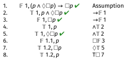
:::

## Question 9

This is open, so it isn't valid. 

The countermodel has three worlds, $w_1$, $w_{1.1}$ and $w_{1.2}$. 

$w_1$ can access everything, the other two can only access themselves. And $p$ is true at $w_1$ and $w_{1.2}$, but false at $w_{1.1}$.

## Question 10

### $\Box \Diamond \Box \Diamond p \rightarrow \Box \Diamond p$ in \textbf{K}

---

\begin{oltableau}
    [\sFmla{\False}{1, \Diamond \Box \Diamond \Box p \rightarrow  \Diamond \Box p}, checked, just = \TAss
        [\sFmla{\True}{1, \Diamond \Box \Diamond \Box p}, checked, just = {\TRule{\False}{\rightarrow}[1]}
            [\sFmla{\False}{1, \Diamond \Box p}, just = {\TRule{\False}{\rightarrow}[1]}
                [\sFmla{\True}{1.1, \Box \Diamond \Box p}, just = {\TRule{\True}{\Diamond}[2]}
                    [\sFmla{\False}{1.1, \Diamond \Box p}, just = {\TRule{\Diamond}{\text{4}}[3]}
                        [\sFmla{\True}{1.1, \Diamond \Box p}, just = {\TRule{\Box}{\text{T}}[4]}, close]
                    ]
                ]
            ]
        ]
    ]
\end{oltableau}

::: {.content-visible when-format="revealjs"}
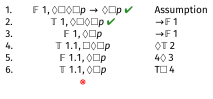
:::

The trunk closes, so this is \textbf{valid}. There are \textit{a lot} of ways to do this one; this is one of the more direct.