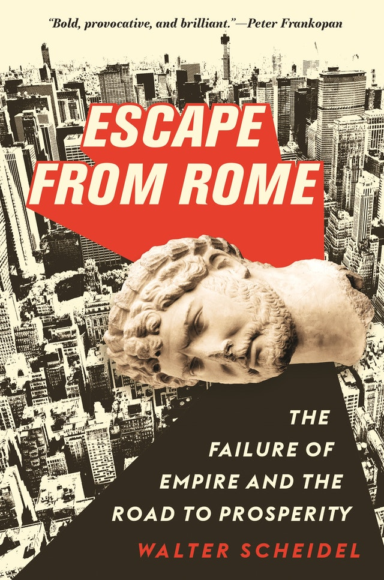
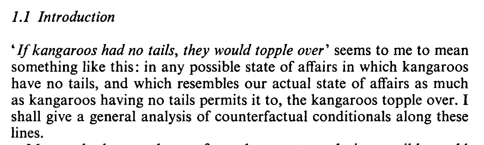

# Two Types of Conditionals

## Compare These Examples

1. If Shakespeare didn't write _Hamlet_, then someone else did.
2. If Shakespeare hadn't written _Hamlet_, then someone else would have.

. . .

Intuitively, 1 is true and 2 is false.

So it must be wrong to write both of them as $\neg A \rightarrow B$.

## Terminology

1. If Shakespeare didn't write _Hamlet_, then someone else did.
2. If Shakespeare hadn't written _Hamlet_, then someone else would have.

. . .

There are some common, if misleading, names for these kinds of conditionals.

. . .

- 1 is called an **indicative** conditional.
- 2 is called a **subjunctive** or **counterfactual** conditional

. . .

Ideally, we'd like a theory of how each works.

# Material Conditionals

## What is It

The material conditional is what the truth tables say is the conditional.

- We will write it as $A \supset B$
- This just means $\neg (A \wedge \neg B)$, i.e., $\neg A \vee B$.

. . .

One interesting hypothesis is that this is the right way to interpret English language conditionals.

## What About Hamlet

Perhaps we should say that two interesting hypotheses are that the two kinds of English language conditionals are best represented as material conditionals.

- Hypothesis 1: If it were the case that $A$ it would be the case that $B$ = $A \supset B$.
- Hypothesis 2: If it is the case that $A$ then it is the case that $B$ = $A \supset B$.

. . .

The first of these is wildly implausible; the second is a bit more defensible.

## Antecedent Strengthening

If indicative conditionals are material conditionals, then they should satisfy **Antecedent Strengthening**.

That is, whenever $A \rightarrow B$ is true, $(A \wedge C) rightarrow B$ should be true.

But there are intuitive counterexamples to this.

1. If I win the lottery tonight, I'll be very happy.
2. So if I get hit by a car on the way home and win the lottery tonight, I'll be vey happy

## False Antecedents

But the big problem with the material conditional analysis is what it says about false antecedents.

Note that if the material conditional analysis is right, then $(A \rightarrow B) \vee (B \rightarrow A)$ is a logical truth.

This does not always sound like a logical truth.

- If Brett went to Australia over break then he stayed in Ann Arbor, or if stayed in Ann Arbor, he went to Australia.

# Strict Conditional

## Strict Conditional Analysis

Here's a more plausible account of the conditional that avoids the last problem.

- _If A, B_ means _Necessarily, A materially implies B_.
- In symbols, $A \rightarrow B = \Box (A \supset B)$

. . .

What does $\Box$ mean here? Probably something epistemic; like it is known that.

## Antecedent Strengthening

Antecedent strengthening is still valid on this picture.

- Assume every $A$ world is a $B$ world.
- Consider an $A \wedge C$ world.
- It's an $A$ world, by the rule for true $\wedge$.
- So it's a $B$ world.
- So $(A \wedge C) \rightarrow B$.

. . .

So if you were worried about that problem, it's still hanging around.

## False Antecedents

But $A$ being false isn't enough for $A \rightarrow B$ any more.

So it fixes those problem.

## Summary

This is better than the material conditional theory, but not perfect. And we haven't said anything about the subjunctive conditionals.

# Antecedent Strengthening

## Antecedent Strengthening

Here is one of the implications we can use to test the strict implication theory.

1. $A \rightarrow B$
2. So, $(C \wedge A) \rightarrow B$

. . .

That is **valid** on the strict implication theory. Is it valid for ordinary, English conditionals?

## Subjunctive Counterfactual Conditionals

1. If I had struck this match, it would have lit.  
2. If I had dropped this match in water, and struck it, it would have lit.  

. . .

If you think 1 is true, but 2 is false, then you think antecedent strengthening is **invalid** for subjunctive conditionals.

## Future Directed Indicative Conditionals

1. If I strike this match tomorrow, it will light.  
2. If I soak this match in water overnight, then strike it tomorrow, it will light.  

. . .

If you think 1 is true, but 2 is false, then you think antecedent strengthening is **invalid** for future directed indicative  conditionals.

## Past Directed Indicative Conditionals

It is a little trickier to get a counterexample here. There are some very unnatural examples though.

1. If Shakespeare didn't write Hamlet, someone else did.
2. If we've all been collectively hallucinating that there is such a play as Hamlet, when in fact there is no such play, and it certainly wasn't written by Shakespeare, then someone else wrote Hamlet.

. . .

If pushed I might say 1 is true and 2 false, but I'm really not sure.

## Challenge

Three examples to see how well you're doing with these.

- Find your own counterexample to antecedent strenghening for subjunctive conditionals.
- Find your own counterexample to antecedent strenghening for future-directed indicative conditionals, i.e., indicative conditionals where the antecedent is about an event that may or may not happen in the future.
- Find your own counterexample to antecedent strenghening for past-directed indicative conditionals, i.e., indicative conditionals where the antecedent is about an event that may or may not have happened in the past.

## Reverse Direction

Is the following speech ok.

> If I'd dropped this match in water and then struck it, it would not have lit. But if I'd struck this match, it would have lit. 

. . .

A lot of philosophers and linguists have argued that this sounds really weird. And this is going to be relevant, because on the best theory of why antecedent strengthening fails, it should be ok.

# Counterfactuals

## Counterfactuals in Philosophy

These play a central role in lots of fields, including

- Causation
- Explanation
- Evaluation
- Planning

. . .

The most important of these is causation.

## Causation

There feel like there is a close connection between these claims.

- Causal event C caused effect event E.
- If C hadn't happened, E wouldn't have happened.

It's not a foolproof connection - maybe E would have happened some other way. But there is a link.

## History

::: {.columns}

:::: {.column width=50%}
{height=70%}
::::

:::: {.column width=50%}
Part of what makes this provocative is that Prof Scheidel is doing what philosophers think is obvious, using counterfactuals to provide evidence about causation and explanation.
::::
:::

## Coincidence

- But Scheidel isn't just interested in explanation.
- He's also interested in which facts about history are coincidences, and which are not. 
- In particular, is is a coincidence that since the fall of Rome, there has not been a large empire in Europe that has lasted more than a few years.
- This is a striking contrast to the many empires that have arisen in South Asia, East Asia and the Americas.

## Two Ways to Answer that Question

1. Is there something that could easily have happened such that if it had happened, there would have been a long lasting empire in Europe?
2. Is there a very similar world to ours in which there is a long lasting empire in Europe?

. . .

Intuition: These are sort of the same question.

## David Lewis

# Minimal Change Semantics

## Basic Idea

- Replace the on/off accessibility relation between worlds with a distance measure $d$.
- So $d(x, y)$, where $x, y$ are worlds, measures how similar $x$ and $y$ are. 
- But we'll sometimes talk as if it is a distance measure, that tracks 'how far apart' the worlds are.
- And for simplicity, we'll assume $d(x, y)$ is always an integer - there are the worlds 1 unit apart, 2 units apart, etc.

## Nearest World

- So if we're evaluating "If A were true, B would be true", we do the following.
- We find the nearest world, or worlds, where A is true.
- We see A is actually true, if not we look one unit away and see if there are any A worlds there, if not we look two units away and see if there are A worlds there, and so on until we find some A worlds.
- Say the distance they are separated from us is $d$.
- Then "If A were true, B would be true" is true just in case all the worlds distance $d$ away where A is true also make B true.

## Short Version

_If A were true, B would be true_, means

- All of the nearest A-worlds are B-worlds.

From now on, I'll sometimes write this as $A \boxright B$.

## Variably Strict

- This makes the conditional a variably strict conditional.
- It's strict, because it requires all A worlds to be B worlds.
- But it's variably strict, because which worlds it ranges over varies with what the antecedent is.

## Intuition Check

Here's the thought behind Lewis's view.

- When a counterfactual has a normal antecedent, the only worlds that matter to its truth are fairly normal worlds.
- To figure out what would have happened if I'd had bacon and eggs for breakfast, you only have to consider worlds that are really a lot like the actual world.
- But to figure out what would have happened if Columbus's fleet had sunk, you have to think about worlds that are really different to reality.

## How Far Away

We can even try to think about really wild counterfactuals.

> - What would happen if a vampire was the starting QB for the University of Michigan? 
> - Or a zombie? 
> - Or the number 7? 

Maybe some of those don't make sense - there are no worlds, not even distant ones, where they are actual. But we can go a fair way until we get to that point.

## Recap

The textbook calls this theory "minimal change semantics". Here's a reminder of how it works.

- Let's say we want to find out whether $A \boxright B$ is true at $w$ (we'll use $\boxright$ for the conditional we're about to define).
- We find the world $x$ such that $A$ is true at $x$, and $x$ is closest to $w$, i.e., is the least distance away.
- Then we look to see whether $B$ is true.
- If so, $A \boxright B$ is true.
- If not, $A \boxright B$ is false.

## Complication 1: No A-world

We'll just stipulate that if there are no $A$-worlds at all, then $A \boxright B$ is true for all $B$. These cases are weird, and I'll mostly set them aside.

## Complication 2: No 'closest' A-world

Here's something that can happen if you drop the assumption that the distances are integers.

- For any distance $d > 2$, there is a world $x$ such that the distance between $w$ and $x$ is $d$, and $A$ is true at $x$.
- But for any distance $d \leq 2$, there is no world $x$ such that the distance between $w$ and $x$ is $d$, and $A$ is true at $x $.
- So there isn't a **closest** $A$-world, because you can get closer and closer to 2, and find a yet closer $A$-world.
- This is also a weird possibility, and I'll set it aside.

## Complication 3: Many equally closest A-worlds

This is more philosophically substantial.

- Imagine that for $d$ less than 2, there is no $A$-world distance $d$ away.
- But at distance 2, there are multiple worlds where $A$ is true.
- And at some of them $B$ is true, and at others $B$ is false.

## One solution: Require all of them to be $B$ worlds

As I noted above David Lewis said that in that case we should say:

- $A \boxright B$ is false.    But also
- $A \boxright \neg B$ is false.

In general $A \boxright$ something requires that the something is true at all the nearest $A$-worlds. And neither $B$ nor $\neg B$ is true at all of them, so neither is true.

## Intuition Pump

Could you have 1 and 2 false, but 3 true?

1. If a UM student had been elected mayor of Ann Arbor, it would have been an undergraduate.
2. If a UM student had been elected mayor of Ann Arbor, it would have been a postgraduate.
3. If a UM student had been elected mayor of Ann Arbor, it would have been either an undergraduate or a postgraduate.

Lewis said that you could have 1 and 2 both false, but 3 true, and that's why $\boxright$ should work this way.

## Another solution: Deny this is possible

But the other great founder of this tradition, Robert Stalnaker, argued that we should want these things to be equivalent (at least if $\boxright$ was going to represent something in English).

1. $A \boxright B \vee A \boxright C$
2. $A \boxright (B \vee C)$

And we couldn't have that on Lewis's picture.

## Stalnaker's Solution

- It is a constraint on the distance metric that there are no ties.
- The similarity measure is a strict ordering.
- And it's still a matter of debate whether Lewis or Stalnaker is right about this.

## Next Time

- We'll talk more about this notion of similarity.

## Plan

To discuss the notion of similarity at the heart of Lewis's theory.

## Reading

This isn't covered so much in the book.

## Julius Caeser in Command

Which of these (if either) sounds true?

1. If Julius Caeser had commanded the US forces in Vietnam, he would have used nuclear weapons.
2. If Julius Caeser had commanded the US forces in Vietnam, he would have used catapults.

## Respects of Similarity

Lewis argued that either could be true, in different contexts, though they couldn't both be true at once.

- A world where Caeser is in command in Vietnam is going to be very different to reality in several ways.
- Making it similar requires highlighting some aspects of similarity, and, by necessity, downplaying others.  
- Hold fixed how belligerent Caeser is, and you get him using nuclear weapons.  
- Hold fixed his knowledge of weaponry, and you get him using catapults.

## Conjoining

Could this be true?

- If Julius Caeser had commanded the US forces in Vietnam, he would have used catapults to fire nuclear weapons.

## Feature, Not Bug

It feels like in some sense the world in which Caeser uses nuclear weapons is more similar to actuality, and in some other sense the world in which he uses catapults is more similar. Lewis argued that this was a good feature of his theory.

- These conditionals just are vague, and context-sensitive.
- It's a good thing that we use a vague, content-sensitive notion like **similarity** to analyse them.
- That doesn't make them too vague, or context-sensitive, it **explains** why they are so vague and context-sensitive.  

I'm not sure whether that argument works, but I'm not going to investigate it further.

## A Different Example

This seems like a tricky to figure out, historical question.

1. If Richard Nixon had ordered the use of nuclear weapons in Vietnam, his generals would have refused the order.  

You can imagine trying to figure that out by careful archival research, and guesswork about the parts of the archives that are off-limits to researchers.  

- But there's an argument that philosophy shows 1 is true.

## Two Worlds

- Let $w$ be the actual world where (I'll assume), Nixon never gave such an order.
- Let $w_1$ be the world where the order is given, and refused, and we never hear about it, and life goes on more or less as in $w$.
- Let $w_2$ be the world where the order is given, carried out, and other relevant parties (especially Russia and China) react in ways you'd expect to nuclear weapons being launched against their ally/neighbor.

## Two Worlds

Which of these worlds is more similar to the actual world?  

- There is a good case for $w_1$.
- It just requires a few generals to act a little out of character for a few minutes.
- In $w_2$, everyday life is changed in unrecognisable ways for millions of people; perhaps billions of people if it triggers a larger nuclear war.
- So philosophy tells us that if Nixon had ordered nuclear weapons to be used, his generals would have refused.

## History and Philosophy

This is an absurd result.

- Maybe Nixon's generals would have refused.
- But you can only tell that by careful historical research, not by thinking about similarity of worlds.
- Something must have gone wrong.

## Fixing The Problem

Insist that similarity of patterns or regularities is more important than similarity of particular facts.

- In $w_1$, some generals (arguably) do something very out of character.
- That's the kind of violation of a pattern or regularity that makes a big difference in similarity. (In the special sense of similarity that we care about.)
- In $w_2$ there are lots of particular facts that are different. There is a lot more radiation poisoning in Vietnam, and possibly in the United States (depending on the retaliation), but the patterns or regularities are not violated.

## A New Puzzle

Which of these is true?

1. If I'd jumped out my office window, I would have been seriously injured (I'm 1.5 floors above some concrete steps).
2. If I'd jumped out my office window, I would only have done that if there were a net to catch me, so I wouldn't have been seriously injured.

## Puzzle

- At least some of the time, we want to say that 1 is true.
- That's the 'non-backtracking' reading of the conditional that's relevant for thinking about decision-making, moral responsibility, causation, etc.
- But it's not clear Lewis can get that result.

## Three Worlds

- World $w$ is the actual world where I stay nice and safe in my office working on these slides.
- World $w_3$ is where there is no net, I jump and am seriously injured.
- World $w_4$ is where I check that there is a net, and then jump.
- World $w_4$ differs from $w$ in two respects - there is a net that doesn't really exist, and I jump out the window.
- But world $w_3$ differs in two ways as well - I jump out the window, and this is **really** out of character

## The New Puzzle

The 'solution' to the previous case seems to make this worse.

- If we prioritise patterns and regularities, then it looks like $w_3$ is really dissimilar to the actual world.
- But we want there to be an ordinary sense in which it's just true that if I had jumped out the window, I would have been seriously injured.

## Recap

- If you use an overall, intuitive, measure of similarity, you get the wrong results in the nuclear weapons example.
- If you use a measure that focuses on patterns and regularities, you get the wrong result (or at least rule out a good result) in the jump out window example.
- This is starting to feel like a trap.

## A Way Through

Here's how Lewis suggested getting out of the trap. (I'm simplifying a bit here; if you're interested you should read his paper "Counterfactual Dependence and Time's Arrow".)

- Treat the past and the future differently.
- In terms of the past, what matters for similarity is keeping **everything**, patterns, regularities, particular facts, everything, **exactly the same**. The nearest worlds are an exact duplicate of ours from the Big Bang to as close as possible to the present.
- In terms of the future, patterns and regularities are **much** more important.

## Intuitive Picture

How to find the nearest world where $A$ is true.

- Start at the present time and work backwards.
- What's the first time where you can make $A$ true with only a single violation of patterns or regularities in the world. It might be a big violation - like gravity stopping for a second, but ideally it is just one violation.
- Roll the world forward from that time according to the laws of the world - the physical laws, the biological laws, the psychological laws, the economic laws and so on.
- If those laws leave lots of things open, then there are lots of worlds that are equally close to actuality where $A$ is true.

## Two Puzzles

I like this intuitive picture a lot - I think it captures a lot of what we're trying to do with counterfactuals. But there are still puzzles remaining. I'll end this lecture with two of them.

1. The car theft puzzle.
2. The baseball jinx puzzle.

## The Car Theft

- Imagine that yesterday I parked my car at work in a UM garage, then drove home at the end of the day.
- My car wasn't stolen yesterday (like every other day). 
- But car thefts happen - it being stolen isn't like aliens invading.  
- Think about this counterfactual:

> If my car had been stolen yesterday, it would have been stolen just before midnight.

## The Car Theft

- Intuitively, that's not true.
- Just before midnight, my car was locked in my garage.
- During the day, it was in a public carpark at UM.
- If it was going to get stolen yesterday, it's at least as likely that it would have been stolen during the day as late at night.

## Three Worlds (Again)

- Again, let $w$ be the actual, no car theft, world.
- Let $w_5$ be the world where my car is stolen from a UM parking lot at midday.
- Let $w_6$ be the world where my car is stolen from my garage just before midnight.
- In $w_6$, things stay exactly the same as in $w$ for much longer - for nearly 12 hours longer.
- So by the metric we're using, it's more similar to actuality than $w_5$.
- So it will be true that had my car been stolen yesterday, it would have been stolen just before midnight.
- This isn't very plausible, so we still need to tinker with the similarity metric.

## The Baseball Jinx

Imagine that I watch a baseball game, and my team loses. My friends accuse me of jinxing the team. I defend myself with 1.

1. If I hadn't watched, they would still have lost.  

Here's an argument that 1 is, for all we know, false.

## Physics and Baseball

- Possibly baseball is seriously indeterministic.
- Possibly quantum indeterminacy in the player's brains causes differences in outcomes.
- Possibly quantum indeterminacy in the interaction of the ball with the air as it travels to the plate causes just enough variation in the position of the ball when it's hit to make the difference between a home run and a fly ball at the wall.
- Maybe physics will tell us otherwise, but it seems to me we can't rule out this kind of indeterminacy.

## Baseball and Uncertainty

Now compare these two worlds (to $w$, the actual world).

- In $w_7$, I don't watch, but the game goes **exactly** as it goes in $w$, and my team loses.
- In $w_8$, things go **exactly** as they do in $w$ up until the start of the game, when I don't sit down to watch it. Then they follow the laws of nature. But the laws are chancy, and in $w_8$ the variations favor my team just enough that they narrowly win rather than narrowly lose.  

## The Puzzle

- If all we care about is exact match before the 'break point' (when the first thing changes), then conformity to laws, patterns and regularities after the 'break point', then $w_7$ and $w_8$ are equally close to actuality.
- They both are exactly alike until I don't watch (rather than watch) and both conform to laws afterwards.
- So the conditional, _If I hadn't have watched, we still would have lost_, is false.
- In one of the nearest worlds where I don't watch, we lose.

## Is This a Problem

This doesn't sound great.

- We know that we don't make a difference to baseball games by watching or not watching them.
- But this theory, which otherwise looks promising, seems to say that maybe we do.
- This is just an open puzzle.

## Next Time

We'll talk more about the logic of these counterfactuals.

## Plan

- To discuss some features of the logic of counterfactual conditionals.

## Associated Reading

- _Boxes and Diamonds_, chapter 7.

## Antecedent Strengthening

This fails on the minimal change semantics.

## Antecedent Strengthening

What is it?

1. $A \boxright B$.
2. so, $(A \wedge C) \boxright B$

## Antecedent Strengthening

Why does it fail? Because this is possible.

- The nearest $A$-world is 10 units away, and at it, $B$ is true, but $C$ is false.
- The nearest $A \wedge C$-world is 100 units away, and at it, $C$ is true (of course), but $B$ is false.

## Antecedent Strengthening

Put in less technical terms, it fails when these things happen at once.

> - In all normal worlds, when $A$ is true, $B$ is true and $C$ is false.
> - So there are no normal worlds where $A \wedge C$.
> - But in the $A \wedge C$-worlds that are only a bit abnormal, $B$ is false.

## Skiing Example

Here are some things we might imagine are true in all normal possibilities.

- When it snows, it snows a normal amount - it isn't a blizzard.
- When it snows, Jack goes skiing.
- Jack has no disposition to want to ski in a blizzard. 

So in the most normal blizzard world, Jack does not go skiing. And we have both of the following.

- If it had snowed, Jack would have gone skiing.
- If there had been snow and a blizzard, Jack would not have gone skiing.

## Transitivity (or Conditional Syllogism)

This argument seems initially compelling for any interpretation of 'if'.

1. If $A, B$.
2. If $B, C$.
3. So if $A, C$.

## Transitivity for Subjunctives

On the nearest possible world, or minimal change, semantics, this will fail for subjunctive conditionals.

- Imagine there is no nearby world where $A$.
- The nearest $A$ worlds (which in these cases will be quite distant) are worlds where $B$ is true and $C$ is false.
- There are nearby, normal $B$ worlds, and they are all worlds where $C$ is true.

## Real Life Example

1. If there had been a hurricane and a blizzard on Presidents' Day Weekend, it would have snowed on Presidents' Day Weekend.  
2. If it had snowed on Presidents' Day Weekend, Jack would have gone skiing on Presidents' Day Weekend.  
3. So if there had been a hurricane and a blizzard on Presidents' Day Weekend, Jack would have gone skiing on Presidents' Day Weekend.

## Link To Antecedent Strengthening

1. If I had crashed my car last week and won the lottery on the weekend, I'd have crashed my car last week.  
2. If I had crashed my car last week, I'd now have less money than actually do.  
3. So if I had crashed my car last week and won the lottery on the weekend, I'd now have less money than actually do.

## Recipe Here

Assume that you have _If A, C_, but not _If A and B, C_.

1. If $A$ and $B$, $A$.
2. If $A, C$.
3. So, If $A$ and $B$, $C$.

That should have true premises and a false conclusion.

## But Wait

But don't we reason this way all the time.

1. If there had been a major earthquake in Ann Arbor last weekend, several buildings in Ann Arbor would have been destroyed.  
2. If several buildings in Ann Arbor were destroyed, I would have been very upset.  
3. So if there had been a major earthquake in Ann Arbor on the weekend, I would have been very upset.

The point is not that 1-3 look true here, it's that reasoning from 1 and 2 to 3 looks like good, ordinary, everyday reasoning.

## Modified Transitivity

This argument form is valid on the minimal change semantics.

1. If $A, B$
2. If $A \wedge B, C$
3. So, if $A, C$

## Proof Of Modified Transitivity

- Let $d$ be the distance of the nearest $A$ world.
- By premise 1, all of those nearest $A$ worlds, which are distance $d$ away, are $B$ worlds.  
- So they are also the nearest $A \wedge B$ worlds. (There can't be any closer, because then they would be closer $A$ worlds.)  
- By premise 2 then, all these $A \wedge B$ worlds distance $d$ away are also $C$ worlds.
- So all the $A$ worlds distance $d$ away are $C$ worlds.  
- So, if $A, C$.

## Explanation

Lewis suggested that was what was really going on when we use transitivity arguments in everyday life.

- The middle premise is really _If A and B, C_, not just _If B, C_.
- Is this plausible? I don't know.

## That's All!

Next class will just be about revision before the final. Thanks for staying to the end!