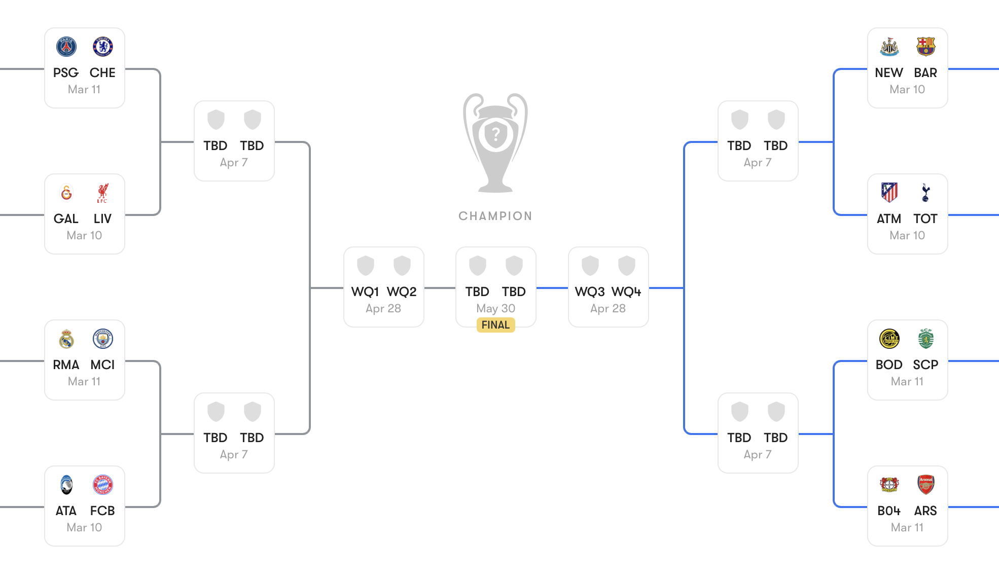

# Introduction

## Plan

This lecture introduces the basics of probability.

### Associated Reading

Odds and Ends, Chapter 1

## Basic Idea

- A probability function is a mapping from possibilities to numbers.
- The numbers must sum to one.
- Intuitively, the numbers measure how likely the possibilities are.

## Sum to One

The math of probability functions is just the math of proportions. Ultimately, all we'll be doing is the same kind of math that you would do when thinking about things like

- What proportion of UM students are from North Carolina?
- What proportion of UM undergraduates are Detroit Tigers fans?

etc.

## Three Big Questions

1. What to do with these numbers?
2. Where these numbers come from?
3. What do the numbers even mean?

## A Simple Case

- Imagine that it is basketball season, and UM has planned to have both the women's and men's teams play on the same night.
- So at the end of the night there are four possible outcomes.

## Made Up Probabilities

I'll stipulate that the probabilities of the four possible outcomes are given by this table.

              Men Win   Men Lose
-----------  --------- ----------
Women Win       0.45      0.25
Women Lose      0.20      0.10

## Another Representation

Here are the same numbers written a different way.

 Women   Men    Probability
------- ------ -------------
  Win    Win        0.45
  Win    Lose       0.25
  Lose   Win        0.20
  Lose   Lose       0.10
  
## Possibilities

Say a possibility (for current purposes) is one of these maximally specific things that the probability is defined over.

- It is not really a complete possibility.
- It doesn't tell us the score, or the weather, or the results of the next election, or for that matter the results of the last election.
- But it tells us everything that's relevant to a particular inquiry.
- It is a lot like a line on a truth table.
  
## Events

We will say an **event** is a proposition that can be defined using these possibilities. So here are some sample events.

- The women's team wins.
- The men's team wins.
- At least one Michigan team wins.
- The two teams have the same result.

## Probability of Events

- An event is true at some possibilities, false at others.
- Each possibility gets a probability.
- The probability of an event is the sum of the probabilities of the possibilities where it is true.

## Examples - Probability Women's Team Wins

::: columns

:::: column

 Women   Men    Probability
------- ------ -------------
  Win    Win        0.45
  Win    Lose       0.25
  Lose   Win        0.20
  Lose   Lose       0.10
  
::::

:::: column

\bigskip
- The women's team wins at lines 1 and 2.
- So its probability is 
- 0.45 + 0.25 = 0.7.

::::

:::

## Examples - Probability Men's Team Wins

::: columns

:::: column

 Women   Men    Probability
------- ------ -------------
  Win    Win        0.45
  Win    Lose       0.25
  Lose   Win        0.20
  Lose   Lose       0.10
  
::::

:::: column

\bigskip
- The men's team wins at lines 1 and 3.
- So its probability is
- 0.45 + 0.20 = 0.65.

::::

:::

## Examples - At Least One Team Wins

::: columns

:::: column

 Women   Men    Probability
------- ------ -------------
  Win    Win        0.45
  Win    Lose       0.25
  Lose   Win        0.20
  Lose   Lose       0.10
  
::::

:::: column

\bigskip
- At least one team wins at lines 1, 2 and 3.
- So its probability is
- 0.45 + 0.25 + 0.20 = 0.90.

::::

:::

## Examples - Same Result in Each Game

::: columns

:::: column

 Women   Men    Probability
------- ------ -------------
  Win    Win        0.45
  Win    Lose       0.25
  Lose   Win        0.20
  Lose   Lose       0.10
  
::::

:::: column

\bigskip
- It is the same result in each game at lines 1 and 4.
- So its probability is
- 0.45 + 0.10 = 0.55.

::::

:::

# Basic Probability Math

## Overview

Some general features of probability functions.

### Associated Reading

Odds and Ends, Chapter 5

## Scale

$$
0 \leq \Pr(A) \leq 1
$$

## Negation

$$
\Pr(\neg A) = 1 - \Pr(A)
$$

## Excluded Middle

$$
\Pr(A) + \Pr(\neg A) = 1
$$

## Partition

Some events $A_1, \dots A_n$ form a partition if, necessarily, exactly one of them is true.

- So they are **exclusive** - you can't have any two of them both be true.
- And they are **exhaustive** - you have to have at least one true.

## Partition

If $A_1, \dots A_n$ form a partition then

$$
\Pr(A_1) + \dots + \Pr(A_n) = 1
$$

## Exclusive

If $A, B$ are exclusive

$$
\Pr(A \vee B) = \Pr(A) + \Pr(B)
$$

## General Principle

$$
\Pr(A) + \Pr(B) = \Pr(A \vee B) + \Pr(A \wedge B)
$$

# Probability Trees

## Overview

Introducing probability trees

### Reading

_Odds and Ends_, sections 1.1 and 6.2. 

## Trees

- Often, we can't just write down numbers for the possibilities.
- But we can write down, or at least make reasonable guesses about, numbers for certain events.
- And we can think about how things are likely to go given those events happen.
- This is the tree structure that is used in _Odds and Ends_.

## Flight Forecasting

- So let's say you're flying from Detroit to Salt Lake City via Denver (which apparently is a common route), next Monday.
- And you want to know how likely it is you'll get there on time. 
- The weather looks fine here in Michigan, but changing planes in Denver in March can be a bit of a lottery.
- You've got a tight connection, so if the first flight is delayed, you'll probably be delayed.
- And that's not the only thing that could go wrong with planes.
- But it's hard to put into numbers how it affects things.

## One Method

- Divide up the state space.
- Work out the probability of being in one or other part of the space.
- Work out the probability of being delayed given you are in one or other part of the space.
- Add things up.

## Nothing is Reliable

- There are a lot of ways to do this.
- You could divide up the space by how many flights are delayed next Monday.
- Or you could divide up the space by how many airline employees show up for work on Monday.
- Or, and let's work with this one, you could divide it up by what the weather is like in Denver. The advantage of this is that we can get an independent assessment of it without knowing a ton about the state of the aviation industry.

## Three States

1. Blizzard.
2. Bad weather, but not a blizzard.
3. Clear skies.

## Two Step Process

1. Work out (or at least estimate) probability of each state.
2. Work out probability of being delayed within each of those states.

. . .

This will involve a lot of guesswork - do not make travel planning decisions on the basis of the numbers I'm about to use because they are really pulled out of the air - but it's a very helpful heuristic to at least approximate the reality.

## Probabilities of States

Let's say the probabilities look like this.

- Blizzard - 10%, or 0.1.
- Other bad weather - 60%, or 0.6.
- Good weather  - 30%, or 0.3.

## Flight Probabilities

Then we want to work out how likely it is that you get there on time in each of these three possibilities.

## Blizzard

- This one's easy - you're going to be late. 
- Your plane won't land, or the plane you're connecting to won't land, or your plane won't take off.
- Never say never, but the probability that you'll be late is 1.

## Bad Weather

- It snows a lot in Denver, and yet planes get through.
- But still, things start going wrong when there's bad weather, and you've got two points where things can go wrong.
- So let's say it's a 25% chance you're delayed in this situation.
- Across the year, just over 90% of flights from Detroit to Denver are on time, and just under 90% of flights from Denver to Salt Lake City are on time, but things are worse in winter - even without a blizzard - that's why the 25%.

## Good Weather

- Now it would have to be some other kind of bad luck to be late.
- That happens, but let's put it at 10% likelihood.
- If you wake up on Monday and see it's sunny in Denver, it seems you should be at least 90% confident you'll get to Salt Lake on time.

## The Giant Table

                                     On Time                Late
---------------------------- -------------------------- ---------------------------
Blizzard                      $0.1 \times 0.00 = 0.00$   $0.1 \times 1.00 = 0.10$
Bad Weather                   $0.6 \times 0.75 = 0.45$   $0.6 \times 0.25 = 0.15$
Good weather                  $0.3 \times 0.90 = 0.27$   $0.3 \times 0.10 = 0.03$
  
So the probability that you arrive on time (given these literally made up assumptions) is $0.00 + 0.45 + 0.27 = 0.72$, or 72%, and the probability that you're delayed is 28%.

## Probabilities and Errors

- The error bars on that calculation are massive.
- But it's a kind of sanity check on how you think things are going.
- Especially in situations where only a handful of paths lead to a salient result (like in playoffs in sports, or when thinking about the likelihood of a particular challenger winning), doing the tree even with favorable numbers can give you a conservative estimate of some probability.

## Above or Below 0.5

It's really tempting to reason this way.

- It's likely that $A_1$.
- It's likely that $A_2$ will be true if $A_1$ is true.
- It's likely that $A_n$, if $A_1$, ..., $A_{n-1}$ are true.

. . .

Therefore, it's likely that $A_1 \wedge \dots \wedge A_n$ are true

## Above or Below 0.5

{width=50%}

This fails in 'knockout' situations.

## Above or Below 0.5

You can simultaneously believe:

1. In each game, the higher seed is more likely to win than not.
2. It is less likely than not that the #1 seed will win the whole thing.

. . .

Indeed, not only are these consistent, that's often a very sensible thing to believe, including in this very example.

## For Next Time

We'll start looking at **conditional probability**.