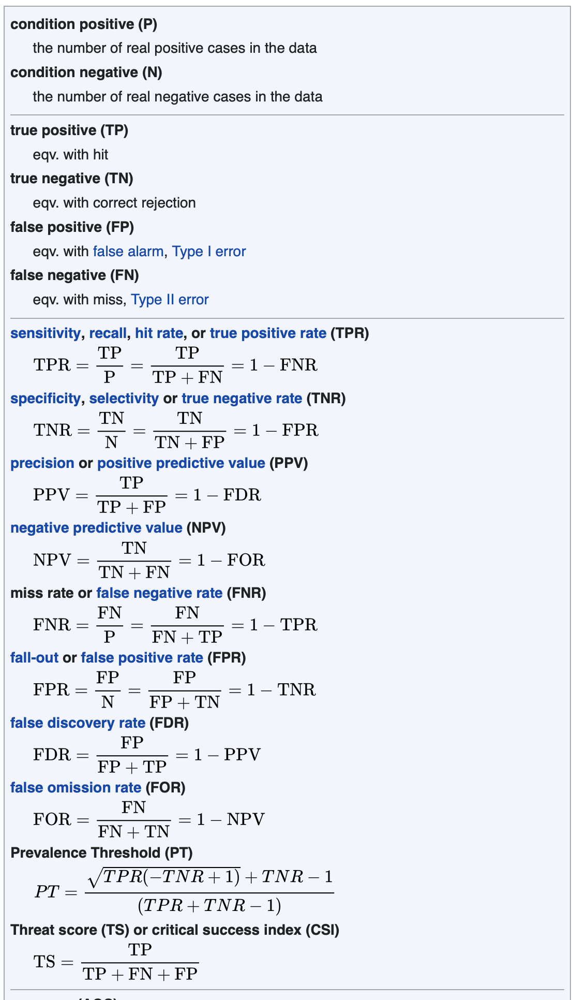

# Introduction

## Plan

- We know how to compute $\Pr(A \mid B)$ when we know $\Pr(A \wedge B)$ and $\Pr(B)$.
- But often what we're *given* is a set of conditional probabilities, and we need to work out a different conditional probability.
- Today we'll learn how to **invert** conditional probabilities.

### Associated Reading

*Odds and Ends*, Chapter 8

## Why Inverting Matters

A burglary was committed, and fingerprints resembling mine were found at the scene. Let:

- $I$ = I am innocent
- $F$ = these fingerprints were found

. . .

From forensic science, we can estimate $\Pr(F \mid I)$: the chance that fingerprints like mine appear at a random crime scene where I'm innocent.

. . .

But what matters for criminal responsibility is $\Pr(I \mid F)$. These are very different things, and conflating them is a serious error.

# The Table Method

## A Real-World Problem

- 3% of men have disease $D$.
- A man you know has no special risk factors.
- There is a test for $D$: among those with $D$, 90% test positive; among those without, only 5% test positive.

. . .

This man tested **positive**. What is the probability he has disease $D$?

---

{height=50%}

## How to Solve These Problems

Build a table with:

- The possible **states of the world** on the rows (Has Disease / No Disease)
- The possible **test results** on the columns (Positive / Negative)
- Fill each cell with $\Pr(\text{state} \wedge \text{result})$

. . .

The key formula used throughout:

$$
\Pr(X \wedge Y) = \Pr(X) \times \Pr(Y \mid X)
$$

## Building the Table

Start with what we know:

- $\Pr(\text{Disease}) = 0.03$, so $\Pr(\text{No Disease}) = 0.97$
- $\Pr(\text{Positive} \mid \text{Disease}) = 0.9$, so $\Pr(\text{Negative} \mid \text{Disease}) = 0.1$
- $\Pr(\text{Positive} \mid \text{No Disease}) = 0.05$, so $\Pr(\text{Negative} \mid \text{No Disease}) = 0.95$

## Top-Left: Disease and Positive

$$
\Pr(\text{Disease} \wedge \text{Positive}) = 0.03 \times 0.9 = 0.027
$$

|              | Positive | Negative |
|:-------------|:--------:|:--------:|
| Disease      | 0.027    |          |
| No Disease   |          |          |

## Top-Right: Disease and Negative

$$
\Pr(\text{Disease} \wedge \text{Negative}) = 0.03 \times 0.1 = 0.003
$$

|              | Positive | Negative |
|:-------------|:--------:|:--------:|
| Disease      | 0.027    | 0.003    |
| No Disease   |          |          |

## Bottom-Left: No Disease and Positive

$$
\Pr(\text{No Disease} \wedge \text{Positive}) = 0.97 \times 0.05 = 0.0485
$$

|              | Positive | Negative |
|:-------------|:--------:|:--------:|
| Disease      | 0.027    | 0.003    |
| No Disease   | 0.0485   |          |

## Bottom-Right: No Disease and Negative

$$
\Pr(\text{No Disease} \wedge \text{Negative}) = 0.97 \times 0.95 = 0.9215
$$

|              | Positive | Negative |
|:-------------|:--------:|:--------:|
| Disease      | 0.027    | 0.003    |
| No Disease   | 0.0485   | 0.9215   |

## Checking the Table

|              | Positive | Negative |
|:-------------|:--------:|:--------:|
| Disease      | 0.027    | 0.003    |
| No Disease   | 0.0485   | 0.9215   |

- Top row sums to 0.03 ✓ (that's $\Pr(\text{Disease})$)
- Bottom row sums to 0.97 ✓ (that's $\Pr(\text{No Disease})$)
- Everything sums to 1 ✓

## Solving the Problem

We want $\Pr(\text{Disease} \mid \text{Positive})$.

$$
\Pr(\text{Disease} \mid \text{Positive}) = \frac{\Pr(\text{Disease} \wedge \text{Positive})}{\Pr(\text{Positive})}
$$

. . .

- $\Pr(\text{Disease} \wedge \text{Positive}) = 0.027$
- $\Pr(\text{Positive}) = 0.027 + 0.0485 = 0.0755$

$$
\Pr(\text{Disease} \mid \text{Positive}) = \frac{0.027}{0.0755} \approx 0.36
$$

## The Surprising Upshot

- The test looked pretty reliable: 90% sensitivity, 95% specificity.
- But testing positive only raises the probability of disease from 3% to about **36%**.

. . .

Why? Because the disease is **rare**. Even though the test is fairly reliable, false positives outnumber true positives when the base rate is low.

. . .

This pattern is general. When testing for rare conditions, a positive result is worrying but usually doesn't mean you almost certainly have the disease.

# General Strategy

## The General A/B Strategy

For any problem where you want $\Pr(A \mid B)$ from information of the form $\Pr(B \mid A)$, $\Pr(A)$, etc.:

::: {.incremental}
1. Make a $2 \times 2$ table with $A$, $\neg A$ on rows and $B$, $\neg B$ on columns.
2. Fill each cell using $\Pr(X \wedge Y) = \Pr(X \mid Y)\Pr(Y)$.
3. Add up rows to get $\Pr(A)$, $\Pr(\neg A)$; columns to get $\Pr(B)$, $\Pr(\neg B)$.
4. Use the conditional probability formula to find the answer.
:::

## Example

Given:

- $\Pr(A) = 0.6$
- $\Pr(B \mid A) = 0.3$
- $\Pr(B \mid \neg A) = 0.8$

Find $\Pr(B)$ and $\Pr(A \mid B)$.

## Setting Up

From negation: $\Pr(\neg A) = 0.4$, $\Pr(\neg B \mid A) = 0.7$, $\Pr(\neg B \mid \neg A) = 0.2$.

|           | $B$  | $\neg B$ |
|----------:|:----:|:--------:|
| $A$       |      |          |
| $\neg A$  |      |          |

## Filling In

\begin{align*}
\Pr(A \wedge B) &= 0.3 \times 0.6 = 0.18 \\
\Pr(A \wedge \neg B) &= 0.7 \times 0.6 = 0.42 \\
\Pr(\neg A \wedge B) &= 0.8 \times 0.4 = 0.32 \\
\Pr(\neg A \wedge \neg B) &= 0.2 \times 0.4 = 0.08
\end{align*}

|           | $B$  | $\neg B$ |
|----------:|:----:|:--------:|
| $A$       | 0.18 | 0.42     |
| $\neg A$  | 0.32 | 0.08     |

## Reading Off the Answers

|           | $B$  | $\neg B$ |
|----------:|:----:|:--------:|
| $A$       | 0.18 | 0.42     |
| $\neg A$  | 0.32 | 0.08     |

- $\Pr(B) = 0.18 + 0.32 = 0.5$

$$
\Pr(A \mid B) = \frac{0.18}{0.5} = 0.36
$$

Learning $B$ drops the probability of $A$ from 0.6 to 0.36.

# Probability Rules

## Why These Rules Work

It helps to see the algebra behind the table method.

### The Negation Rule

$$
\Pr(\neg A) = 1 - \Pr(A)
$$

This holds because $A$ and $\neg A$ are exclusive and exhaustive.

## The Multiplication Rule

From the definition of conditional probability:

$$
\Pr(A \mid B) = \frac{\Pr(A \wedge B)}{\Pr(B)}
$$

Multiply both sides by $\Pr(B)$:

$$
\Pr(A \wedge B) = \Pr(A \mid B)\,\Pr(B)
$$

This is what we use to fill in every cell of the table.

## The Law of Total Probability

$B$ is equivalent to $(A \wedge B) \vee (\neg A \wedge B)$, and those are exclusive, so:

$$
\Pr(B) = \Pr(B \mid A)\,\Pr(A) + \Pr(B \mid \neg A)\,\Pr(\neg A)
$$

This is what lets us compute column totals from the cells.

## Bayes's Theorem

Combining the multiplication rule and total probability:

$$
\Pr(A \mid B) = \frac{\Pr(B \mid A)\,\Pr(A)}{\Pr(B \mid A)\,\Pr(A) + \Pr(B \mid \neg A)\,\Pr(\neg A)}
$$

. . .

This is **Bayes's Theorem**. It's very famous, but note that it's just a compact way of writing out what the table method does.

## Using Bayes's Theorem

$$
\Pr(A \mid B) = \frac{\Pr(B \mid A)\,\Pr(A)}{\Pr(B)}
$$

. . .

The table method and Bayes's theorem always give the same answer. Use whichever you find easier. For most exam problems, the table is clearer and less error-prone.

# Base Rates

## A Famous Example

A cab was involved in a hit-and-run at night. Two cab companies operate in the city: Green (85% of cabs) and Blue (15%).

A witness identified the cab as Blue. The court tested the witness under similar conditions: they correctly identified the color of cabs 80% of the time.

**What is the probability the cab was Blue?**

## Setting Up the Table

Let $\Pr(\text{Blue}) = 0.15$, $\Pr(\text{Green}) = 0.85$.

From the reliability data:

- $\Pr(\text{Looks Blue} \mid \text{Is Blue}) = 0.8$
- $\Pr(\text{Looks Blue} \mid \text{Is Green}) = 0.2$

|           | Looks Blue | Looks Green |
|----------:|:----------:|:-----------:|
| Is Blue   | $0.15 \times 0.8 = 0.12$ | $0.15 \times 0.2 = 0.03$ |
| Is Green  | $0.85 \times 0.2 = 0.17$ | $0.85 \times 0.8 = 0.68$ |

## The Answer

$$
\Pr(\text{Is Blue} \mid \text{Looks Blue}) = \frac{0.12}{0.12 + 0.17} = \frac{0.12}{0.29} \approx 0.41
$$

. . .

Even though the witness is 80% accurate, it is still **more likely the cab was green**.

## The Lesson: Base Rates

- When one possibility is much more likely *a priori*, it takes strong evidence to overturn it.
- Here, Green cabs outnumber Blue 85:15. So even a fairly reliable witness can't overcome that.

. . .

We often conflate the **direction** of recent evidence with its **strength**. The witness supports "Blue" over "Green", but the overall balance still favors Green.

## A Caution About This Example

The cab example assumes the witness's accuracy is stated in a particular way. It could be read differently:

. . .

If "80% accurate" means:

- $\Pr(\text{Correct} \mid \text{Looks Blue}) = 0.8$ (i.e., whenever they say "Blue", they're right 80% of the time)

. . .

Then the answer would simply be 0.8. English descriptions of accuracy data are often ambiguous. Always check exactly what you are being told.

## General Lesson

::: {.incremental}
- Base rates matter enormously.
- "This evidence supports $H$" is different from "$H$ is now probably true."
- Use the table method to avoid being misled by salient recent evidence.
:::

# Multiple Hypotheses

## Worked Example: The Urn Problem

An urn contains 4 marbles, each either blue or green. The number of blue marbles is equally likely to be 0, 1, 2, 3, or 4. We draw 3 marbles **with replacement** and observe: **blue, green, blue**.

**Question**: What is the probability the urn contains exactly 1 blue marble?

. . .

Let $H_k$ = the urn contains $k$ blue marbles, for $k = 0, 1, 2, 3, 4$.

**Prior**: $\Pr(H_k) = \frac{1}{5}$ for each $k$. We start with no reason to favour any particular composition.

## Computing the Likelihoods

Let $E$ = the sequence blue, green, blue. Since draws are **independent** (with replacement), we multiply:

$$\Pr(E \mid H_k) = \frac{k}{4} \times \frac{4-k}{4} \times \frac{k}{4} = \frac{k^2(4-k)}{64}$$

. . .

| $H_k$ | $k^2(4-k)$ | $\Pr(E \mid H_k)$ |
|:-----:|:----------:|:-----------------:|
| $H_0$ | 0          | $0$               |
| $H_1$ | 3          | $3/64$            |
| $H_2$ | 8          | $8/64$            |
| $H_3$ | 9          | $9/64$            |
| $H_4$ | 0          | $0$               |

## Applying Bayes's Theorem

$$\Pr(H_1 \mid E) = \frac{\Pr(E \mid H_1)\,\Pr(H_1)}{\displaystyle\sum_{k=0}^{4} \Pr(E \mid H_k)\,\Pr(H_k)}$$

. . .

Since all priors equal $1/5$, the $1/5$ factors cancel and the denominator is just the sum of the likelihoods (times $1/5$):

$$\Pr(E) = \frac{1}{5} \cdot \frac{0 + 3 + 8 + 9 + 0}{64} = \frac{1}{5} \cdot \frac{20}{64} = \frac{1}{16}$$

. . .

$$\Pr(H_1 \mid E) = \frac{(3/64) \times (1/5)}{1/16} = \frac{3}{320} \times 16 = \frac{3}{20}$$

## What the Evidence Tells Us

With a uniform prior, the posterior is **proportional to the likelihood**. The evidence does all the work:

| $H_k$ | Likelihood | Posterior |
|:-----:|:----------:|:---------:|
| $H_0$ | $0$        | $0$       |
| $H_1$ | $3/64$     | $3/20$    |
| $H_2$ | $8/64$     | $8/20$    |
| $H_3$ | $9/64$     | $9/20$    |
| $H_4$ | $0$        | $0$       |

. . .

The most likely urn composition after observing blue-green-blue is $H_3$ (3 blue marbles). Intuitively: we saw two blues and one green, which is consistent with a 3:1 ratio. The uniform prior means the evidence speaks for itself.

## For Next Time

- We move from probability to **decisions**.
- How should we act when the outcomes of our choices depend on uncertain facts?
- We'll introduce expected utility as the key tool.
