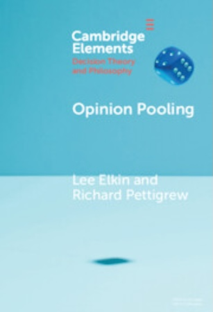
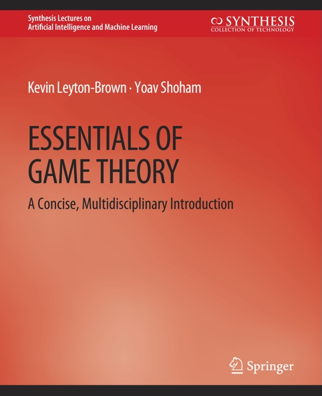
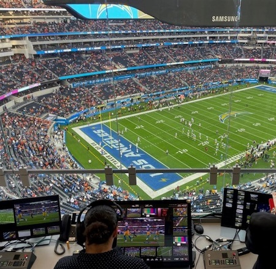
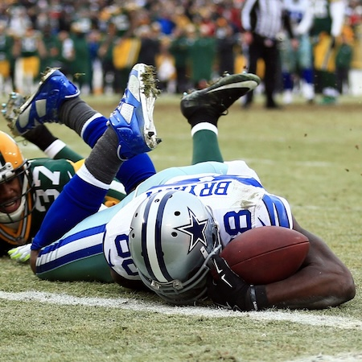
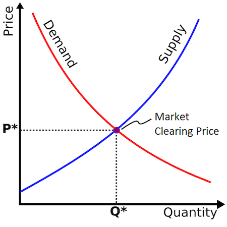
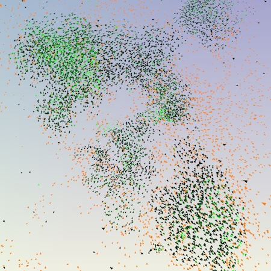
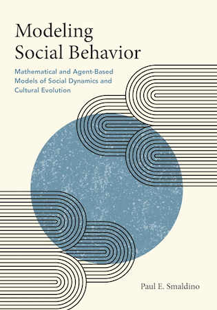

# Introduction

## The Course

This is **Philosophy 342**: Introduction to Theory of Choice in Groups.

It introduces a range of topics that have the following features:

1. They concern human choices;
2. They raise philosophically interesting questions; and
3. At least some of these questions arise from how choices by different people interact.

## Lectures By...

I'm Brian Weatherson, a professor in the philosophy department.

My office is **2207 Angell Hall**. (That's not far from where we are; the numbering for Mason, Angell, Tisch and Haven is continuous.)

My email is **weath@umich.edu**.

My office hours are 9:30–11:30 a.m. Thursdays. You should drop by any week **after this one** to ask about the course, or other philosophy courses, or to chat about how your favorite sports team is doing, etc.

The **after this one** is because I'm away at a conference starting tomorrow; office hours will start next week.

## Discussion Sections

The discussion sections for the course are led by Mitch Barrington.

Their office is 2253 Angell Hall.

Their office hours are Monday, 1pm-3pm.

You should also drop by their office hours with questions about this course, other philosophy courses, etc.

## Books

There are two main textbooks for this course.

::: {.columns}

:::: {.column width="50%"}
{fig-alt="Cover of Opinion Pooling."}
::::

:::: {.column width="50%"}
{fig-alt="Cover of Modeling Scientific Communities."}
::::

:::

## Books

Both books are available through the library, which has a subscription to the Cambridge Elements series.

There is also a Github site for the course that has a number of readings on it. This is at:

::: {.columns}
::: {.column width="100%"}
{width="30%"}
:::
:::

There is also a Canvas page, at the regular location, where the assignments will be (and the readings are linked).

## Game Theory Text

::: {.columns}

:::: {.column}
We will also be spending one week working through some of the basics of game theory using Kevin Leyton-Brown and Yoav Shoham's book _Essentials of Game Theory_.

Like the Elements books, the library has an electronic version of this book, so you don't need to buy anything.
::::

:::: {.column}
{width=40%}
::::

:::

## More Books

If you are interested in the material and would like to investigate further, the two books to start with are:

- *Collective Choice and Social Action*, Amartya Sen, 1970.
- *The Evolution of Cooperation*, Robert Axelrod, 1984.

. . .

We'll talk about the material in both of these as the course progresses, and neither is **required**, but they are both deservedly classics.

## Plan

The course will be in two halves, roughly pivoting around the midterm break.

1. **Pooling**: How do we form collective attitudes out of individual attitudes?
2. **Modeling**: What can we learn about social structures by looking at very simple models of them?

# Pooling

## A Hypothetical

::: {.columns}

:::: {.column width="45%"}
{fig-alt="View from behind replay officials sitting at a console with multiple monitors, overlooking an NFL football field during a game"}
::::

:::: {.column width="55%"}
It's easiest to understand some of the puzzles about pooling with an example.
::::

:::

## A Hypothetical

::: {.columns}

:::: {.column width="45%"}
{fig-alt="View from behind replay officials sitting at a console with multiple monitors, overlooking an NFL football field during a game"}
::::

:::: {.column width="55%"}
Let's start by imagining a future world where the NFL has decided to have three replay officials on hard calls.
::::

:::

## A Hypothetical

This is Michigan, so I assume most people know the basics of NFL rules, but to make sure everyone is on the same page, here's what will be relevant here.

If a player (a) catches a pass and (b) runs into the end zone without going out of bounds or being tackled, then it's a **touchdown**. 

(That's the biggest scoring play.)

There are bells and whistles, of course—what exactly counts as a pass and so on—but we just need to know that much.

## Two Questions

1. Did the receiver catch the ball?
2. Did the receiver stay in bounds while running into the end zone?

. . .

If yes to both, everyone agrees that it's a touchdown.

## The Catch Part

::: {.columns}

:::: {.column width="50%"}
{fig-alt="Dallas Cowboys player #88 Dez Bryant lying on the ground clutching a football after a contested catch"}
::::

:::: {.column width="50%"}
Sometimes it's hard to tell whether someone caught the ball.

Let's assume two replay officials, A and B, say it was a catch, and a third one, C, says it wasn't.
::::

:::

## Out of Bounds

After maybe catching the ball, the receiver runs to the end zone.

On the way, he swerves to get around a defender and gets *very close* to running out of bounds.

The TV pictures are a bit blurry, and he's wearing white shoes the same color as the sideline, so it's hard to tell just what happened.

Replay judges A and C think he stayed in bounds; B thinks he went out of bounds.

## Summary

Here is what the judges thought:

|  Judge |  Catch  |  In Bounds |  Touchdown |
|:------:|:-------:|:----------:|:----------:|
|   A    |   Yes   |   Yes      |    Yes     |
|   B    |   Yes   |   No       |    No      |
|   C    |   No    |   Yes      |    No      |

: Individual judge verdicts on each component of the play {#tbl-judge-verdicts}

I've added the last column because everyone agrees that if Catch + In Bounds, then Touchdown.

OK, so what's the overall verdict?

## Majority Rules on Verdict

Here's a simple rule—ask what the majority thinks the verdict should be.

|  Judge |  Catch  |  In Bounds |  Touchdown |
|:------:|:-------:|:----------:|:----------:|
|   A    |   Yes   |   Yes      |    Yes     |
|   B    |   Yes   |   No       |    No      |
|   C    |   No    |   Yes      |    No      |
|   **Majority**    |       |         |    No      |

: Majority rule applied to final verdict only {#tbl-majority-verdict}

That's how most US courts work—the receiver doesn't get a touchdown.

## Majority Rules on Components

Here is a different rule. 

For each stage of the play, go with majority rule, and then use the rules of the game to work out what that means.

|  Judge |  Catch  |  In Bounds |  Touchdown |
|:------:|:-------:|:----------:|:----------:|
|   A    |   Yes   |   Yes      |    Yes     |
|   B    |   Yes   |   No       |    No      |
|   C    |   No    |   Yes      |    No      |
|   **Majority**    |   Yes    |  Yes       |    **Yes**      |

: Majority rule applied to each component separately {#tbl-majority-components}

## Problem

Majority rule looks inconsistent. The majority believes:

1. The receiver caught the ball.
2. The receiver stayed in bounds.
3. If the receiver caught the ball and stayed in bounds, a touchdown was scored.
4. No touchdown was scored.

. . .

Oops!

## Pooling

We'll come back to this problem, because it comes up in a lot of places.

If you are taking law classes, you're probably familiar with law cases where the majority of an appeals court reaches a verdict, but there is no reasoning that the majority endorses.

## Pooling

The general problem here is that there is no obvious way to **pool** a series of yes-no judgments into a single overall judgment.

That's because there can be a set of inconsistent propositions where:

1. A majority believes every member of the set; even though
2. Every individual is consistent.

## Probability

- Until 10–15 years ago, I would have said there was a special case of this kind of pooling question that was relatively easy.
- Instead of trying to pool some yes/no judgments, imagine we instead try to pool probability judgments.
- Then there is a simple rule you can follow: **find the average probability**.
- That is, you add up the probabilities everyone gives and divide by how many judges you have.

## Example

|  Judge |  Catch  |  In Bounds |  Touchdown |
|:------:|:-------:|:----------:|:----------:|
|   A    |   0.9   |   0.8      |    0.72     |
|   B    |   0.6   |   0.4       |    0.24      |
|   C    |   0.3    |   0.9      |    0.27      |
|   **Average**    |  0.6      |  0.7        |    0.41      |

: Pooling probability judgments by averaging {#tbl-prob-average}

Here is an important fact about probability:

- The average of some probability functions is a probability function. So you can't get the kind of inconsistency we saw earlier.

## Problem 1

|  Judge |  Catch  |  In Bounds |  Touchdown |
|:------:|:-------:|:----------:|:----------:|
|   A    |   0.9   |   0.8      |    0.72     |
|   B    |   0.6   |   0.4       |    0.24      |
|   C    |   0.3    |   0.9      |    0.27      |
|   **Average**    |  0.6      |  0.7        |    0.41      |

: Averaged probabilities showing conjunctive fallacy pattern {#tbl-prob-problem1}

We do still have a version of the earlier problem. 

The average view is that the receiver probably caught the ball and probably stayed in bounds, but did not probably score a touchdown.

But that's common in probability.

## Problem 2

|  Judge |  Catch  |  In Bounds |  Touchdown |
|:------:|:-------:|:----------:|:----------:|
|   A    |   0.9   |   0.8      |    0.72     |
|   B    |   0.6   |   0.4       |    0.24      |
|   C    |   0.3    |   0.9      |    0.27      |
|   **Average**    |  0.6      |  0.7        |    0.41      |

: Averaged probabilities failing to preserve independence {#tbl-prob-problem2}

Each judge thinks Catch and In Bounds are **independent**.

The average does not think this. We'll come back to this a lot in what follows, because one thing that recent work has revealed is that it has significant consequences for pooling.

# Modeling

## What We're Up To

The models we're interested in have the following features:

- You start with a very abstract description of a real-life situation.
- You write mathematically precise statements of what happens in the abstract description.
- You do some more math (or have a computer do it for you) to work out what must happen given those starting assumptions.

## Philosophical Questions

Here are two questions you could ask about this kind of activity that we won't be asking. 

(Although they are good questions—in different classes we might focus on them.)

1. Can you ever learn about the real world by playing around with mathematical models that deliberately oversimplify it?
2. What kind of activity are social scientists doing when they analyze or present a model like this?

## Philosophical Questions

For our purposes we'll be assuming something like the following:

1. **Yes**, you can learn things this way, though just how you do is a hard question.
2. Roughly, they are saying the world is **approximately** like this.

. . .

But I'm not going to spend time on either of those and instead look at a *slightly* more applied question:

- What are some models that seem useful, and how can you use them?

## Two Kinds of Models

We're interested in modeling social situations where people make choices.

One big choice point is whether we just use some proxies for large groups of people or whether we try to model each person in the model individually.

The first kind is sometimes called a **representative agent model**.

## Economic Example

::: {.columns}

:::: {.column width="50%"}
{fig-alt="Economic graph showing intersecting supply and demand curves with price on y-axis and quantity on x-axis"}
::::

:::: {.column width="50%"}
Graphs like these are models of whole industries, but they don't model each supplier or each customer.
::::

:::

## Biological Example

::: {.columns}

:::: {.column width="50%"}
{fig-alt="Abstract visualization showing multiple colored clusters of dots representing simulated flocking patterns, with green, orange, and gray groupings against a light background"}

Source: <https://doi.org/10.1016/j.jtbi.2024.111880>
::::

:::: {.column width="50%"}
Sometimes you get more exciting results from modeling each individual separately and modeling the interactions.
::::

:::

## History

This kind of individual modeling was prohibitively expensive until relatively recently.

So most of the best work on it is reasonably new, though the basics go back a few decades now.

But both kinds are useful.

## Our Plan

- Start with basics of game theory.
- Then look at some game-theoretic models of real-world events, with a bit of time on the vexed question of why anyone bothers going to college.
- Then look at some more recent models that model each individual separately, sometimes using extensive computational resources.

## Further Reading

::: {.columns}

:::: {.column width="50%"}
{fig-alt="Cover of the book 'Modeling Social Behavior' by Paul E. Smaldino"}
::::

:::: {.column width="50%"}
If you'd like to get a start on this kind of work, this is a good recent book that has a number of worked examples.

And most of the models can run, and be modified, on any computer you're likely to be using.
::::

:::

## For Next Time

We'll go back to versions of the football example and look at ways out of the problems with simple aggregation rules.
