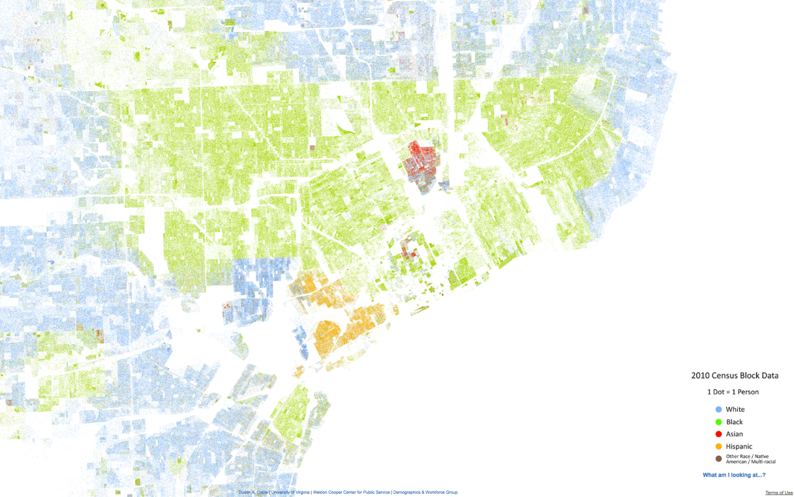
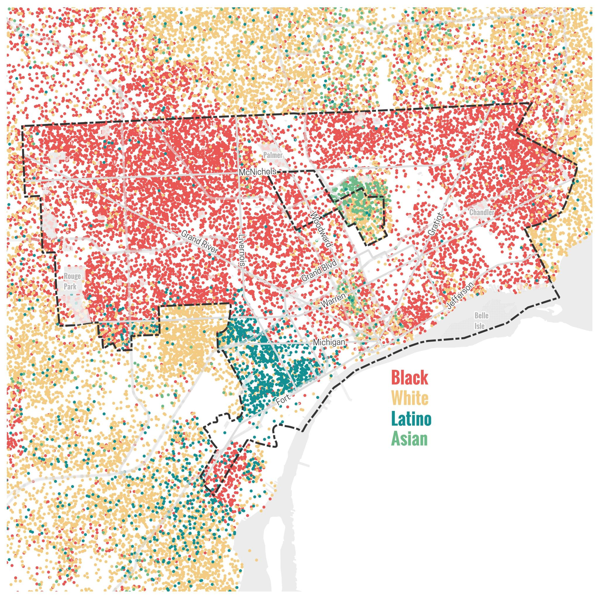

# Schelling's Model

## Feedback

Did anyone find any surprising results from playing with the model?

## The Setup

Imagine a checkerboard populated by two groups (e.g., blue and red).

- Each cell is occupied by one agent or is empty.
- Each agent has **neighbors** (the eight surrounding cells).
- Each agent has a **tolerance threshold**: the minimum fraction of neighbors that must be "like me" for the agent to stay put.
- If the threshold is not met, the agent moves to a random empty cell.

. . .

You can study lots of questions with this, but the one that gets most discussed is: **What happens when everyone is only mildly picky?**

## Key Parameters

| Parameter | Meaning |
|-----------|---------|
| Grid size | $n \times n$ board |
| Vacancy rate | Fraction of cells left empty |
| Group ratio | Relative size of the two groups |
| **Threshold** | Minimum same-type neighbor fraction to stay |

The threshold is the crucial variable. What Schelling noticed was that we get lots of segregation even when it is set **well below 50%**.

## The Algorithm

1. Place agents randomly on the grid.
2. For each agent, count same-type and different-type neighbors. (Remember that they will typically have fewer than 8 neighbors.)
3. If the fraction of same-type neighbors is below threshold, mark the agent as **unhappy**.
4. Move all unhappy agents to random empty cells.
5. Repeat until equilibrium (no unhappy agents) or a step limit is reached.

## Agent Based Models

This is one of the earliest and simplest **agent-based models** (ABMs).

- There is no central planner.
- There is no coordination; just local rules.
- But also, we don't care about *representative* agents; we really do model each agent one at a time.

## The Core Result

:::: {.columns}

::: {.column width="50%"}
### Threshold ≈ 35%

- Set the tolerance threshold to be around 35%.
- Each agent is happy as long as roughly **1 in 3** neighbors are like them.
- That does not sound wildly intolerant.
:::

::: {.column width="50%"}
### Outcome

- The board rapidly **self-segregates** into large, homogeneous clusters.
- Stable equilibrium is far more segregated than anyone individually "wanted".
:::

::::

. . .

> "Individuals who would be content in a mixed neighbourhood find themselves in a segregated one."

## Why Does It Happen?

The mechanism is a **tipping cascade**:

1. A few agents on the boundary are *just barely* unhappy.
2. They move, which changes the neighborhood composition for those left behind.
3. Previously happy agents now fall below their threshold.
4. They move in turn, triggering further departures.

. . .

Each local adjustment **shifts the context** for nearby agents, producing a chain reaction that vastly overshoots any individual's preference.

## Philosophical Significance

The existence of this model means we have to be careful making an inference from **outcomes** to **attitudes**.

- You can't *simply* say "Oh none of the Reds are associating with any of the Blues, so they must all be really bigoted."
- Maybe they are just have a preference for not being too outnumbered.
- That's not exactly a neutral attitude, but it's not exactly the bigotry that you might infer.

## Inference

Models like this one are answers to *how possibly* questions.

- Sometimes answering a *how possibly* question takes you from bafflement to at least a sense that something could make sense, when you go from 0 possible explanations to 1.
- And sometimes, as here, they take you out of a false sense of certainty.

## Racial Segregation in Housing

That said, in the particular case of **racial** segregation in **housing**, we have a lot more evidence than just the existence of segregated communities.

For one thing, we have the pattern of segregation.

The next few images are taken from Alex B. Hill's website [Detroitography](https://detroitography.com/), which has lots of really detailed discussions of, as you might guess, the geography of Detroit.

## Detroit in 2000

::: {.columns}

:::: {.column width=60%}
](images/detroit_2000.jpg){height=70%}
::::

:::: {.column width=40%}
Note that the boundaries are not just sharp, almost all are exactly at the municipal boundaries.
::::
:::

## Detroit in 2010

::: {.columns}

:::: {.column width=60%}
{height=70%}
::::

:::: {.column width=40%}
There wasn't much change by 2010, though the population density has decreased.

Source: <https://detroitography.com/2013/08/12/detroit-racial-dot-map/>
::::
:::

---

::: {.columns}

:::: {.column width=60%}
{height=50%}
::::

:::: {.column width=40%}
And the boundaries are getting just a little blurrier in 2020.

Source: <https://detroitography.com/2024/01/05/detroit-racial-dot-map-2020/>
::::
:::

## Schelling Model

The Schelling model, applied to racial housing segregation, predicts somewhat random boundaries.

That's not what we see in reality; the boundaries fall on pre-existing municipal lines.

## Housing Segregation

Also, we have so much more evidence than the demographic distributions shown on these maps.

We know the whole history of formal and informal discrimination in housing.

If you want to see some evidence just for Ann Arbor, the district library recently made a documentary with lots of interviews with locals who faced horrific discrimination:

- <https://aadl.org/roomforchange>

## Model Failure

Indeed, we can see a case where the model totally does not predict what we see in reality. Try it with the following parameters:

- The A/B mix is 80/20, and the vacancy rate is fairly low, say 20.
- The B's are happy to live anywhere; their threshold is 0.
- The A's want to live somewhere where the A's are at least as prevalent as on the board, so their threshold is at 80.

. . .

We typically do **not** get segregation; we just get A's bouncing around the board indefinitely.

## Model Failure

What happened in real-life cases where the A's had those preferences?

- They used some mix of laws, practices, and outright violence, to get rid of the B's.
- This is not something the model represents.

## What is Being Modeled?

In Schelling's original discussion, he mentions a particular story that motivated the case.

- At a particular summer camp, the kids didn't seem particularly racist when they had to interact in activities.
- But when they sat wherever they wanted for lunch, they ended up at racially homogenous tables.

## What is Being Modeled?

That kind of informal grouping looks much more like the model than housing. It's useful to look around you and see what kinds of homogenous and heterogenous groups there are, and long which dimensions they are homogenous and heterogenous.

. . .

Think of all the ways in which housing is not like what we see in the model.

- Moving house is **expensive**.
- People do not move **randomly**; in particular, they typically don't move to a place they can tell they'll want to move away from.

## Housing

The point is not just that the model is unrealistic in these respects. Of course it's unrealistic; it's a bunch of points on a board.

The point is that the behavior in the model is being driven by the ways in which it is unrealistic.

# Models

## What Models Are

Any time we make a simplified version of a situation, we are building a model.

Put that way, the accounts of a company are kind of a model.

But what we're interested in really are models that do at least one, and ideally all three, of the following things:

- Represent **causal** relations;
- **Explain** some phenomena; or
- **Predict** what will happen next

## What Models Are

The company accounts is a simplified picture of what's going on at the company, but it need not do any of those things.

Still, this isn't just something that scientists do.

Any kind of projection, e.g., sales forecasts for the next year, or Netflix estimating viewership numbers when deciding what shows to make, require these kinds of models.

## Models in (Social) Science

The philosopher of science Michael Weisberg, in his 2013 book *Simulation and Similarity: Using Models to Understand the World*, argues that there are three main kinds of model used in science.

1. **Concrete** models; where we use a real thing to model something else.
2. **Mathematical** models; where we represent something using (simplified) equations.
3. **Computational** models; where we start with a toy example, and work out what it does.

## Concrete Models

{height=60%}

## Mathematical Models

Also via Wikipedia, the Lotka–Volterra equations for predator-prey interactions, where $x$ is the prey population density and $y$ is the predator density.

\begin{align*}
\frac{dx}{dt} = \alpha x - \beta x y \\
\frac{dy}{dt} = - \gamma y + \delta x y
\end{align*}

Note that we don't model individual animals; just population level statistics.

## Computational Models

Here the paradigm, the one Weisberg uses as the main exemplar, is Schelling's model.

Though he describes it as a model of urban segregation, and I think it's actually quite a bad model of *that*.

## Models

What's common to all of these is that

1. They leave a lot out; but
2. They are still similar enough to reality that they can tell us something about the real world.

. . .

'Similar' here needs a lot of spelling out, and in a different class we might spend a lot of time on it, but I'll leave it as given for now.

# Improving Models

## Additions

What additions do you think would be worth adding to the Schelling model?

## Subtractions

What do you think should be subtracted?

## Keep it Simple

It's really tempting when you have a model like this, to add more and more detail.

- This is especially true when you're building them on a computer, not moving coins around an actual board like Schelling.
- But sometimes the real trick is to **subtract**.

## Aim of a Model

What we want to show is what feature is really doing the work.

- The busier the model, the harder it is to see that.
- The time to add detail to a model is when you are worried about something being a feature of the simplification.
- But if you can subtract noisy features, and keep the result, that's really interesting.

## Back to Schelling

And that's I think part of what's interesting here.

It's not that this is what happens in housing, it clearly isn't, or it's even the only factor in group formation.

But rather, seeing how easily agents can self-select, tells us something about what could be going on in real groups.

## After Break

We're going to do a week of game theory, then get onto the most famous model to come out of the University of Michigan, Robert Axelrod's Iterated Prisoner's Dilemma.
