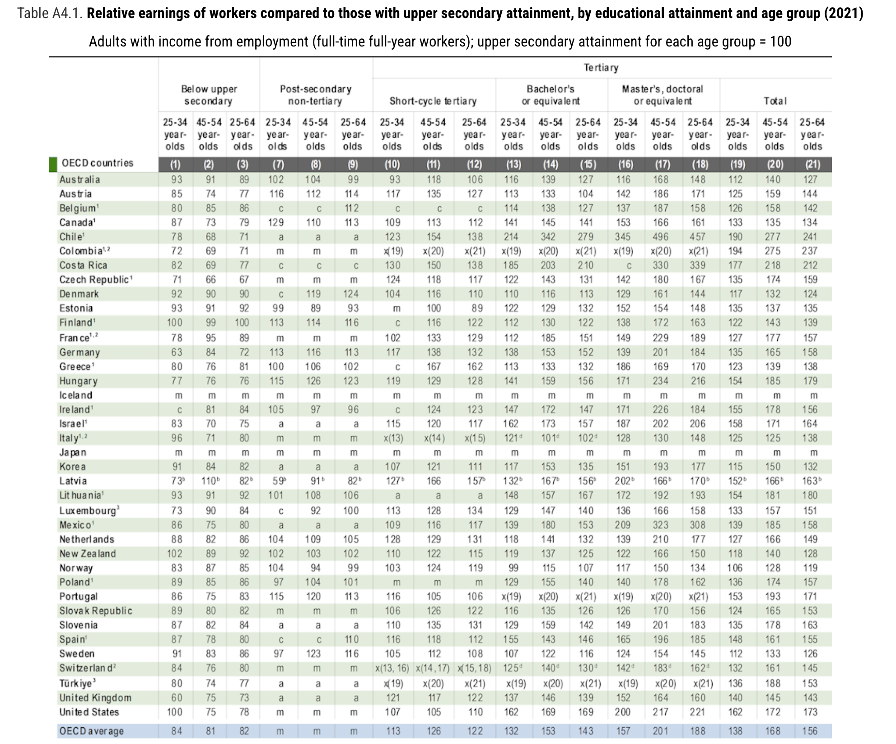
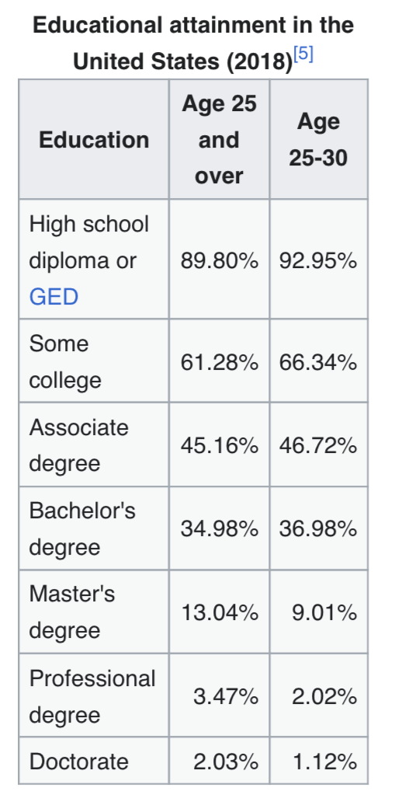

# The Fact to be Explained

## A Striking Wage Gap

Here is a robust empirical fact across almost every rich country: people who complete a college degree earn substantially more over their lifetimes than people who don't.

. . .

This isn't subtle. In the US, the lifetime earnings gap is well over **one million dollars**.

. . .

The gap is large enough, and consistent enough across countries, that it demands an explanation.

---

{width=75%}

## The Sheepskin Effect

Before discussing explanations: there is a striking feature of the wage data that any good explanation must account for.

. . .

Completing **two or three years** of college gives you very little of the wage premium. The premium kicks in when you **finish** — when you get the degree.

. . .

This is sometimes called the **sheepskin effect** (after the old tradition of printing diplomas on sheepskin).

. . .

It is hard to explain if college simply develops valuable skills — why would three years of skills suddenly be worth dramatically more the moment a fourth year is complete?

## The US "Some College" Anomaly

The sheepskin effect is especially stark in the US.

---

::: {.columns}

:::: {.column width=35%}
{width=90%}
::::

:::: {.column width=60%}
The gap between "some college" and "associate degree" earners is **very large** in the US — much larger than in comparable countries.

. . .

Having started a degree but not finished is worth almost nothing in wage terms, even though it involves years of work.

. . .

Any explanation of the premium needs to explain why the **completion** of a degree matters so much more than the years spent acquiring it.
::::

:::

## The Pattern by Age

One more fact that will matter a great deal: the college wage premium is **not constant across age**.

. . .

Among workers aged 25–34, the premium is real but relatively modest.

. . .

Among workers aged 45–54, the premium is **substantially larger**.

. . .

Whatever is causing the premium seems to grow more powerful — not less — as workers age and accumulate experience.

## Your Turn: First Conjectures

Before we go any further — **why do you think employers pay so much more for college graduates?**

. . .

Take two minutes to discuss with a neighbor. Try to come up with at least two different explanations that could in principle be true.

. . .

*(Collect conjectures)*

# Three Explanations

## The Three Standard Models

Economists and philosophers have identified three main families of explanation for the college wage premium:

. . .

**Human capital**: college develops skills that are genuinely valuable to employers. The premium reflects those skills.

. . .

**Selection**: colleges admit people who are already more capable. The premium reflects the prior ability of graduates, not anything college does.

. . .

**Signaling**: college is a costly hurdle that demonstrates ability to employers. The premium reflects the signal, not the skills.

. . .

These aren't mutually exclusive — the truth may involve all three. But they have different implications, and the data can help us sort them out.

## A Useful Test

Before accepting any explanation, it's worth asking: **what would the world look like if this were the whole story?**

. . .

If human capital is everything, we'd expect partial degrees to have partial returns — three years should give three-quarters of the premium. We don't see that.

. . .

If selection is everything, we'd expect admission letters to be nearly as valuable as degrees — employers would pay for the signal of admission, not completion. We don't see that either.

. . .

If signaling is everything, we'd expect the premium even if college taught nothing useful. This one is harder to test directly.

## Your Turn: Which Is It?

Which of these explanations do you find **most plausible**? What's your best argument for your preferred view?

. . .

And: is there an explanation that none of these models capture?

. . .

*(Discussion)*

# The Spence Model

## Michael Spence

Michael Spence won the Nobel Prize in economics in 2001, partly for this model.

. . .

His 1973 paper "Job Market Signaling" showed how education could function as a **costly signal** even if it adds no productive skills whatsoever.

. . .

We'll use a simplified binary version of his model — the continuous version has more realism in the details, but the core logic is the same.

## Structure of the Game

Three players: **Nature**, **Worker**, and **Employer**.

. . .

**Nature** assigns each worker a type: **High** (productive, able) or **Low** (less so). The worker knows their type; the employer doesn't.

. . .

**Worker** chooses: go to **College** or go to the **Beach** (i.e., skip college and enter the job market).

. . .

**Employer** sees the worker's choice (College or Beach) but not their type. Based on that, they offer either a **Good job** or a **Poor job**.

## The Crucial Assumption

For the model to work, college must be **more costly** for Low workers than for High workers.

. . .

This doesn't mean Low workers pay higher tuition. It means the effort, stress, and opportunity cost of completing a degree are greater for people with less ability.

. . .

High workers find college demanding but manageable. Low workers find it genuinely painful — or can't finish it at all.

. . .

This differential cost is what makes college a potentially credible signal.

## Payoffs

For the **employer**: they get 1 if they match correctly (Good to High, Poor to Low), and 0 otherwise.

. . .

For the **worker**: a Poor job pays 0; a Good job pays 4. Going to the beach costs nothing. Going to college costs **1 if you're High**, **5 if you're Low**.

---

|  Type  |  Choice  |  Offer  |  Worker  |  Employer  |
|:------:|:--------:|:-------:|:--------:|:----------:|
|  High  |  College |  Good   |    3     |    1       |
|  High  |  College |  Poor   |   −1     |    0       |
|  High  |  Beach   |  Good   |    4     |    1       |
|  High  |  Beach   |  Poor   |    0     |    0       |
|  Low   |  College |  Good   |   −1     |    0       |
|  Low   |  College |  Poor   |   −5     |    1       |
|  Low   |  Beach   |  Good   |    4     |    0       |
|  Low   |  Beach   |  Poor   |    0     |    1       |

---

```{r engine='tikz'}
#| label: fig-spence
#| fig.cap: "College or Beach signaling game"
#| fig.ext: 'png'
#| cache: TRUE
#| echo: FALSE
#| fig.width: 4

\usetikzlibrary{calc}

\begin{tikzpicture}[scale=1.4,font=\footnotesize]
\tikzset{
solid node/.style={circle,draw,inner sep=1.5,fill=black},
hollow node/.style={circle,draw,inner sep=1.5},
square node/.style={rectangle,draw, inner sep = 1, fill = black}
}

\tikzstyle{level 1}=[level distance=12mm,sibling distance=25mm]
\tikzstyle{level 2}=[level distance=15mm,sibling distance=15mm]
\tikzstyle{level 3}=[level distance=13mm,sibling distance=11mm]

\node(0)[hollow node,label=right:{Nature}]{}
child[grow=up]{node[solid node,label=above:{Worker}] {}
child[grow=left]{node(1)[solid node]{}
child{node[square node,label=left:{3,1}]{} edge from parent node [above]{G}}
child{node[square node,label=left:{-1,0}]{} edge from parent node [below]{P}}
edge from parent node [below]{C}
}
child[grow=right]{node(3)[solid node]{}
child{node[square node,label=right:{0,0}]{} edge from parent node [below]{P}}
child{node[square node,label=right:{4,1}]{} edge from parent node [above]{G}}
edge from parent node [below]{B}
}
edge from parent node [left, align=center]{High \\ 0.4}
}
child[grow=down]{node[solid node,label=below:{Worker}] {}
child[grow=left]{node(2)[solid node]{}
child{node[square node,label=left:{-1,0}]{} edge from parent node [above]{G}}
child{node[square node,label=left:{-5,1}]{} edge from parent node [below]{P}}
edge from parent node [above]{C}
}
child[grow=right]{node(4)[solid node]{}
child{node[square node,label=right:{0,1}]{} edge from parent node [below]{P}}
child{node[square node,label=right:{4,0}]{} edge from parent node [above]{G}}
edge from parent node [above]{B}
}
edge from parent node [left,align=center]{Low \\ 0.6}
};

\draw[dashed,rounded corners=10]($(1) + (-.45,.45)$)rectangle($(2) +(.45,-.45)$);
\draw[dashed,rounded corners=10]($(3) + (-.45,.45)$)rectangle($(4) +(.45,-.45)$);
\node at ($(1)!.5!(2)$) {Employ};
\node at ($(3)!.5!(4)$) {Employ};
\end{tikzpicture}
```

## The Separating Equilibrium

This game has a **separating equilibrium**:

::: {.incremental}
- High workers go to College; Low workers go to the Beach
- Employers offer Good jobs to College; Poor jobs to Beach
:::

. . .

Let's check that neither side wants to deviate.

. . .

High workers: College + Good = 3. Could they get more by going to the Beach? Beach + Poor = 0. No.

. . .

Low workers: Beach + Poor = 0. Could they do better by going to College? College + Good = −1. No — and College + Poor = −5. Definitely no.

## Why Low Workers Don't Mimic

This is the crucial point. Low workers *could* go to college to get the Good job. But they don't, because for them the cost (5) exceeds the benefit (4).

. . .

High workers find the same trade-off tilted the other way: cost (1) is much less than the benefit (4).

. . .

The signal is **credible precisely because it's too expensive for Low types to fake**. The degree acts as a hurdle that sorts workers without anyone explicitly verifying their type.

## What the Model Explains

The Spence model handles several things previous models struggled with:

::: {.incremental}
- **The sheepskin effect**: finishing the degree is what sends the signal — partial completion doesn't clear the hurdle, so it earns no premium
- **Content-independence**: the model doesn't require any skill acquisition — medieval epistemology counts just as much as accounting
- **Gate-keeping**: there's no need to restrict attendance, only to award degrees to those who complete — which is all we actually do
:::

# Three Challenges

## Challenge 1: The Age Profile

Recall: the college wage premium **rises** as workers age.

. . .

Among workers aged 25–34, the premium is modest. Among workers aged 45–54, it's much larger.

. . .

This is puzzling for the signaling model.

## Why It's Puzzling

The Spence model works because employers can't directly observe worker type — they rely on the college signal.

. . .

But that assumption becomes increasingly implausible over time. After twenty years in the workforce, employers — and the market as a whole — should have *direct* evidence about a worker's productivity.

. . .

Performance reviews, promotions, colleagues' assessments, track records: all of these provide information that should eventually replace the college signal.

. . .

**Question for discussion**: if employers can tell who's good after a decade of work, why does the college signal get *more* valuable at ages 45–54, not less?

## Possible Responses

There are some things the signaling theorist can say:

::: {.incremental}
- Employers at **age 25–34** are taking a risk; by 45–54, those risks have resolved and the better workers have been promoted — so the premium reflects career sorting, not the signal itself
- The information sets in the model may not be information sets anymore, but the **wage structure** has already been set through long-term contracts, union agreements, or internal pay scales established earlier
- High types, by going to college, get access to **better networks and entry points** that compound over time — not a pure signal story, but compatible with it
:::

. . .

These responses are defensible, but they require adding assumptions the basic model doesn't contain.

## Challenge 2: The Permanent Student Problem

The model requires that college is **more costly for Low workers than High workers**.

. . .

But think about who actually *enjoys* college most.

. . .

In most people's experience, the students who thrived — who loved the reading, the dorm room debates, the seminars, the library — were not always the most productive future employees.

. . .

The "permanent student" type: comfortable in an academic environment, happy to spend another year on a thesis, not easily stressed by exams. Are these the High types the model needs?

## The Problem Sharpened

Spence's model requires a tight correlation between **how much you dislike college** and **how little employers want you**.

. . .

But the traits that make someone a good employee — reliability, practical judgment, client management, execution under deadlines — are not obviously the same traits that make college feel easier.

. . .

Someone could be a wonderful accountant or nurse and find college genuinely painful. Someone could love and excel at academic life while being a poor fit for most professional environments.

. . .

If the cost-type correlation doesn't hold, the separating equilibrium breaks down: Low workers find college cheap enough to mimic High workers, and the signal loses its credibility.

## Question for Discussion

Is the correlation tight enough to rescue the model?

. . .

One response: whatever the mechanism, *in practice* college completion does predict job performance, so the equilibrium must be maintained by something.

. . .

Another response: maybe the model was never fully accurate, and we've been in a messy partial-pooling situation all along — college screens out some Low types but not all.

. . .

Where do you come down on this?

## Challenge 3: Degree Length and Cross-Country Evidence

The Spence model treats degree length as the costly hurdle. This generates a prediction:

. . .

**If you change the length of a degree, you should change who gets the premium.**

. . .

And we have some natural experiments. The **Bologna Process** (from around 2000 onward) standardized European university degrees, in many countries shortening bachelor's programs from 4–5 years to 3 years.

. . .

What happened to the wage premium?

## What the Models Predict

Under **human capital**: a shorter degree produces less skill. The premium should fall when degrees are shortened.

. . .

Under **signaling**: the hurdle is recalibrated — employers simply update so that completing a 3-year degree now signals the same thing as completing a 4-year degree used to. The premium should persist roughly unchanged.

. . .

Under **selection**: it doesn't much matter — what's selected for is the underlying ability, and degree length is just the filter.

## What the Evidence Suggests

The evidence is somewhat mixed, but a few things stand out:

::: {.incremental}
- The UK has 3-year undergraduate degrees; the US has 4-year degrees. The wage premium is **roughly comparable** in both countries. This is hard to explain if an extra year of human capital acquisition is driving the US premium.
- In Germany, the shift from the 5-year Diplom to the 3-year Bologna Bachelor's did not eliminate the graduate premium — though the Master's degree has become increasingly expected, suggesting the hurdle shifted rather than disappeared.
- Countries with very short degrees (2-year associate equivalents) often show **much smaller premiums**, consistent with a threshold effect rather than a linear skills story.
:::

## The Interpretation

None of this evidence is clean enough to settle the debate. But it does suggest:

. . .

The premium is not simply proportional to time spent in college — which is bad news for a pure human capital story.

. . .

The premium tracks **degree completion** more than **degree length**, which is more consistent with signaling or selection.

. . .

And the premium recalibrates when degree norms change, which is exactly what a signaling model would predict: employers update their priors about what the standard signal means.

## The Deeper Question

Even if Spence's model is broadly right, there's a normative question lurking.

. . .

If the premium is mostly a signal, then vast resources — tuition, four years of forgone income, the effort of millions of students — are being spent **purely as a sorting device**.

. . .

The signal is privately rational (each student benefits from going to college) but **socially wasteful** (if everyone just skipped college, the same sorting could be achieved more cheaply, or not at all).

. . .

This is one of the stranger equilibria we've encountered: everyone does the rational thing, and the outcome is a multi-trillion dollar institution that may not be educating anyone.

## Your View

Which explanation strikes you as **most important** in explaining the college wage premium?

. . .

And: does the answer change how you think about **your own reasons for being at college**?

. . .

*(Discussion)*

## For Next Time

We've now covered two major applications of signaling games — used cars and college.

. . .

Both show the same underlying structure: an informed party moves first, an uninformed party observes and responds, and the equilibrium involves reading between the lines of what the informed party does.

. . .

Next time we'll move to a related set of questions about how information gets aggregated across many people — from individual beliefs to collective decisions.
